# Εγκατάσταση λειτουργικού συστήματος

## Προετοιμασία εγκατάστασης

Η φιλοσοφία που διέπει την εγκατάσταση του λειτουργικού συστήματος Windows 11 εξαρτάται από πολλές παραμέτρους, όπως η ύπαρξη περισσοτέρων σκληρών δίσκων, καθώς και η χωρητικότητα αυτών ή η ανάγκη για εγκατάσταση άλλων λειτουργικών συστημάτων στον ίδιο υπολογιστή (π.χ. Linux). Οι γενικές οδηγίες που μπορούν να εφαρμοστούν στη συνηθισμένη περίπτωση ύπαρξης ενός μόνο σκληρού δίσκου είναι οι ακόλουθες:

- Να πραγματοποιείται διαχωρισμός του σκληρού δίσκου σε περισσότερες από μία κατατμήσεις

- Η διαμόρφωση των κατατμήσεων πραγματοποιείται με χρήση του συστήματος αρχείων NTFS.

- Η κύρια κατάτμηση που περιλαμβάνει το λειτουργικό σύστημα και τις εγκατεστημένες εφαρμογές να καταλαμβάνει το 30% του σκληρού δίσκου (ή τουλάχιστον 20GB). Η λήψη αντιγράφου ασφαλείας αυτής της κατάτμησης επαρκεί για έκτακτες περιπτώσεις αντιμετώπισης καταστροφών (disaster recovery). Το όνομα (volume label) της κατάτμησης προτείνεται να είναι "system".

- Η δεύτερη κατάτμηση να καταλαμβάνει το 30% της διαθέσιμης χωρητικότητας και να χρησιμοποιείται αν είναι επιθυμητό για την εγκατάσταση δεύτερου λειτουργικού συστήματος. Το όνομα (volume label) της κατάτμησης προτείνεται να είναι ομώνυμο του λειτουργικού συστήματος που έχει εγκατασταθεί (π.χ. "linux").

- Ο χώρος που απομένει και αποτελεί το 40% της χωρητικότητας του σκληρού δίσκου προτείνεται να χρησιμοποιείται για τη λήψη αντιγράφων ασφαλείας. Το όνομα (volume label) της κατάτμησης προτείνεται να είναι "backup".

## Δημιουργία μέσων εγκατάστασης {#media-creation}

Συστήνεται, ακομη και αν διαθέτετε πρωτότυπα μέσα εγκατάστασης να δημουργείτε ένα καινούριο μέσο εγκατάστασης κάνοντας χρήση του εργαλείου [Media Creation Tool](https://www.microsoft.com/en-gb/software-download/windows11). Με αυτόν τον τρόπο γίνεται εγκατάσταση της πιο πρόσφατης έκδοσης των Windows 11, οπότε μειώνεται δραματικά τόσο ο χρόνος που απαιτείται για αναβαθμίσεις του Λ/Σ όσο και η πιθανότητα εκμετάλλευσης των ευπαθειών του Λ/Σ μέχρι την αναβάθμισή του.

Η εγκατάσταση του Media Creation Tool μπορεί να γίνει σε οποιονδήποτε ήδη εγκατεστημένο με Windows σταθμό εργασίας. Αφού το εγκαταστήσετε και το εκκινήσετε, το εργαλείο κατεβάζει την πιο πρόσφατη έκδοση των Windows 11 και σας καθοδηγεί να δημιουργήσετε ένα μέσω τύπου DVD ή USB που θα χρησιμοποιήσετε για την εγκατάσταση στο νέο σταθμό εργασίας.

!!! tip "Συμβουλή"
    Ακολουθώντας αυτήν τη διαδικασία μειώνετε το χρόνο εγκατάστασης καθώς δεν θα χρειαστείτε να "κατεβάσετε" και να εγκαταστήσετε τις απαραίτητες αναβαθμίσεις (updates, patches κ.τ.λ.)

## Εκκίνηση του Η/Υ με το μέσο εγκατάστασης

Τοποθετήστε το CD/USB εγκατάστασης MS-Windows 11 Pro στο σταθμό εργασίας και ρυθμίστε το UEFI ή το BIOS (ή πατήστε **`F12`** για να βγει το boot menu) ώστε να ξεκινάει από αυτό.

## Ρύθμιση γλώσσας

[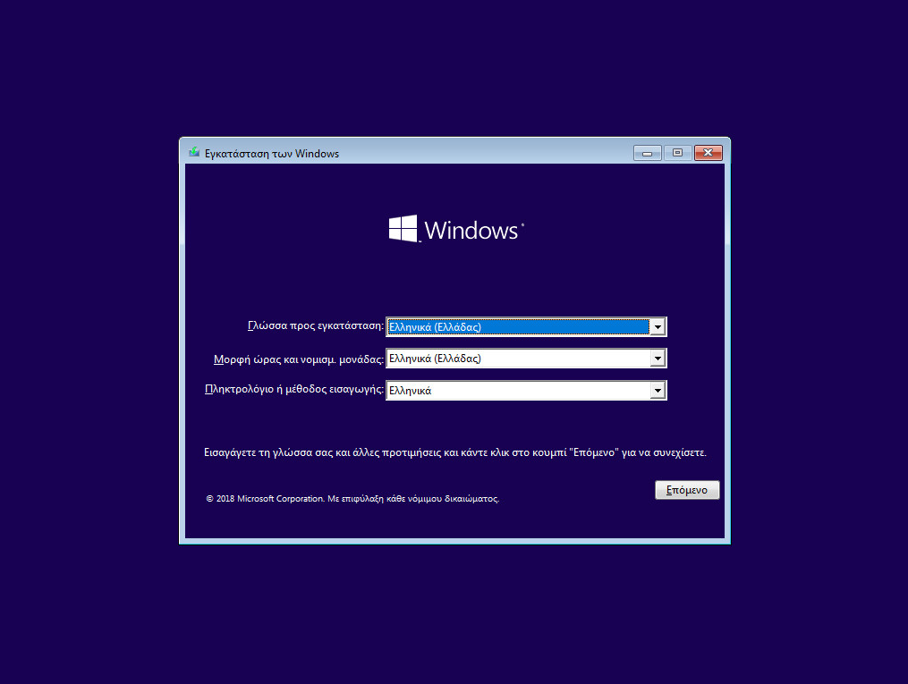](01-setup-language.png)

Κατά την αρχική εγκατάσταση ζητείται η ρύθμιση της γλώσσας. Επιλέξτε τα ακόλουθα:

- Γλώσσα προς εγκατάσταση: ***Ελληνικά (Ελλάδας)***

- Μορφή Ώρας και Νομισματική Μονάδα: ***Ελληνικά (Ελλάδας)***

- Πληκτρολόγιο ή μέθοδος εισαγωγής: ***Ηνωμένων Πολιτειών***

## Εκκίνηση Εγκατάστασης

[](02-setup-start.png)

Επιλέγετε ***Επόμενο*** και κατόπιν ***Εγκατάσταση Τώρα***. Θα ενημερωθείτε με το μήνυμα **Εκκίνηση του προγράμματος εγκατάστασης**.

[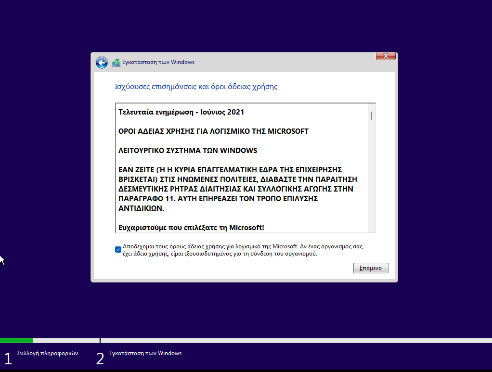](03-accept-license.png)
{.clear}


Το επόμενο βήμα για να προχωρήσει η εγκατάσταση είναι να γίνει αποδοχή των όρων χρήσης του προϊόντος 

[](04-setup-customize.png)
{.clear}

Στην ερώτηση **Ποιον τύπο εγκατάστασης θέλετε;** επιλέξτε ***Προσαρμοσμένη: Εγκατάσταση των Windows μόνο (για προχωρημένους)***.

[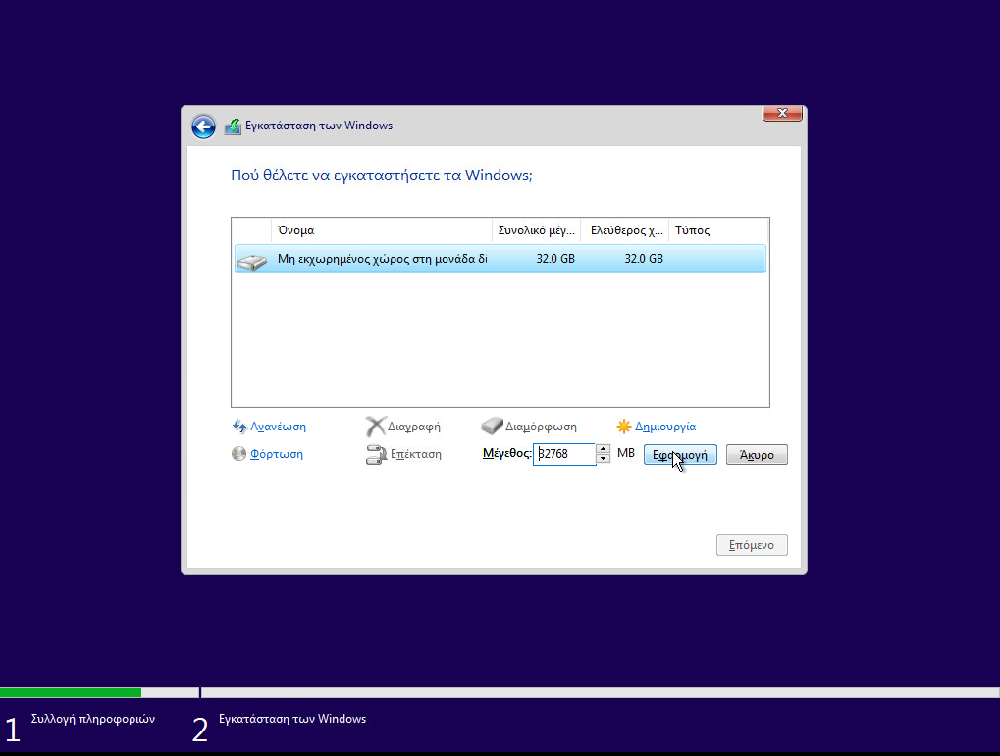](05-setup-disk.png)
{.clear}

Στην ερώτηση **Που θέλετε να εγκαταστήσετε τα Windows;** επιλέξτε τον σκληρό δίσκο και τη διαμέριση που επιθυμείτε και κατόπιν επιλέξτε ***Δημιουργία***.

[](06-setup-partitions.png)
{.clear}

Αποδεχτείτε την προτροπή να δημιουργηθούν αυτόματα τα επιπλέον διαμερίσματα για τα αρχεία του συστήματος και επιλέξτε ***Επόμενο***.

[](07-setup-copy-files.png)
{.clear}

Στη συνέχεια η εγκατάσταση των Windows σας ενημερώνει για τη διαδικασία αντιγραφής και εγκατάστασης των αρχείων, των δυνατοτήτων και των ενημερώσεων που η διάρκειά της (περίπου 8'-15') εξαρτάται από την ταχύτητα του συστήματός σας (μνήμη, δίσκος κτλ).

[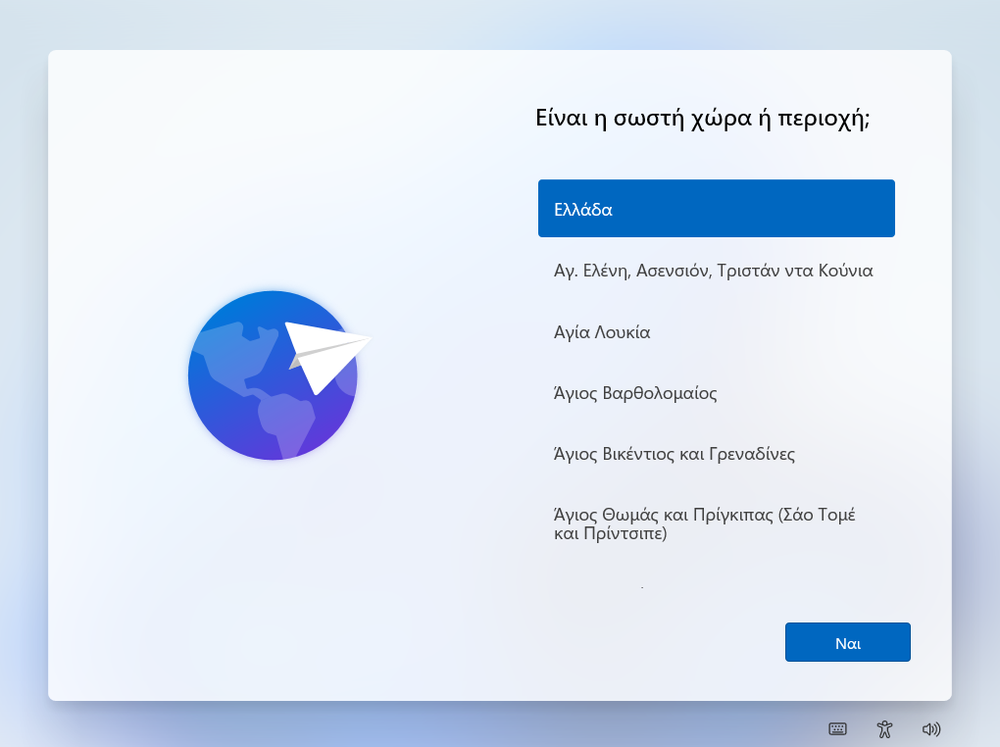](08-setup-country.png)
{.clear}

Κατόπιν της ολοκλήρωσης της αντιγραφής των αρχείων του συστήματος το σύστημα εκκινεί από την εγκατάσταση και ζητά να οριστούν οι ρυθμίσεις της εγκατάστασης. Επιβεβαιώστε επιλέγοντας ***ΝΑΙ*** ότι η περιοχή που βρίσκεστε είναι η Ελλάδα.

[](09-setup-keyboard.png)
{.clear}

Επιβεβαιώστε επιλέγοντας ***ΝΑΙ*** ότι η διάταξη του πληκτρολογίου είναι Ελληνικά.

[](10-setup-additional-keyboard.png)
{.clear}

Επιλέξτε ***Παράλειψη*** να μην προστεθεί δεύτερη διάταξη πληκτρολογίου. Όταν ολοκληρωθεί η διαδικασία ο Η/Υ θα επανεκκινήσει για να συνεχίσει η παραμετροποίηση του συστήματος.

## Ονομασία σταθμού εργασίας

[](11-name-station.png)

Το επόμενο βήμα είναι να αποδοθεί όνομα στο σταθμό εργασίας. Στο Σ.Ε.Π.Ε.Η.Υ. οι σταθμοί εργασίας προτείνεται να έχουν όνομα της μορφής "ClientXY" και η αρίθμηση να ακολουθεί την τοποθέτηση των σταθμών εργασίας στο χώρο του εργαστηρίου.

Δώστε τον νέο όνομα πχ Client01, PC01 κτλ και κατόπιν επιλέξτε ***Επόμενο*** και επανεκκινήστε το σταθμό εργασίας.

!!! tip "Συμβουλή"
    Αν πατήσετε ***Παράλειψη*** μπορείτε να μετονομάσετε αργότερα το σταθμό εργασίας πατώντας το **`Windows key`** (ή click στο σημαιάκι των Windows) ▸ ***Ρυθμίσεις*** (το γρανάζι) ▸ ***Σύστημα*** ▸ ***Μετονομασία***

## Ορισμός διαχειριστή

[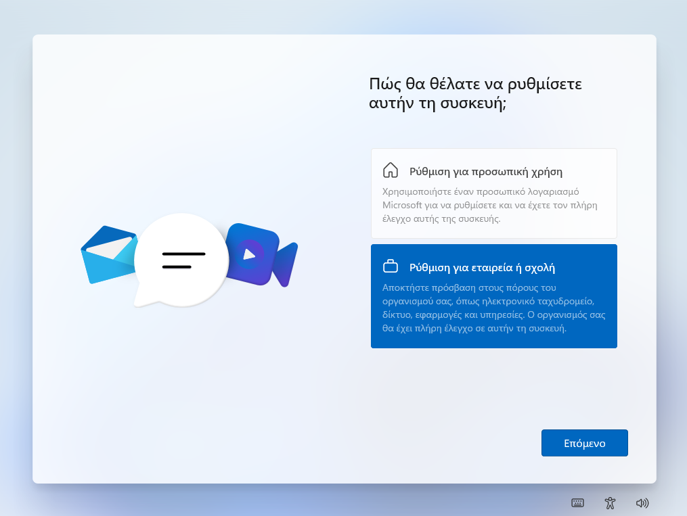](11-setup-admin.png)
{.clear}

Στην ερώτηση **Που θέλετε να κάντε τη ρύθμιση;** του λογαριασμού:

- Επιλέξτε ***Ρύθμιση για εταιρεία ή σχολή*** και ***Επόμενο***

[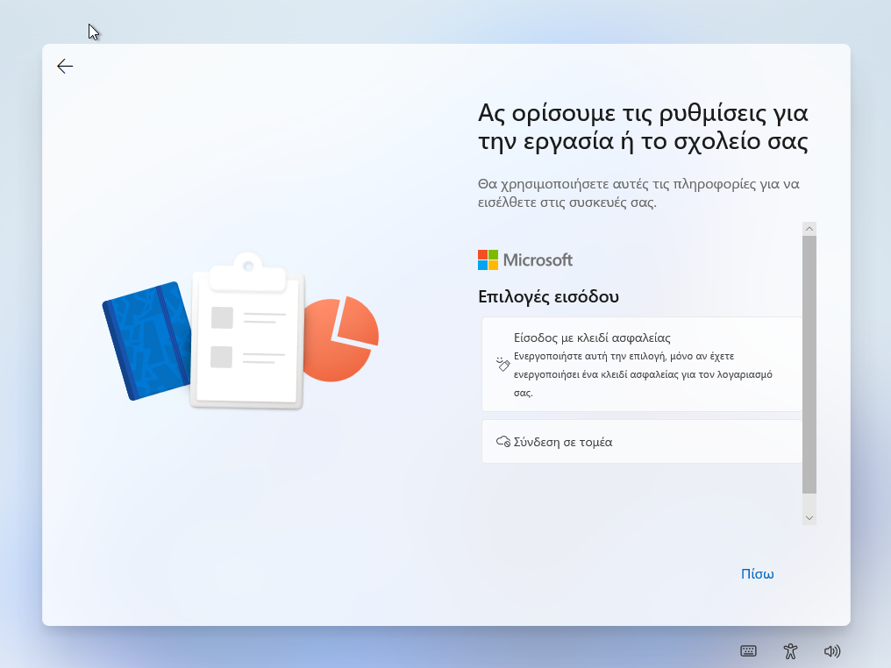](11-setup-admin-local.png)
{.clear}

Στo παράθυρο **Ας ορίσουμε τις ρυθμίσεις για την εργασία ή το σχολείο σας**

- Επιλέξτε ***Επιλογές εισόδου*** και στη συνέχεια ***Σύνδεση σε τομέα***
- Ορίστε το όνομα χρήστη **localadm** και τον κωδικό του και απαντήστε στις 3 ερωτήσεις που θα επιλέξετε για την επαλήθευση των στοιχείων του. Καταγράψτε και αποθηκεύστε σε χαρτί τις απαντήσεις ώστε να είναι διαθέσιμες αν ποτέ τις χρειαστείτε.

!!! tip "Συμβουλή"
    Προτείνεται η χρήση κωδικού τουλάχιστον 8 χαρακτήρων, που να περιλαμβάνει πεζούς και κεφαλαίους λατινικούς χαρακτήρες, σημεία στίξης και αριθμούς (π.χ. **Changem3!**).

    **Η πρακτική χρήσης προφανούς ή κοινού κωδικού ασφαλείας πρέπει να αποφεύγεται.**

## Ρυθμίσεις Ιδιωτικότητας

Το επόμενο βήμα αφορά ρυθμίσεις ιδιωτικότητας. Προτείνουμε να επιλέξετε όσο το δυνατόν πιο αυστηρές ρυθμίσεις.

[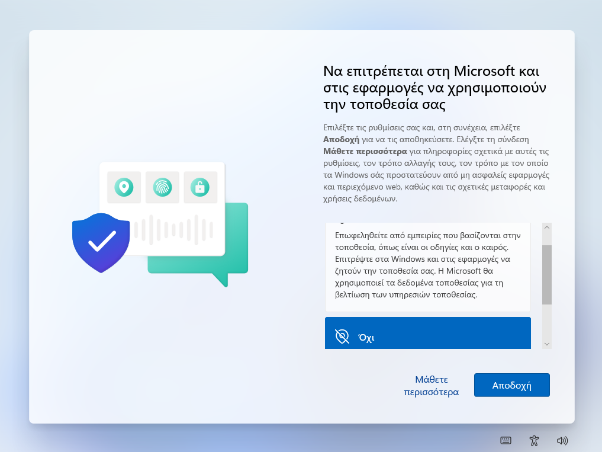](12-setup-privacy-03.png)
{.clear}

Στην ερώτηση **Να επιτρέπεται στη Microsoft και στις εφαρμογές να χρησιμοποιούν την τοποθεσία** επιλέξτε ***Όχι*** και κατόπιν ***Αποδοχή***.

[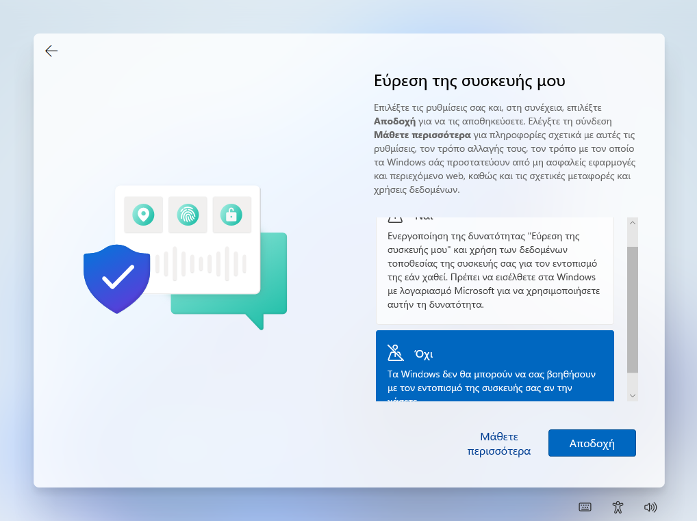](12-setup-privacy-04.png)
{.clear}

Στην ερώτηση **Εύρεση της συσκευής μου** επιλέξτε ***Όχι*** και κατόπιν ***Αποδοχή***.

[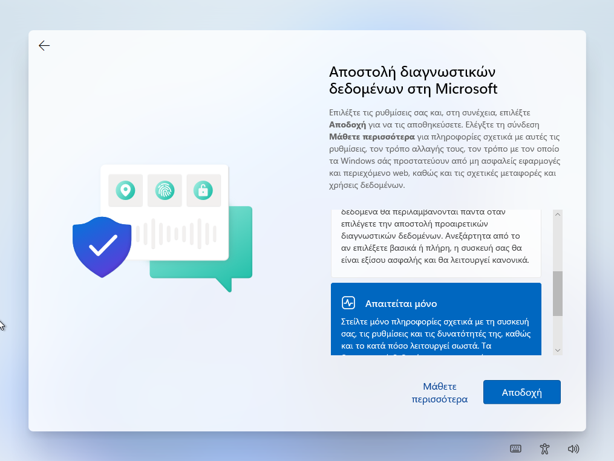](12-setup-privacy-05.png)
{.clear}

Στην ερώτηση **Αποστολή διαγνωστικών δεδομένων στη Microsoft** επιλέξτε ***Βασικό*** και κατόπιν ***Αποδοχή***.

[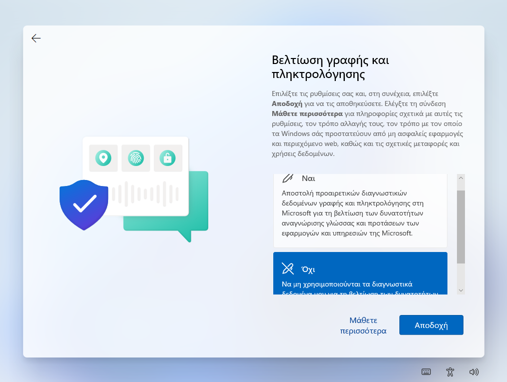](12-setup-privacy-06.png)
{.clear}

Στην ερώτηση **Βελτίωση γραφής και πληκτρολόγησης** επιλέξτε ***Όχι*** και κατόπιν ***Αποδοχή***.

[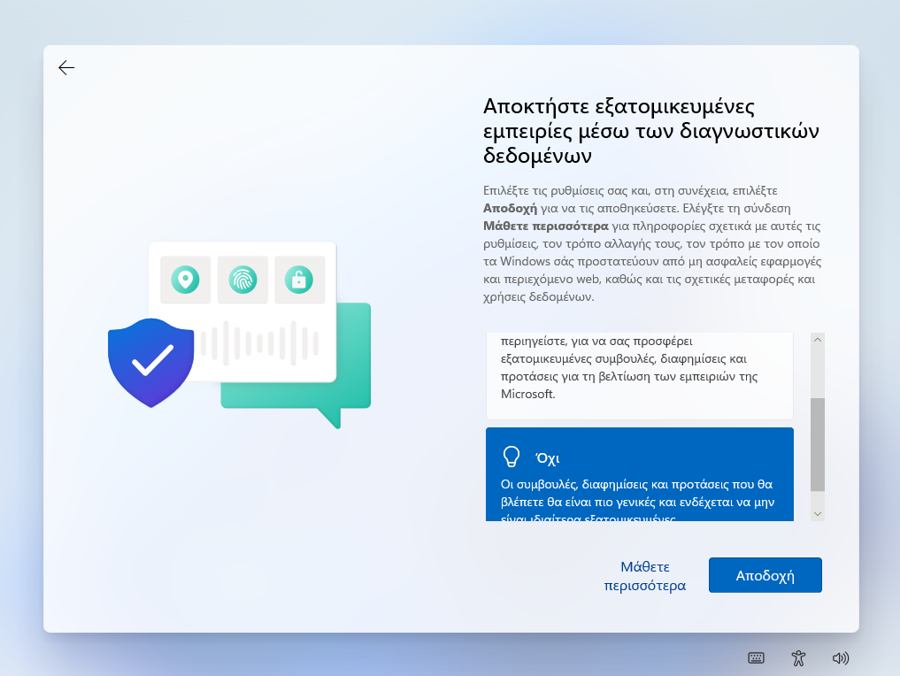](12-setup-privacy-07.png)
{.clear}

Στην ερώτηση **Αποκτήστε εξατομικευμένες εμπειρίες μέσω των διαγνωστικών δεδομένων** επιλέξτε ***Όχι*** και κατόπιν ***Αποδοχή***.

[](12-setup-privacy-08.png)
{.clear}

Τέλος, στην ερώτηση **Να επιτρέπεται στις εφαρμογές να χρησιμοποιούν το αναγνωριστικό διαφήμισης** επιλέξτε ***Όχι*** και κατόπιν ***Αποδοχή***.

## Ολοκλήρωση εγκατάστασης

[](12-setup-privacy-complete.png)
{.clear}

H εγκατάσταση προχωρά και θα πρέπει να περιμένετε μέχρι να ολοκληρωθεί.

[](13-setup-complete.png)

Η εγκατάσταση ολοκληρώθηκε και πλέον έχετε τη δυνατότητα να συνδεθείτε με το λογαριασμό διαχειριστή που δημιουργήσατε.

## Εγκατάσταση ενημερώσεων

Απαραίτητη προϋπόθεση για την εύρυθμη λειτουργία του λειτουργικού συστήματος είναι η εγκατάσταση όλων των κρίσιμων ενημερώσεων.

[](14-windows-update.png)

Πατήστε το **`Windows key`** (ή click στο σημαιάκι των Windows) ▸ ***Ρυθμίσεις*** (το γρανάζι) ▸ ***Ενημέρωση και Ασφάλεια*** ▸ ***Έλεγχος για ενημερώσεις***.

Θα πραγματοποιηθεί σύνδεση στο Windows Update και θα "κατέβουν" και θα εγκατασταθούν οι απαραίτητες αναβαθμίσεις. Ενδέχεται να χρειαστεί και επανεκκίνηση για την ολοκλήρωση της εγκατάστασης των ενημερώσεων.

!!! warning "Προσοχή"
    Εάν δεν έχετε πραγματοποιήσει την εγκατάσταση από πρόσφατη έκδοση μέσων εγκατάστασης οπως αναφέρθηκε στην [παράγραφο δημιουργίας μέσων εγκατάστασης](#media-creation), προτείνουμε να εγκαταστήσετε τον [Windows 11 Update Assistant](https://www.microsoft.com/el-gr/software-download/windows11), ο οποίος θα σας κάνει ενημέρωση στην πιο πρόσφατη έκδοση των Windows αποφεύγοντας τις πολύωρες αναβαθμίσεις.

## Ενεργοποίηση άδειας

[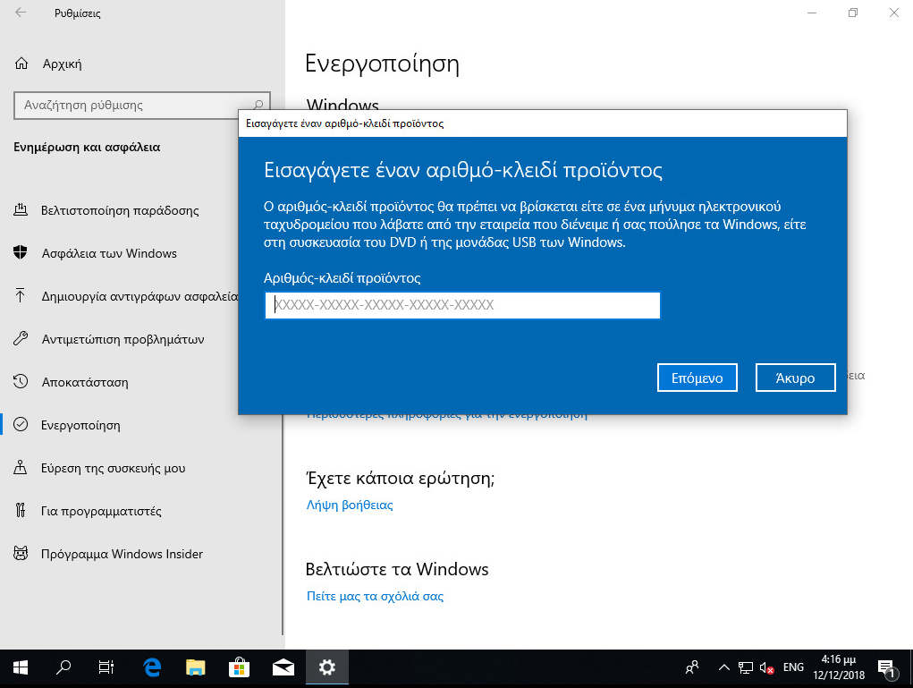](16-registration.png)

Μετά την εγκατάσταση του λειτουργικού συστήματος είναι πιθανό να απαιτείται η ενεργοποίησή του μέσα σε κάποιο χρονικό διάστημα για να είναι δυνατή η περαιτέρω χρήση του (product activation). Η άδεια χρήσης καθορίζει αν είναι απαραίτητο κάτι τέτοιο καθώς και το διάστημα που μπορεί να χρησιμοποιηθούν τα Windows 11 χωρίς ενεργοποίηση. Η πρακτική για τους σταθμούς εργασίας των σχολικών εργαστηρίων είναι να πραγματοποιείται η διαδικασία μέσω διαδικτύου.

!!! info "Πληροφορία"
    Εάν δεν εμφανιστεί το μήνυμα ενεργοποίησης μπορείτε να "τρέξετε" το SOFTWARE LICENSING USER INTERFACE (SLUI) σε γραμμή εντολών, ανοίγοντας ένα τερματικό πατώντας **`Windows Key`** + **`R`** και πληκτρολογώντας `cmd` και δίνοντας την εντολή:
    ```shell
    slui
    ```

## Εγκατάσταση οδηγών υλικού και περιφερειακών

Τμήμα της εγκατάστασης του λειτουργικού συστήματος θεωρείται και η εγκατάσταση των οδηγών συσκευών (system drivers) της μητρικής, των καρτών επέκτασης και των περιφερειακών συσκευών. 

Μπορεί να γίνει χρήση των μέσων (cd’s, δισκέτες κλπ) που παρασχέθηκαν μαζί με το υπολογιστικό σύστημα. Προτείνεται όμως να εγκαθίστανται οι τελευταίες εκδόσεις των οδηγών, που στην πλειονότητα των περιπτώσεων μπορούν να ληφθούν από το Διαδίκτυο.

Μπορείτε να κάνετε και έναν έλεγχο για τυχόν πιο ενημερωμένους οδηγούς με την ΕΛ/ΛΑΚ εφαρμογή [Snappy Driver Installer](https://sdi-tool.org/).

Σε περίπτωση που ο Η/Υ διαθέτει υλικό του κατασκευαστικού οίκου Intel, μπορείτε να ελέγξετε για ενημερώσεις των εκδόσεων των οδηγών του υλικού με την εφαρμογή [Intel Driver & Support Assistant](https://www.intel.com/content/www/us/en/support/intel-driver-support-assistant.html).

Η εγκατάσταση του εκτυπωτή, που συνήθως είναι συνδεδεμένος στο σταθμό εργασίας μπορεί να γίνει σε αυτό το σημείο σύμφωνα με τις οδηγίες του εκάστοτε μοντέλου. Για τη χρήση της υπηρεσίας εκτύπωσης από όλους τους χρήστες του εργαστηρίου ο εκτυπωτής πρέπει να διαμοιραστεί, οπότε ο σταθμός αναλαμβάνει και το ρόλο του διακομιστή εκτυπώσεων.

!!! tip "Συμβουλή"
    Προτείνεται, εφόσον υπάρχει εξυπηρετητής, [ο διαμοιρασμός εκτυπωτών να γίνεται στον εξυπηρετητή](../../2019/basic-settings/#printer-sharing).

## Εγκατάσταση του App Installer

[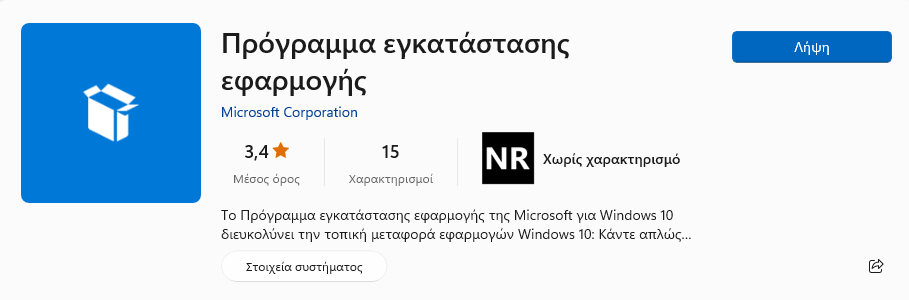](17-app-installer.png)

To `App Installer` ή `Πρόγραμμα εγκατάστασης εφαρμογής` είναι ένας Windows Package Manager που δίνεται ως ΕΛ/ΛΑΚ εφαρμογή από τον οίκο Microsoft και αποτελείται από μία εφαρμογή που από γραμμή εντολών, διευκολύνει την εγκατάσταση εφαρμογών μέσα από ένα κανάλι διανομής.

Η εγκατάσταση του winget πραγματοποιείται από το Microsoft Store, αναζητώντας το "Πρόγραμμα εγκατάστασης εφαρμογής" ή "App Installer" και εγκαθιστώντας το. Δείτε τις διαθέσιμες εφαρμογές ή πακέτα εφαρμογών που μπορείτε να εγκαταστήσετε στο https://winstall.app/

!!!info "Πληροφορία"
    Το App Installer περιλαμβάνει το `winget` που είναι αντίστοιχο σε λειτουργικότητα με το apt στο ubuntu. Για παράδειγμα για να εγκαταστήσετε την εφαρμογή `Notepad++` που δίνεται ως πακέτο Notepad++.Notepad++ δίνεται σε γραμμή εντολών με δικαιώματα διαχειριστή την ακόλουθη εντολή:
    ```shell
    winget install Notepad++.Notepad++
    ```

## Τελικοί έλεγχοι

Χρήσιμοι είναι οι παρακάτω έλεγχοι για την εγκατάσταση των Windows:

### Ώρα και Ημερομηνία

Ελέγχουμε τη **σωστή ρύθμιση ώρας και ημερομηνίας**. Η ώρα δεν πρέπει να διαφέρει περισσότερο από 5 λεπτά από αυτή του εξυπηρετητή, καθώς αυτό θα αποτελεί εμπόδιο στη σύνδεση στο Active Directory Domain, που παρουσιάζεται στη συνέχεια.

!!! info "Πληροφορία"
    Μετά τη σύνδεση στο Active Directory Domain ο σταθμός εργασίας συγχρονίζεται μέσω NTP με τον εξυπηρετητή.

### Προφίλ Δικτύου

Πατώντας στο **`Σημαιάκι των Windows`**  ▸ ***Ρυθμίσεις*** (εικονίδιο γραναζιού) ▸ ***Δίκτυο και Internet*** ▸ ***Κατάσταση*** ▸ ***Αλλαγή ιδιοτήτων σύνδεσης*** επαληθεύστε ότι το **Προφίλ Δικτύου** είναι **Ιδιωτικό**.

!!! info "Πληροφορία"
    Στην ορολογία των Windows, Ιδιωτικό Προφίλ Δικτύου σημαίνει ότι πρόκειται
        για δίκτυο που εμπιστεύεστε ώστε ο σταθμός εργασίας να είναι ορατός από
        τους υπόλοιπους στο τοπικό δίκτυο για λόγους διαμοιρασμού πόρων.
