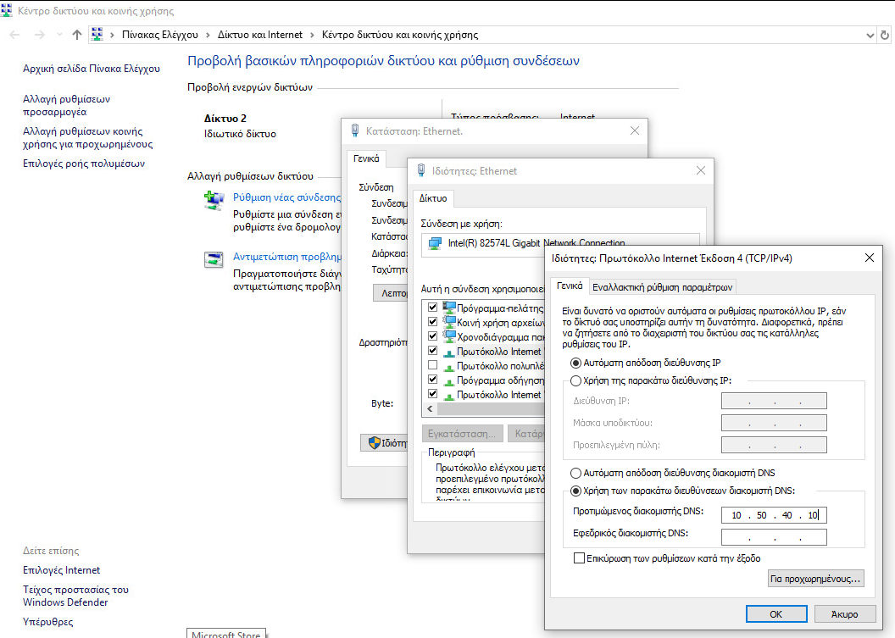
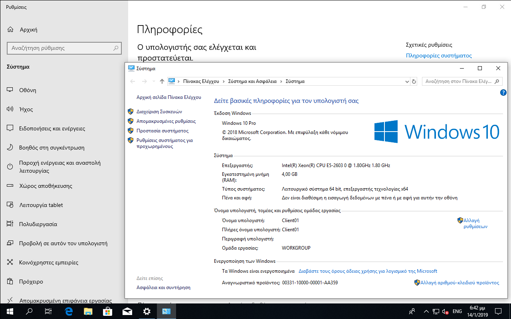
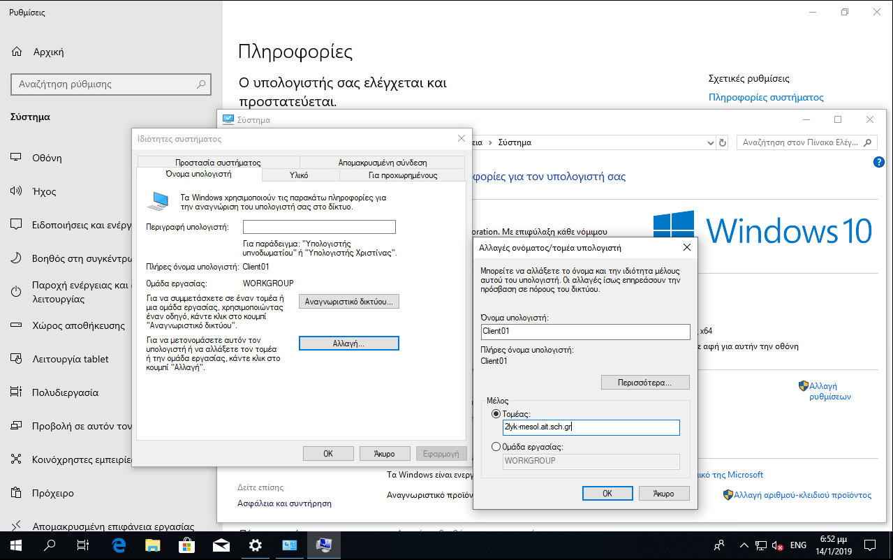
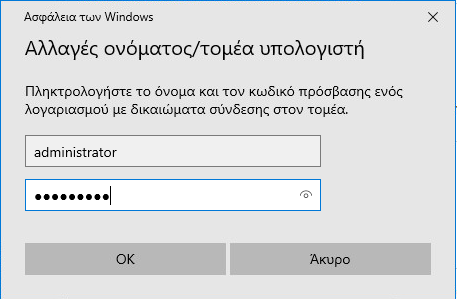

# Σύνδεση σταθμού εργασίας στο domain

Για την εύρυθμη λειτουργία των σταθμών εργασίας του σχολικού εργαστηρίου
κρίνεται απαραίτητη η λειτουργία τους εντός ενός διαχειριστικού Domain. Με
αυτόν τον τρόπο οι λογαριασμοί χρηστών δημιουργούνται μόνο στον εξυπηρετητή, η
διαχείριση των σταθμών εργασίας γίνεται από τον διαχειριστή του τομέα (Domain
Administrator), το περιβάλλον εργασίας των χρηστών είναι ανεξάρτητο του σταθμού
εργασίας που συνδέονται, μπορεί να γίνει αυτοματοποίηση των ρυθμίσεων των
σταθμών εργασίας μέσω της επιβολής πολιτικών, είναι ευκολότερος ο διαμοιρασμός
πόρων (αρχείων, εκτυπωτών κτλ) στους χρήστες του domain, γενικά δηλαδή η διαχείριση του Σ.Ε.Π.Ε.Η.Υ. απλοποιείται.

Για να συνδεθεί ένας σταθμός εργασίας στο Domain θα πρέπει να χρησιμοποιεί ως DNS εξυπηρετητή τον Domain Controller του Active Directory Domain. Μέχρι αυτή τη στιγμή ο σταθμός εργασίας λάμβανε τις δικτυακές ρυθμίσεις του μέσω του DHCP από το δρομολογητή του εργαστηρίου. Θα γίνει αλλαγή στις δικτυακές ρυθμίσεις μόνο σε ότι αφορά τον DNS εξυπηρετητή.

Επιλέγετε με ***Click πάνω στο σημαιάκι των Windows*** ▸ ***Ρυθμίσεις*** (εικονίδιο γραναζιού) ▸ ***Δίκτυο και Internet*** ▸ ***Κέντρο Δικτύου και Κοινής Χρήσης*** ▸ ***Ethernet*** ▸ ***Ιδιότητες*** ▸ ***Πρωτόκολλο Internet έκδοση 4*** ▸ ***Ιδιότητες*** ▸ ***Χρήση των παρακάτω διευθύνσεων διακομιστή DNS*** και ορίζετε ως **Προτιμώμενος διακομιστής DNS:** την IP διεύθυνση του εξυπηρετητή (βλ. [δικτυακές ρυθμίσεις στο βήμα εγκατάστασης του εξυπηρετητή](../../2019/installation/index.md#server-ip-dns-settings)) και τέλος πατήστε το ***OK*** για να πραγματοποιηθούν οι αλλαγές.

Πλέον ο σταθμός μπορεί να συνδεθεί στο domain, επιλέγοντας: ***Δεξί κλικ στο σημαιάκι των Windows*** ▸ ***Σύστημα*** ▸ ***Πληροφορίες Συστήματος***

{.clear}

Επιλέξτε ***Αλλαγή ρυθμίσεων*** ▸ ***Αλλαγή*** και στο παράθυρο που θα ανοίξει στο Μέλος επιλέξτε ***Τομέας*** και πληκτρολογήστε το όνομα του τομέα (domain) **school.lan** και τέλος πατήστε το ***OK***.

{.clear}

Θα σας ζητηθούν τα στοιχεία του διαχειριστικού λογαριασμού (administrator), που έχει δικαίωμα να προσθέτει υπολογιστές στον τομέα (domain). Πληκτρολογήστε τα στοιχεία του διαχειριστή του τομέα και πατήστε το OK.

Εφόσον ήταν επιτυχής η προσθήκη του σταθμού εργασίας στο domain θα ειδοποιηθείτε με το μήνυμα καλωσορίσματος στον τομέα που συνδεθήκατε.

Ακολουθήστε την προτροπή για επανεκκίνηση του σταθμού εργασίας ώστε να ενεργοποιηθούν οι νέες ρυθμίσεις.

!!! info "Πληροφορία"
    - Πλέον στον συγκεκριμένο σταθμό εργασίες μπορείτε να συνδεθείτε είτε ως τοπικός διαχειριστής (localadm) είτε ως οποιοσδήποτε χρήστης του τομέα επιλέγοντας ***Άλλος χρήστης***.

    - Ο διαχειριστής του τομέα είναι και διαχειριστής του σταθμού εργασίας.
