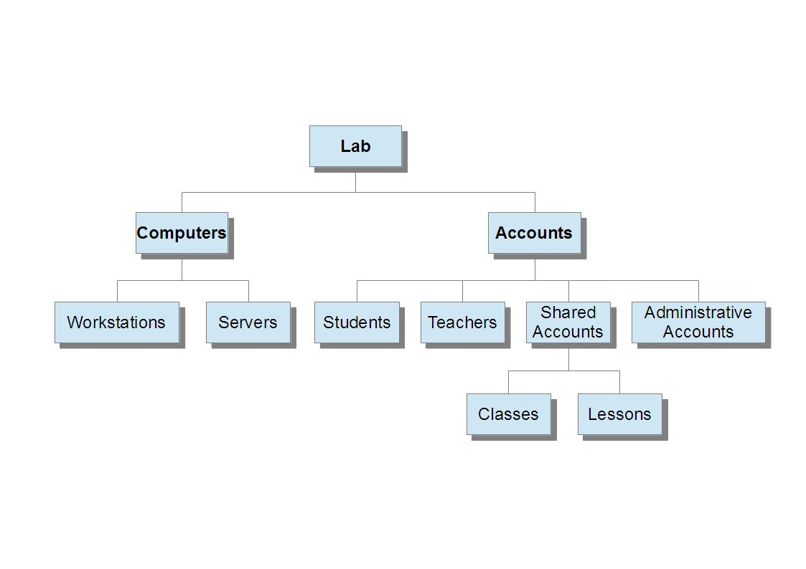

# Πολιτικές Domain

Σε κάθε σχολική μονάδα ο ενεργός κατάλογος (active directory) αναπτύσσεται σε ανεξάρτητο δέντρο (domain tree) και δάσος (domain forest) σε σχέση με τα υπόλοιπα σχολεία. Ο τομέας (Domain) είναι της μορφής <όνομα σχολείου>.<Νομαρχιακή Ενότητα>.priv.sch.gr πχ 2lyk-mesol.ait.priv.sch.gr. Η διαδικασία δημιουργίας της υποδομής Active Directory περιγράφεται στη συνέχεια.

## Δόμηση Domain

[](01-recommended-ou-schema.png)

Τα αντικείμενα του Active Directory Domain (υπολογιστές και λογαριασμοί χρηστών) εντάσσονται σε Οργανωτικές Μονάδες (Organizational Units – OUs), με σκοπό την ευκολότερη ρύθμιση των παραμέτρων λειτουργίας τους και επομένως την αυξημένη λειτουργικότητα, ασφάλεια και απόδοση. Οι ρυθμίσεις λειτουργίας εφαρμόζονται με Πολιτικές Ομάδας (Group Policies). Στο γειτονικό διάγραμμα απεικονίζεται η προτεινόμενη δόμηση του Active Directory σε οργανωτικές μονάδες (OU’s). Στη συνέχεια αναλύεται κάθε τμήμα του, ώστε να γίνει κατανοητός ο τρόπος με τον οποίο μπορεί να αξιοποιηθεί η εν λόγω δομή. Η προτεινόμενη δομή μπορεί να προσαρμοστεί ανάλογα με τις ανάγκες διαχείρισης και τις λειτουργικές απαιτήσεις του κάθε σχολείου.

Το domain **<όνομα σχολείου>.<Νομαρχιακή Ενότητα>.priv.sch.gr** πχ 2lyk-mesol.ait.priv.sch.gr, περιέχει μόνο το OU “Lab”, που περιλαμβάνει τους υπολογιστές και τους λογαριασμούς του σχολικού εργαστηρίου. Μπορεί μελλοντικά να ενσωματώσει επιπλέον OUs (π.χ. δεύτερο εργαστήριο, υπολογιστές και χρήστες γραφείων σχολείου) αν είναι επιθυμητή η επέκταση του domain σε όλο το σχολείο.

Κάτω από το OU “Computers” αποθηκεύονται μόνο οι υπολογιστές που ανήκουν στο σχολικό εργαστήριο και εφαρμόζονται μόνο τα τμήματα των group policies που αφορούν υπολογιστές (όπως και στα OU’s που βρίσκονται πιο χαμηλά στο δέντρο). Κάτω από το OU “Servers” αποθηκεύονται όλα τα υπολογιστικά συστήματα που παρέχουν κάποιο είδος υπηρεσίας στο εργαστήριο (π.χ. proxy server). Στην παρούσα μορφή των εργαστηρίων αυτό το OU δεν έχει μέλη, καθώς ο domain controller εξ’ ορισμού ανήκει σε ομώνυμο OU που βρίσκεται εκτός του δέντρου. Το OU “Workstations” περιέχει όλους τους σταθμούς εργασίας του σχολικού εργαστηρίου.

Κάτω από το OU “Accounts” αποθηκεύονται μόνο οι λογαριασμοί χρηστών του σχολικού εργαστηρίου και εφαρμόζονται μόνο τα τμήματα των group policies που αφορούν χρήστες (όπως και στα OU’s που βρίσκονται πιο χαμηλά στο δέντρο).

Σε ότι αφορά τους λογαριασμούς χρηστών υπάρχει ένα OU με τίτλο “Administrative accounts” με χρήστες με διαχειριστικά δικαιώματα, που μπορούν να χρησιμοποιηθούν από τον υπεύθυνο εργαστηρίου, τους τεχνικούς της ΤΣ ή οποιονδήποτε άλλο απαιτήσει τέτοιας μορφής πρόσβαση στο μέλλον. Στο OU “Template accounts” αποθηκεύονται πρότυποι λογαριασμοί, που μπορούν να χρησιμοποιηθούν για τη γρήγορη δημιουργία λογαριασμών που ανήκουν σε οποιαδήποτε άλλη κατηγορία (π.χ. μαθητών).

Το OU “Shared accounts” περιέχει τρία OUs. Στο “Classes” μπορούν να δημιουργηθούν κοινόχρηστοι λογαριασμοί για τους μαθητές ανάλογα με την τάξη ή το τμήμα στο οποίο ανήκουν (1st class, 2nd class κλπ). Στο “Lessons” είναι δυνατή με αντίστοιχο τρόπο η δημιουργία κοινόχρηστων λογαριασμών ανάλογα με το μάθημα για το οποίο γίνεται χρήση του εργαστηρίου (Physics, English κλπ).

Τα OUs “Teachers” και “Students” μπορούν να χρησιμοποιηθούν για τη δημιουργία προσωπικών λογαριασμών για καθηγητές () και μαθητές συγκεκριμένης τάξης (). Η αξιοποίησή του πολλαπλασιάζει τις παρεχόμενες δυνατότητες από το σχολικό εργαστήριο (π.χ. κάθε μαθητής μπορεί να έχει το δικό του χώρο αποθήκευσης αρχείων). Απαιτείται όμως να αφιερωθεί πολύ μεγαλύτερος χρόνος για τη διαχείριση του Active Directory από τον υπεύθυνο εργαστηρίου.

!!! tip "Συμβουλή"
    Είναι ευνόητο πως κάποιο μέρος του ανωτέρω δέντρου μπορεί να μην
    δημιουργηθεί, ανάλογα με τη μέθοδο αξιοποίησης του Active Directory που θα
    επιλέξει ο υπεύθυνος εργαστηρίου. Η ύπαρξη ενός τέτοιου υποδέντρου δεν
    επηρεάζει με κάποιο τρόπο τη λειτουργικότητα ή την ασφάλεια των
    πληροφοριακών συστημάτων. Για τη σωστή αξιοποίηση του εργαστηρίου κρίνεται
    καταρχήν αναγκαία η χρήση των OU’s “Workstations”, “Administrative
    accounts” & “Shared accounts”.

Η κονσόλα διαχείρισης ```Active Directory Users and Computers``` είναι το εργαλεία διαχείρισης του Active Directory και με το οποίο διαμορφώνεται η επιθυμητή δομής OUs. Είναι διαθέσιμη επιλέγοντας **`Windows Key`** ▸ ***Administrative Tools*** ▸ ***Active Directory Users and Computers***.

Στη συνέχεια επιλέγετε το προς διαμόρφωση domain **<όνομα σχολείου>.<Νομαρχιακή Ενότητα>.priv.sch.gr** πχ 2lyk-mesol.ait.priv.sch.gr και προσθέτουμε μια νέα οργανωτική μονάδα (OU) στον τομέα πχ 2lyk-mesol.ait.priv.sch.gr με  ***δεξί κλικ*** στο ***2lyk-mesol.ait.priv.sch.gr*** ▸ ***New*** ▸ ***Organizational Unit***. Προσθέτουμε την πρώτη οργανωτική μονάδα πχ με όνομα **Lab**. Αυτό επαναλαμβάνεται για όλες τις οργανωτικές μονάδες που περιγράψαμε προηγουμένως. Τελικά, από το γραφικό περιβάλλον της κονσόλας θα εμφανίζεται το διάγραμμα όλων των οργανωτικών μονάδων που δημιουργήθηκαν.

!!! warning "Προσοχή"
    Τα OUs δημιουργούνται εξ ορισμού με προστασία από κατά λάθος διαγραφή. Για τη διαγραφή τους πρέπει στην κονσόλα διαχείρισης ```Active Directory Users and Computers``` αρχικά να ενεργοποιηθούν τα  ***View*** ▸ ***Advanced Features*** και έπειτα στις ιδιότητες του OU στην καρτέλα “Object” να απενεργοποιηθεί η ρύθμιση ***☑ Protect container from accidental deletion***.

!!! powershell "PowerShell: Δημιουργία των απαραίτητων OUs"
    ```shell
    New-ADOrganizationalUnit -Name "Workstations" -Path "DC=2lyk-mesol,DC=priv,DC=sch,DC=gr"

    New-ADOrganizationalUnit -Name "Administrative accounts" -Path "DC=2lyk-mesol,DC=priv,DC=sch,DC=gr"

    New-ADOrganizationalUnit -Name "Shared accounts" -Path "DC=2lyk-mesol,DC=priv,DC=sch,DC=gr"
    ```
    Αντικαταστήστε το 2lyk-mesol με το όνομα του domain σας.

## Πολιτικές ομάδας (group policies)

Η πολιτική ομάδας (Group Policy) είναι ένα χαρακτηριστικό των Windows που διευκολύνει την παραμετροποίηση ενός μεγάλου αριθμού ποικίλων ρυθμίσεων από ένα σημείο (κεντρικά στον εξυπηρετητή) ώστε οι διαχειριστές να μπορούν να ελέγχουν πλήρως τόσο το περιβάλλον εργασίας των χρηστών όσο και τη λειτουργία των υπολογιστών.

Στην ουσία παρέχει στους διαχειριστές ένα κεντρικό τρόπο διαχείρισης:

- των λειτουργικών συστημάτων,
- των εφαρμογών και
- των ρυθμίσεων των χρηστών.

### Διαχείριση πολιτικών

Η διαχείριση των πολιτικών πραγματοποιείται ξεκινώντας την κονσόλα ```Group Policy Management``` από το **`Windows Key`** ▸ ***Administrative Tools*** ▸ ***Active Directory Users and Computers*** ▸ ***Group Policy Management*** , όπου επιλέγουμε το προς διαμόρφωση domain πχ 2lyk-mesol.ait.priv.sch.gr.

Σύμφωνα με την προτεινόμενη δομή του Active Directory σε OU’s, είναι δυνατή η εφαρμογή πολιτικών ομάδας (Group Policies - GPOs), για την εφαρμογή ρυθμίσεων λειτουργίας των λογαριασμών χρηστών και υπολογιστών του τομέα. Ο τομέας με τη δημιουργία του περιλαμβάνει τις ακόλουθες δύο πολιτικές:

- Default Domain Policy
- Default Domain Controllers Policy

Οι πολιτικές που εμείς δημιουργούμε καλό είναι στην ονομασία τους να ξεκινούν με το λεκτικό SEPEHY, ώστε να διαχωρίζονται εύκολα από τις προϋπάρχουσες (default) πολιτικές, τις οποίες καλό είναι να μην τροποποιούμε. Στις επόμενες ενότητες αναφέρονται αναλυτικά οι ρυθμίσεις που προτείνεται να εφαρμοστούν:

- στα Shared Accounts (SEPEHY Shared Accounts Policy)
- στα Accounts (SEPEHY Accounts Policy)
- στους λογαριασμούς Administrator και Guest (SEPEHY Rename Administrator Policy)
- στα Workstations (SEPEHY Workstations Policy).

Όλες οι πολιτικές ομάδας δημιουργούνται και αποθηκεύονται στο ***Group Policy Objects*** μέσα στο 2lyk-mesol.ait.priv.sch.gr, με  ***δεξί click*** στο ***Group Policy Objects*** ▸ ***New***  και εισάγοντας το όνομα της εκάστοτε πολιτικής. 

!!! tip "Συμβουλή"
    Μία πολιτική εφαρμόζεται σε ένα OU με τη δημιουργία ενός συνδέσμου (Link) της πολιτικής μέσα στο OU.

Η σύνδεση μιας πολιτικής με ένα OU πραγματοποιείται με  ***δεξί click στο OU*** ▸ ***Link an existing GPO...***. Mία πολιτική μπορεί να εφαρμοστεί σε πολλά OUs, έχοντας ένα σύνδεσμο σε καθένα από αυτά. Επίσης σε ένα OU μπορούν να εφαρμοστούν πολλές πολιτικές εάν δημιουργηθούν πολλοί σύνδεσμοι στο OU.

!!! tip "Συμβουλή"
    Οι ρυθμίσεις μιας πολιτικής τροποποιούνται με  ***δεξί click στην πολιτική*** ▸ ***Edit...***. Μία πολιτική μπορεί να περιέχει ρυθμίσεις τόσο για λογαριασμούς χρηστών όσο και για υπολογιστές. Εάν περιέχει ρυθμίσεις μόνο για υπολογιστές μπορούμε να απενεργοποιήσουμε το τμήμα ρυθμίσεων των λογαριασμών χρηστών και επομένως να εξοικονομήσουμε το χρόνο της επεξεργασίας τους από το Domain Controller, με  ***δεξί click στην πολιτική*** ▸ ***GPO Status*** ▸ ***User Configuration Settings Disabled*** . Αντίστροφα εάν περιέχει μόνο ρυθμίσεις λογαριασμών χρηστών μπορούμε να απενεργοποιήσουμε το τμήμα των ρυθμίσεων υπολογιστών με  ***δεξί click στην πολιτική*** ▸ ***GPO Status*** ▸ ***Computer Configuration Settings Disabled***.

### Αντίγραφα ασφαλείας / επαναφορά / εισαγωγή πολιτικών ομάδας

Η δημιουργία πολιτικών με μεγάλο αριθμό ρυθμίσεων είναι μια αρκετά χρονοβόρα διαδικασία. Είναι επομένως σημαντικό να λαμβάνουμε αντίγραφα (backup) των πολιτικών σε περίπτωση που τις σβήσουμε από λάθος ή στην περίπτωση που θέλουμε να αναιρέσουμε άμεσα μεγάλο αριθμό ανεπιθύμητων αλλαγών.

Μία άλλη σημαντική λειτουργία είναι η εισαγωγή ρυθμίσεων (Import Settings) από πολιτικές που έχουν δημιουργηθεί σε διαφορετικούς τομείς (domains) ή δέντρα τομέων (forests).

!!! warning "Προσοχή"
    Αντίθετα με διαδικασία εισαγωγής ρυθμίσεων, η διαδικασία restore αφορά μόνο σε πολιτικές που έχουν δημιουργηθεί στο ίδιο domain και forest με το δικό μας.

Μπορούμε να λάβουμε αντίγραφα των πολιτικών μας από την κονσόλα ```Group Policy Management``` με  ***δεξί click στο Group Policy Objects*** ▸ ***Backup all...***, όπου επιλέγουμε φάκελο αποθήκευσης. Για να λάβουμε αντίγραφο από μία μόνο πολιτική ακολουθούμε την ίδια διαδικασία, κάνοντας δεξί click μόνο στην πολιτική που μας ενδιαφέρει.

Επαναφέρουμε μια δική μας πολιτική από την κονσόλα ```Group Policy Management``` με  ***δεξί click στο Group Policy Objects*** ▸ ***Manage Backups***, όπου ανοίγουμε το διάλογο διαχείρισης των υπαρχόντων αντιγράφων. Ορίζουμε το φάκελο που βρίσκονται τα αντίγραφα, επιλέγουμε το επιθυμητό αντίγραφο και πατάμε ***Restore***. Κατόπιν ενεργοποιούμε την πολιτική δημιουργώντας Links προς τα OUs στα οποία αυτή θα εφαρμοστεί.

### Εισαγωγή προτεινόμενων πολιτικών ασφαλείας

Για διευκόλυνση ενεργοποίησης των προτεινόμενων πολιτικών προσφέρονται αντίγραφα ασφαλείας των [SEPEHY Shared Accounts Policy και SEPEHY Workstations Policy](https://ts.sch.gr/docs/odigies-egkatastasis-diaxirisis/344-sepehy-w2k8-gpo), τα οποία μπορείτε να εισάγετε στο domains σας μέσω της εισαγωγής ρυθμίσεων. Η διαδικασία εισαγωγής είναι η ακόλουθη:

- Αποσυμπιέζουμε τα αρχεία πολιτικών ομάδας σε κάποιο φάκελο.
- Από την κονσόλα ```Group Policy Management``` δημιουργούμε τις προτεινόμενες πολιτικές ως ονόματα. Κατόπιν με ***δεξί click στην κάθε πολιτική*** ▸ ***Import Settings...***.
- Στο παράθυρο του Wizard επιλέγουμε ***Next***
- Εφόσον δεν έχουμε τροποποιήσει τις πολιτικές προχωράμε χωρίς να πάρουμε Backup επιλέγοντας ***Next***
- Eπιλέγουμε το φάκελο που βρίσκονται τα αντίγραφα
- Επιλέγουμε ***Next***
- Επιλέγουμε τη συγκεκριμένη πολιτική με τις ρυθμίσεις που μας ενδιαφέρουν.
- Επιλέγουμε ***Next***, ***Next***, ***Finish*** και ***OK***.

!!! powershell "PowerShell: Εισαγωγή των προτεινόμενων πολιτικών ασφαλείας"
    import-gpo -BackupGpoName "SEPEHY Shared Accounts Policy" -TargetName "SEPEHY Shared Accounts Policy" -path c:\backups

    New-GPLink -Target "OU=Lab,OU=Accounts,OU=Shared-Accounts,DC=2gym-mesol,DC=ait,DC-sch,DC=gr" -Name "SEPEHY Shared Accounts Policy" -LinkEnabled Yes -Enforced Yes -Order 1
