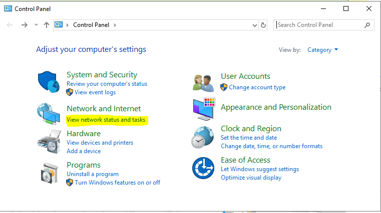

# Βασικές ρυθμίσεις εξυπηρετητή

Για την εύρυθμη λειτουργία του εξυπηρετητή του σχολικού εργαστηρίου κρίνεται απαραίτητη η πραγματοποίηση των ακόλουθων ρυθμίσεων.

## Ενεργοποίηση απομακρυσμένης πρόσβασης (Remote Desktop - για διαχειριστές)

Προκειμένου να είναι εφικτή η απομακρυσμένη διαχείριση του εξυπηρετητή (με αξιοποίηση του πρωτοκόλλου [RDP](https://en.wikipedia.org/wiki/Remote_Desktop_Protocol)) πρέπει να είναι ενεργοποιημένη η προσφερόμενη υπηρεσία των Windows:

[](01-enable-remote-desktop.png)

- Από το `Server Manager` επιλέγουμε ***Local Server*** και στη συνέχεια ***Remote Desktop: Disabled*** ώστε να την ενεργοποιήσουμε.

!!! tip "Πληροφορία"
    Εναλλακτικά με ***δεξί κλικ*** στο  ***This PC***  επιλέγουμε  ***Properties*** ▸ ***Remote Settings***

[](02-allow-fw-remote-desktop-.png)

- Στις ιδιότητες συστήματος επιλέγουμε ***Allow remote connections to this computer***.
- Επιλέγουμε ***OK*** ώστε να είναι εφικτή η απομακρυσμένη πρόσβαση στον εξυπηρετητή από όλα τα δίκτυα που είναι συνδεδεμένος ο εξυπηρετητής.
- Αφήνουμε ενεργή την επιλογή ***Allow Connections only from computers running Remote Desktop with Network Level Authentication (recommended)***

[](03-remote-desktop-users.png)

- Με αυτόν τον τρόπο ενεργοποιείται η δυνατότητα Remote Desktop στον εξυπηρετητή και επιτρέπει εξ’ ορισμού την πρόσβαση σε όσους ανήκουν στο group **Administrators** καθώς και σε όσους λογαριασμούς χρηστών ή ομάδες χρηστών προσθέσετε με το ***Add***

!!! tip clear "PowerShell: Ενεργοποίηση Remote Desktop"
    ```shell
    Set-ItemProperty -Path 'HKLM:\System\CurrentControlSet\Control\Terminal Server' -name "fDenyTSConnections" -value 0

    Enable-NetFirewallRule -DisplayGroup "Remote Desktop"
    ```

## Ενεργοποίηση υπηρεσίας διαμοιρασμού αρχείων και εκτυπωτών

### Ενεργοποίηση διαμοιρασμού αρχείων και εκτυπωτών στο τοπικό δίκτυο

[](04-Enable-File-and-Print-Sharing.png)
[](05-Enable-File-and-Print-Sharing-2.png)

Αρχικά θα πρέπει να ενεργοποιηθεί ο διαμοιρασμός αρχείων και εκτυπωτών για το τοπικό δίκτυο που έχει χαρακτηριστεί ιδιωτικό (private) [σε προηγούμενο βήμα](../server-installation/index.md/#private-network).

- Ανοίξτε τον Πίνακα Ελέγχου (Control Panel).
- Στην ενότητα **Network and Internet**, επιλέξτε ***View Network Status and tasks***

- Επιλέξτε ***Change Advanced sharing settings***
- Στο ιδιωτικό προφιλ, επιλέξτε **Turn on file and printer sharing**

!!! tip clear "PowerShell: Ενεργοποίηση File and Print Sharing"
    ```shell
    Set-NetFirewallRule -DisplayGroup "File And Printer Sharing" -Enabled True -Profile Private
    ```

### Διαμοιρασμός του καταλόγου Users

[](06-share-folder-users.png)
[](07-share-folder-users-permission.png)

Όπως έχει ήδη αναφερθεί στην ενότητα εγκατάστασης του εξυπηρετητή - ρύθμισης των διαμερίσεων, υπάρχει μία διαμέριση για την αποθήκευση των αρχείων των χρηστών και των κοινόχρηστων αρχείων.

- Στη διαμέριση αυτή δημιουργήστε έναν φάκελο με όνομα **Users**.
- Διαμοιράστε το φάκελο επιλέγοντάς τον ***Users*** ▸ ***δεξί κλικ*** ▸ ***Properties*** ▸ ***Sharing*** ▸ ***Advanced Sharing*** 
- Επιλέξτε **Share this folder**
- Ως διαμοιραζόμενο όνομα (Share Name) δώστε: **Users**
- Επιλέξτε ***Permissions*** και δώστε άδειες στο Group Everyone **Full Control**
- Πατήστε το πλήκτρο ***OK*** δύο φορές για να αποδεχτείτε τις αλλαγές

!!! info clear "Πληροφορία"
    - Η τοπική ομάδα (local group) Users του εξυπηρετητή έχει δικαιώματα ανάγνωσης στον συγκεκριμένο κατάλογο.
    - Ο φάκελος Users πλέον διαμοιράζεται και είναι προσβάσιμος στο σταθμό εργασίας ή στον εξυπηρετητή πατώντας **`Ctrl`**+**`R`** και πληκτρολογώντας την εντολή **\\\srv-2lyk-mesol\users**

!!! tip clear "PowerShell: Διαμοιρασμός φακέλου Users"
    ```shell
    mkdir g:\users

    New-SmbShare -Name "Users" -Path "G:\users" -FullAccess "Everyone"
    ```

### Διαμοιρασμός εκτυπωτή

Κατά την εγκατάσταση του εκτυπωτή το σύστημα σας ζητά να δηλώσετε εάν θέλετε να τον διαμοιράσει. Σε περίπτωση θετικής απάντησης ο εκτυπωτής διαμοιράζεται δικτυακά. Αν έχετε επιλέξει όχι, μπορείτε επιλέγοντας  ***Windows Start*** ▸ ***Settings*** ▸ ***Devices*** ▸ ***<Όνομα Εκτυπωτή>***  να επιλέξετε τον εκτυπωτή που έχετε εγκαταστήσει (ή να προσθέσετε έναν καινούριο εκτυπωτή) και κατόπιν να επιλέξετε  ***Manage*** ▸ ***Printer Properties*** ▸ ***Καρτέλα Sharing***  να ενεργοποιήσετε το διαμοιρασμό του.

Οι χρήστες που έχουν λογαριασμό στον εξυπηρετητή αυτομάτως θα μπορούν να τυπώσουν στον διαμοιραζόμενο εκτυπωτή.

