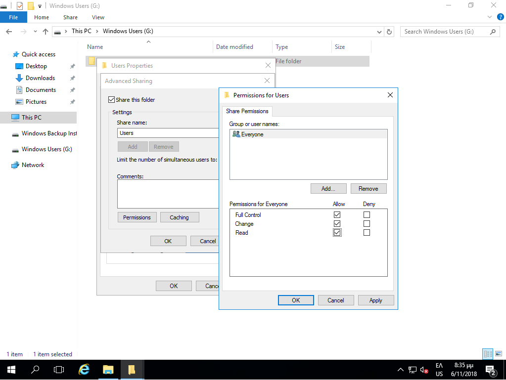
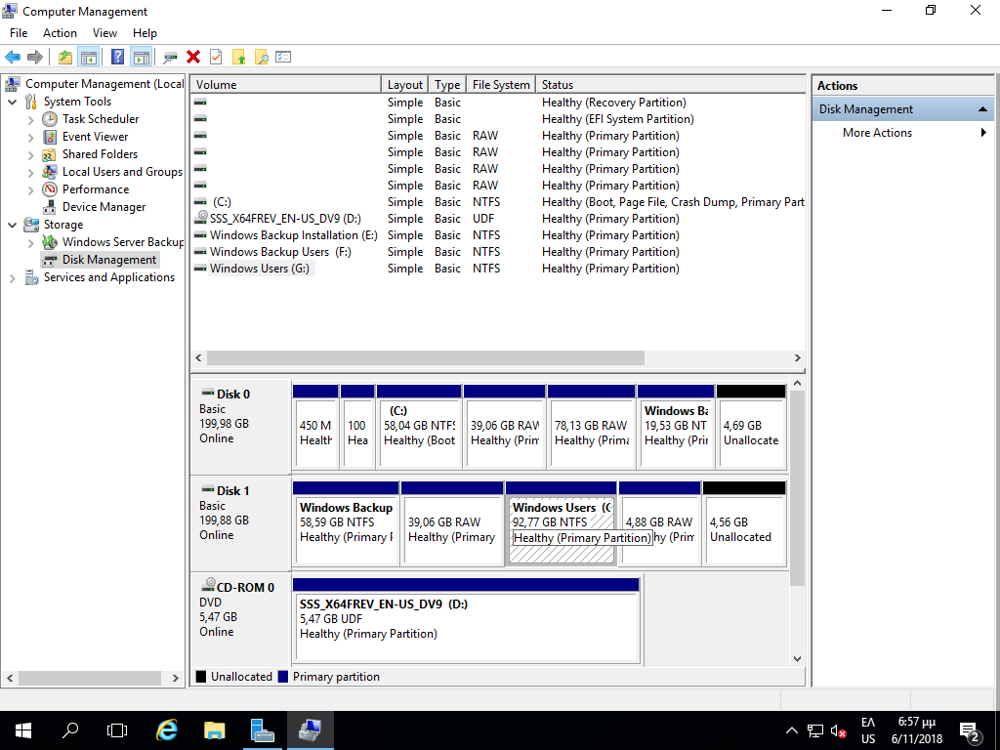
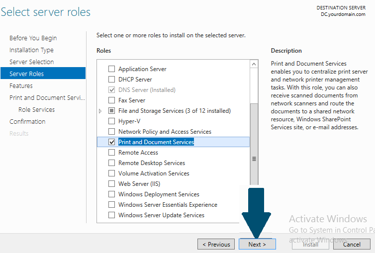
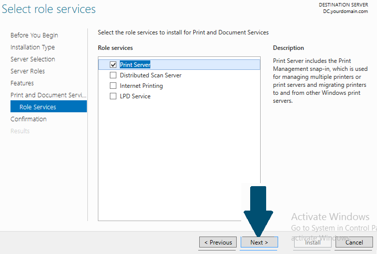

# Βασικές ρυθμίσεις εξυπηρετητή

Για την εύρυθμη λειτουργία του εξυπηρετητή του σχολικού εργαστηρίου κρίνεται απαραίτητη η πραγματοποίηση των ακόλουθων ρυθμίσεων.

## Ενεργοποίηση απομακρυσμένης πρόσβασης (Remote Desktop - για διαχειριστές)

Προκειμένου να είναι εφικτή η απομακρυσμένη διαχείριση του εξυπηρετητή (με αξιοποίηση του πρωτοκόλλου [RDP](https://en.wikipedia.org/wiki/Remote_Desktop_Protocol)) πρέπει να είναι ενεργοποιημένη η προσφερόμενη υπηρεσία των Windows:

[](01-enable-remote-desktop.png)

- Από το `Server Manager` επιλέγουμε ***Local Server*** και στη συνέχεια ***Remote Desktop: Disabled*** ώστε να την ενεργοποιήσουμε.

!!! tip "Πληροφορία"
    Εναλλακτικά με ***δεξί κλικ*** στο  ***This PC***  επιλέγουμε  ***Properties*** ▸ ***Remote Settings***

[](02-allow-fw-remote-desktop-.png)

- Στις ιδιότητες συστήματος επιλέγουμε ***Allow remote connections to this computer***.
- Επιλέγουμε ***OK*** ώστε να είναι εφικτή η απομακρυσμένη πρόσβαση στον εξυπηρετητή από όλα τα δίκτυα που είναι συνδεδεμένος ο εξυπηρετητής.
- Αφήνουμε ενεργή την επιλογή ***Allow Connections only from computers running Remote Desktop with Network Level Authentication (recommended)***

[](03-remote-desktop-users.png)

- Με αυτόν τον τρόπο ενεργοποιείται η δυνατότητα Remote Desktop στον εξυπηρετητή και επιτρέπει εξ’ ορισμού την πρόσβαση σε όσους ανήκουν στο group **Administrators** καθώς και σε όσους λογαριασμούς χρηστών ή ομάδες χρηστών προσθέσετε με το ***Add***

!!! powershell clear "PowerShell: Ενεργοποίηση Remote Desktop"
    ```shell
    Set-ItemProperty -Path 'HKLM:\System\CurrentControlSet\Control\Terminal Server' -name "fDenyTSConnections" -value 0

    Enable-NetFirewallRule -DisplayGroup "Remote Desktop"
    ```

## Ενεργοποίηση υπηρεσίας διαμοιρασμού αρχείων και εκτυπωτών

### Ενεργοποίηση διαμοιρασμού αρχείων και εκτυπωτών στο τοπικό δίκτυο

[](04-Enable-File-and-Print-Sharing.png)
[](05-Enable-File-and-Print-Sharing-2.png)

Αρχικά θα πρέπει να ενεργοποιηθεί ο διαμοιρασμός αρχείων και εκτυπωτών για το τοπικό δίκτυο που έχει χαρακτηριστεί ιδιωτικό (private) [σε προηγούμενο βήμα](../server-installation/#private-network).

- Ανοίξτε τον Πίνακα Ελέγχου (Control Panel).
- Στην ενότητα **Network and Internet**, επιλέξτε ***View Network Status and tasks***

- Επιλέξτε ***Change Advanced sharing settings***
- Στο ιδιωτικό προφιλ, επιλέξτε **Turn on file and printer sharing**

!!! powershell clear "PowerShell: Ενεργοποίηση File and Print Sharing"
    ```shell
    Set-NetFirewallRule -DisplayGroup "File And Printer Sharing" -Enabled True -Profile Private
    ```

### Διαμοιρασμός του καταλόγου Users

[](06-share-folder-users.png)
[](07-share-folder-users-permission.png)

Όπως έχει ήδη αναφερθεί στην ενότητα εγκατάστασης του εξυπηρετητή - ρύθμισης των διαμερίσεων, υπάρχει μία διαμέριση για την αποθήκευση των αρχείων των χρηστών και των κοινόχρηστων αρχείων.

- Στη διαμέριση αυτή δημιουργήστε έναν φάκελο με όνομα **Users**.
- Διαμοιράστε το φάκελο επιλέγοντάς τον ***Users*** ▸ ***δεξί κλικ*** ▸ ***Properties*** ▸ ***Sharing*** ▸ ***Advanced Sharing*** 
- Επιλέξτε **Share this folder**
- Ως διαμοιραζόμενο όνομα (Share Name) δώστε: **Users**
- Επιλέξτε ***Permissions*** και δώστε άδειες στο Group Everyone **Full Control**
- Πατήστε το πλήκτρο ***OK*** δύο φορές για να αποδεχτείτε τις αλλαγές

!!! info clear "Πληροφορία"
    - Η τοπική ομάδα (local group) Users του εξυπηρετητή έχει δικαιώματα ανάγνωσης στον συγκεκριμένο κατάλογο.
    - Ο φάκελος Users πλέον διαμοιράζεται και είναι προσβάσιμος στο σταθμό εργασίας ή στον εξυπηρετητή πατώντας **`Ctrl`**+**`R`** και πληκτρολογώντας την εντολή **\\\srv-2lyk-mesol\users**

!!! powershell "PowerShell: Διαμοιρασμός φακέλου Users"
    ```shell
    mkdir g:\users

    New-SmbShare -Name "Users" -Path "G:\users" -FullAccess "Everyone"
    ```

### Διαμοιρασμός εκτυπωτή

[](09-printer-sharing.png)

Κατά την εγκατάσταση του εκτυπωτή το σύστημα σας ζητά να δηλώσετε εάν θέλετε να τον διαμοιράσει. Σε περίπτωση θετικής απάντησης ο εκτυπωτής διαμοιράζεται δικτυακά. Αν έχετε επιλέξει όχι, μπορείτε επιλέγοντας  ***Windows Start*** ▸ ***Settings*** ▸ ***Devices*** ▸ ***<Όνομα Εκτυπωτή>***  να επιλέξετε τον εκτυπωτή που έχετε εγκαταστήσει (ή να προσθέσετε έναν καινούριο εκτυπωτή) και κατόπιν να επιλέξετε  ***Manage*** ▸ ***Printer Properties*** ▸ ***Καρτέλα Sharing***  να ενεργοποιήσετε το διαμοιρασμό του.

Οι χρήστες που έχουν λογαριασμό στον εξυπηρετητή αυτομάτως θα μπορούν να τυπώσουν στον διαμοιραζόμενο εκτυπωτή.

!!! info clear "Πληροφορία"
    Για εγκατάσταση εκτυπωτών δείτε στο [περιφερειακά/εκτυπωτές](../peripherals/printers.md)

## Ενεργοποίηση υπηρεσίας shadow copies

Στις εκδόσεις των λειτουργικών συστημάτων Microsoft Windows Server από την
έκδοση 2003 και μετά ενσωματώθηκε μια πολύ χρήσιμη λειτουργικότητα με την
ονομασία **Shadow copies of shared folders**. Αυτή η δυνατότητα επιτρέπει την
αντιμετώπιση του φαινομένου της απώλειας δεδομένων σε διαμοιραζόμενους (shared)
φακέλους μετά από εσφαλμένη διαγραφή ή τροποποίηση αρχείων από τους χρήστες.
Αυτό επιτυγχάνεται με την αυτόματη δημιουργία κρυμμένων αντιγράφων (shadow
copies) των αρχείων που ανήκουν σε διαμοιραζόμενους φακέλους, ανά τακτά χρονικά
διαστήματα.

!!! tip "Συμβουλή"
    Προτείνεται η ενεργοποίηση της δυνατότητας τουλάχιστον στην κατάτμηση που
    περιέχει τα αρχεία των χρηστών, αλλά και σε οποιαδήποτε άλλη κατάτμηση
    υπάρχουν διαμοιραζόμενοι φάκελοι που χρειάζονται προστασία.

[](010-shadow-copies-via-server-manager.png)
{.clear}

Η υπηρεσία μπορεί να ρυθμιστεί από το εργαλείο διαχείρισης `Server Manager`, επιλέγοντας από το μενού ***Tools*** ▸ ***Computer Management***  και κατόπιν επιλέγοντας ***Disk Management***.  

[](11-shadow-copies-select-disk.png)  
{.clear}

Στη συνέχεια επιλέγετε τη διαμέριση που αντιστοιχεί στα αρχεία των χρηστών (στο παράδειγμα: Windows Users, δηλ. η 3η διαμέριση του 2ου δίσκου) και ***δεξί κλικ*** ▸ ***Properties***.  

[](12-shadow-copies-enable.png)
{.clear}

Επιλέγετε το tab **Shadow Copies** και κατόπιν το κουμπί ***Enable***.  

[](13-shadow-copies-schedule.png)
{.clear}

Με την επιλογή ενεργοποίησης εμφανίζεται προειδοποιητικό μήνυμα αποδοχής, το οποίο αποδέχεστε πατώντας το κουμπί ***Yes***.  

[](14-shadow-copies-settings.png)
{.clear}

Αποδεχθείτε τις προκαθορισμένες ρυθμίσεις πατώντας το ***Yes***, είτε τις αλλάζετε πατώντας το ***Settings***  

[](15-shadow-copies-size.png)
{.clear}

Σε κάθε κατάτμηση που επιλέγεται εκ προοιμίου χώρος για τη λήψη αντιγράφων ίσος με το 10% του μεγέθους της.
Στην περίπτωση που επιλέξετε να αλλάξετε τις προκαθορισμένες ρυθμίσεις, μπορείτε να ορίσετε το μέγιστο μέγεθος που θα χρησιμοποιείται για την αποθήκευση των Shadow Copies και επιπλέον πατώντας το ***Schedule*** μπορείτε να αλλάξετε το πότε θα λαμβάνονται τα αντίγραφα.  

[](16-shadow-copies-schedule.png)
{.clear}

Τροποποιείστε το υπάρχον χρονοδιάγραμμα ώστε καθημερινά να λαμβάνονται αντίγραφα στις 07:00, αν δεν υπάρχουν ιδιαιτερότητες στο ωράριο λειτουργίας του εργαστηρίου που καθιστούν αναγκαίο κάποιο διαφορετικό χειρισμό.

!!! info clear "Πληροφορία"
    Η ανάκτηση προηγούμενων εκδόσεων αρχείων από τα ληφθέντα shadow copies πραγματοποιείται:
    - Aπό την κονσόλα του εξυπηρετητή πατώντας **`Ctrl`**+**`R`** και πληκτρολογώντας την εντολή **\\\\\<server-name>\\\<driveletter>$**, όπου **\<drive-letter>** η κατάτμηση όπου βρίσκεται ο διαμοιραζόμενος φάκελος από τον οποίο θέλουμε να ανακτήσουμε αρχεία.
    - Από κάποιον σταθμό εργασίας πληκτρολογώντας **\\\\srv-2lyk-mesol**.
    - Και στις δύο περιπτώσεις πατήστε ***δεξί κλικ*** στο drive ή στο φάκελο, κατόπιν επιλέξτε το tab **Previous Versions** και τέλος το κουμπί ***Restore***.

!!! powershell "PowerShell: Ενεργοποίηση Shadow Copies στη διαμέριση των χρηστών G:"
    ```shell
    vssadmin add shadowstorage /for=G: /on=G: /maxsize=10%

    vssadmin create shadow /for=G:

    $Action=new-scheduledtaskaction -execute "c:\windows\system32\vssadmin.exe" -Argument "create shadow /for=G:"

    $Trigger=new-scheduledtasktrigger -daily -at 7:00AM

    Register-ScheduledTask -TaskName ShadowCopy -Trigger $Trigger -Action $Action -Description "ShadowCopy of Users"
    ```

## Ενεργοποίηση υπηρεσίας κεντρικής εκτύπωσης - Print Server

Ο εξυπηρετητής του Σ.Ε.Π.Ε.Η.Υ. μπορεί να ρυθμιστεί ώστε να διαμοιράζει και να
ενεργοποιήσει αυτόματα όλους τους συνδεδεμένους σε αυτόν εκτυπωτές στους
σταθμούς εργασίας του Active Directory Domain. Το πλεονέκτημα αυτής της
ρύθμισης είναι ότι οι εκτυπωτές εμφανίζονται και στο Active Directory και οι
χρήστες μπορούν να συνδεθούν στο σωστό εκτυπωτή και επιπλέον η εγκατάσταση του
εκτυπωτή και των οδηγών του δεν απαιτεί διαχειριστικά προνόμια στους σταθμούς
εργασίας (αντιγράφονται οι οδηγοί που έχουν δηλωθεί στον Printer Server για κάθε έκδοση Windows). Πρέπει να πραγματοποιηθούν τα ακόλουθα βήματα:

- Ενεργοποίηση ρόλου Print Server
- Δημιουργία εκτυπωτών στον εξυπηρετητή.
- Ενεργοποίηση των εκτυπωτών του εξυπηρετητή στους σταθμούς εργασίας του domain με τη βοήθεια Group Policies.

### Ενεργοποίηση ρόλου Print Server

[](17-Print-and-Document-Services-role-install.png)

[](18-Print-Server-install.png)

- Από το `Server Manager` επιλέγετε ***Add roles and features*** και κατόπιν ***Role-based or feature-based installation*** και το όνομα του εξυπηρετητή και πατάτε ***Next***
- Στο παράθυρο **Add Roles and Features Wizard** επιλέγετε το ρόλο **Print and Document Services** και πατάτε το ***Add Features*** και κατόπιν το ***Next***
- Στο παράθυρο **Select Features** πατάτε ***Next***
- Στο παράθυρο **Print and Document Services** πατάτε ***Next***
- Στο παράθυρο **Role Services** επιλέγετε ***Print Server***
- Στο παράθυρο **Select Role Services** πατάτε ***Next***
- Στο παράθυρο **Confirm installation selections** πατάτε ***Install***

!!! powershell clear "PowerShell: Ενεργοποίηση ρόλου Print Server"
    ```shell
    Install-WindowsFeature Print-Services
    ```
    
!!! info "Πληροφορία"
    - Σε περίπτωση που διαθέτετε και άλλα συστήματα με Λ/Σ διαφορετικά από Windows, για να τυπώσετε θα πρέπει να έχετε ενεργό το πρωτόκολλο **SMB** (Samba Client), πχ. στο Ubuntu Linux αυτό είναι ενεργό. 
    
    - Εάν η υποστήριξη SMB δεν είναι δυνατή, τότε μπορείτε στο παράθυρο **Role Services** (κατά την ενεργοποίηση του Print Server) να προσθέσετε εκτός του ***Print Server*** και τους ρόλους ***Internet Printing*** ή/και ***LPD Service*** και να εκτυπώσετε είτε με χρήση του **IPP** πρωτοκόλλου είτε με χρήση του **LPR** πρωτοκόλλου.

### Προσθήκη εκτυπωτών στον Print Server

Από την εφαρμογή `Server Manager` και το μενού  ***Roles*** ▸ ***Print and Document Services*** ▸ ***Print Management*** ▸ ***Print Servers*** ▸ ***SERVER*** ανοίγουμε τη διαχείριση του Print Server και προσθέτουμε τους εκτυπωτές που είναι συνδεμένοι στον εξυπηρετητή. Η διαδικασία περιλαμβάνει:

[](19-Print-Server-add-printer.png)

- Προσθήκη και ρύθμιση των θυρών (**Ports**) με τις οποίες συνδέεται ο εκτυπωτής, πχ LPT1, USB κτλ αν πρόκειται για τοπικό εκτυπωτή, TCP/IP αν πρόκειται για δικτυακό εκτυπωτή.
- Προσθήκη των οδηγών (**Drivers**) του εκτυπωτή. Εκτός από x64, μπορείτε να προσθέσετε και τους x86 αν έχετε παλιές εκδόσεις Windows, με  δεξί κλικ στον επιθυμητό εκτυπωτή ▸ ***Manage Sharing*** ▸ ***Additional Drivers***
- Προσθήκη εκτυπωτή (**Printers**) και ρύθμιση των παραμέτρων του (όπως εκτύπωση σε Α4, διπλής όψης, σύνδεση με θύρα και οδηγό κτλ). Χρήσιμο είναι να επιλέξετε να εμφανίζεται ο εκτυπωτής στο Active Directory **List in Active Directory**, ώστε να μπορούν οι χρήστες να τον αναζητούν και να τον εγκαθιστούν αυτόματα.

!!! powershell "PowerShell: Διαχείριση εκτυπωτών στον Print Server"
    Υπάρχουν [οι ακόλουθες εντολές](https://docs.microsoft.com/en-us/powershell/module/printmanagement/?view=windowsserver2022-ps&viewFallbackFrom=win10-ps) για την ολοκλήρωση των παραπάνω ενεργειών με χρήση powershell.

!!! info clear "Πληροφορία"
    - Οι χρήστες μπορούν να εγκαταστήσουν τους εκτυπωτές στους σταθμούς εργασίας:
    
        - είτε από το ***Control Panel*** ▸ ***Devices and Printers*** ▸ ***Add a printer***, 
        - είτε με [UNC](https://docs.microsoft.com/en-us/openspecs/windows_protocols/ms-dtyp/62e862f4-2a51-452e-8eeb-dc4ff5ee33cc) σύνδεση στον εξυπηρετητή, πχ \\\\srv-2lyk-mesol και κατόπιν ***δεξί κλικ*** σε κάποιον από τους διαμοιραζόμενους εκτυπωτές και ***Εγκατάσταση***.

    - Η εγκατάσταση του εκτυπωτή, των οδηγών του κτλ στους σταθμούς εργασίας δεν απαιτεί διαχειριστικά προνόμια.

### Δημιουργία πολιτικής για αυτόματη εγκατάσταση εκτυπωτών στους σταθμούς εργασίας

Για να εγκαθίστανται αυτόματα οι εκτυπωτές στους σταθμούς εργασίας, θα πρέπει να ενεργοποιηθεί σε επίπεδο Group Policy:

- Δεξί κλικ στον εκτυπωτή που δημιουργήσαμε και επιλέγουμε ***Deploy with Group Policy...***, κάνουμε Browse και επιλέγουμε την πολιτική με την οποία θα γίνει η αυτόματη εγκατάσταση εκτυπωτών (π.χ. με την SEPEHY Workstations Policy), επιλέγουμε εάν η εφαρμογή θα γίνει για τους χρήστες για τους οποίους εφαρμόζεται η πολιτική (per user) ή για τους σταθμούς εργασίας (per machine) και πατάμε ***Add*** και ***Apply***.
- Με την εφαρμογή της πολιτικής και στην επόμενη επανεκκίνηση του σταθμού εργασίας προστίθενται οι εκτυπωτές που έχουμε ορίσει.
