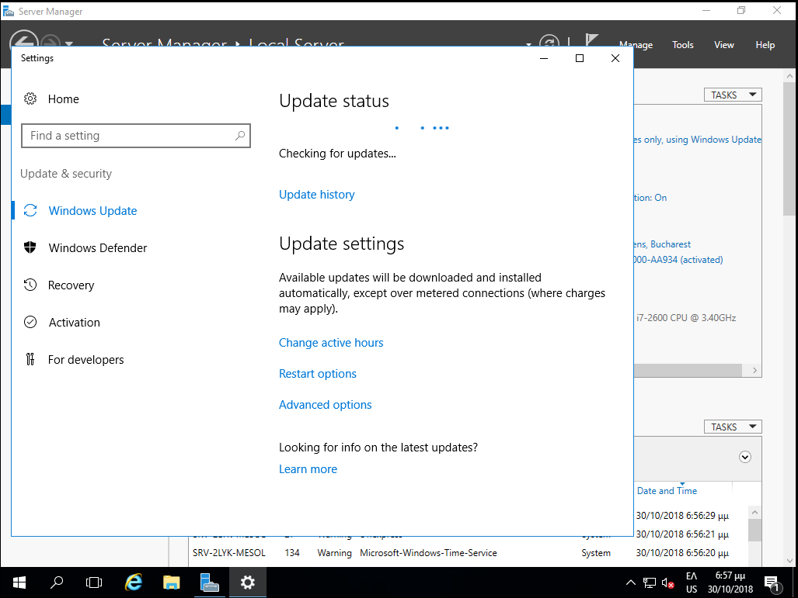
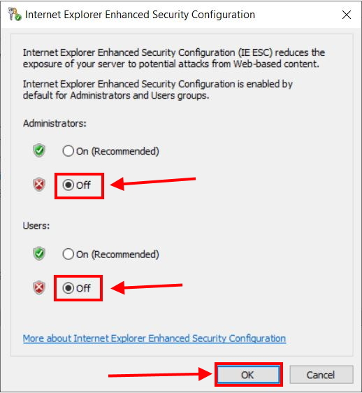

# Εγκατάσταση εξυπηρετητή

Τοποθετήστε το CD/DVD/USB εγκατάστασης MS-Windows Server στον εξυπηρετητή και
ρυθμίστε το UEFI ή το BIOS (ή πατήστε **`F12`** για να βγει το boot menu) ώστε να
ξεκινάει από αυτό. Στους διαλόγους που θα εμφανιστούν, κάντε τις παρακάτω
επιλογές.

!!! tip "Πληροφορία"
    Σε περίπτωση που δεν διαθέτετε μέσα εγκατάστασης, μπορείτε να "κατεβάσετε"
    ένα evaluation σε μορφή ISO από την [ιστοσελίδα της
    Microsoft](https://www.microsoft.com/en-us/evalcenter/evaluate-windows-server-2019).

## 1. Προετοιμασία εγκατάστασης

### Εκκίνηση από το CD/DVD/USB [](01-boot-from-media.png)

Πατήστε οποιοδήποτε πλήκτρο για να πραγματοποιηθεί η εκκίνηση από το CD/DVD/USB

### Φόρτωση των απαραίτητων αρχείων[](02-boot-in-progress.png)

Η διαδικασία δεν απαιτεί κάποια παρέμβαση από το χρήστη.

### Έναρξη εγκατάστασης των Windows [](03-boot-in-progress.png)

Αρχικά, η διαδικασία δεν απαιτεί κάποια παρέμβαση από το χρήστη

## 2. Ρύθμιση γλώσσας[](04-language-settings.png)

Κατά την αρχική εγκατάσταση ζητείται η ρύθμιση των Time and currency format,
  διαλέξτε ***Greek (Greece)*** και Keyboard or input method, επιλέξτε
  ***US***.

## 3. Εκκίνηση Εγκατάστασης[](05-install-now.png)

Επιλέξτε ***Install Now***

## 4. Επιλογή λειτουργικού συστήματος[](06-select-flavor.png)

Επιλέξτε την εγκατάσταση του ***Windows Server 2019 Standard Desktop Experience
  (γραφικό περιβάλλον)***.

### Αποδοχή όρων αδιοδότησης[](07-license.png)

- Αποδεχτείτε τους όρους αδειοδότησης

    ☑ I accept the license terms

## 5. Ρύθμιση κατατμήσεων[](08-custom-installation.png)

- Επιλέγουμε Custom στον τύπο εγκατάστασης ***Custom: Install Windows Only
  (Advanced)***

### Εξυπηρετητής με έναν σκληρό δίσκο[](09-one-disk.png)

- Στην περίπτωση ενός σκληρού δίσκου, επιλέγουμε το δίσκο που αναφέρεται ως
  ***Drive 0*** στον οποίο θα γίνει η εγκατάσταση και με την επιλογή ***New***
  δημιουργούμε τις απαραίτητες διαμερίσεις.


### Εξυπηρετητής με δύο σκληρούς δίσκους[](10-two-disks.png)

- Στην περίπτωση δύο σκληρών δίσκων, επιλέγουμε το δίσκο που αναφέρεται ως
  ***Drive 0*** στον οποίο θα γίνει η εγκατάσταση και με την επιλογή ***New***
  δημιουργούμε τις απαραίτητες διαμερίσεις.

### Διαμερίσεις[](11-select-partition.png)

- Αυτομάτως θα δημιουργηθούν στο Drive 0 από την εγκατάσταση των Windows,
  επιπλέον των διαμερίσεων που επιθυμούμε, οι τρεις (3) διαμερίσεις: Recovery,
  System και MSR (Reserved).

- Η εγκατάσταση του εξυπηρετητή προτείνεται να γίνει σε διαμερίσεις τέτοιες που
  να διευκολύνεται η μετέπειτα διαχείρισή του. Ακολουθεί ένα πρότυπο
  διαμερίσεων για συστήματα με ένα ή δύο δίσκους, λαμβάνοντας υπόψη το
  ενδεχόμενο στο ίδιο σύστημα να υπάρχει εγκατάσταση και με Linux/LTSP.

### Προτεινόμενη διαμέριση για έναν δίσκο

| Primary Partition                                 |                                                |                                              | Extended Partition                                  |                                               |                      |
| ------------------------------------------------- | ---------------------------------------------- | -------------------------------------------- | --------------------------------------------------- | --------------------------------------------- | -------------------- |
| Primary 1                                         | Primary 2                                      | Primary 3                                    | Logical 1                                           | Logical 2                                     | Logical 3            |
| 30%                                               | 15%                                            | 10%                                          | 20%                                                 | 22%                                           | 3%                   |
| 60 Gb ntfs Windows (κανονική εγκατάσταση Windows) | 30 Gb ext4 Ubuntu (κανονική εγκατάσταση Linux) | 20 Gb ext4 Ubuntu (backup εγκατάσταση Linux) | 40 Gb ntfs Windows \\Users (αρχεία χρηστών Windows) | 45 Gb ext4 Linux /home (αρχεία χρηστών Linux) | 5 Gb swap Linux swap |

<br>

### Προτεινόμενη διαμέριση για δύο δίσκους

| 1ος δίσκος | Primary 1                                         | Primary 2                                | Primary 3                                                   | Primary 4                                     |
| ---------- | ------------------------------------------------- | ---------------------------------------- | ----------------------------------------------------------- | --------------------------------------------- |
|            | 30%                                               | 20%                                      | 40%                                                         | 10%                                           |
|            | 60 Gb ntfs Windows (κανονική εγκατάσταση Windows) | 40 Gb ext4 Ubuntu (backup εγκατάσταση)   | 80 Gb ext4 Linux /home                                      | 20 Gb ntfs Αντίγραφο (backup) Windows \\Users |
| 2ος δίσκος | Primary 1                                         | Primary 2                                | Primary 3                                                   | Primary 4                                     |
|            | 30%                                               | 20%                                      | 47%                                                         | 3%                                            |
|            | 60 Gb ntfs Windows (backup εγκατάσταση)           | 40 Gb ext4 Ubuntu (κανονική εγκατάσταση) | 95 Gb ntfs Windows \\Users & Αντίγραφο (backup) Linux /home | 5 Gb swap Linux swap                          |

!!!tip "Συμβουλή"
    Το μέγεθος της κατάτμησης Linux swap εξαρτάται και από το μέγεθος της
    μνήμης RAM του εξυπηρετητή. Η προτεινόμενη χωρητικότητα είναι ενδεικτική
    και είναι πολύ πιθανό να διαφέρει σε κάθε ΣΕΠΕΗΥ.

## 6. Εγκατάσταση του Λ/Σ Windows Server[](12-copying-files.png)
[](13-reboot-after-installation.png)

Μετά τον ορισμό των διαμερίσεων ξεκινά η αντιγραφή των αρχείων των Windows
  στην κατάτμηση και ακολουθεί η εγκατάσταση χαρακτηριστικών και αναβαθμίσεων.

Κατόπιν της ολοκλήρωσης των παραπάνω ενεργειών το σύστημα επανεκκινεί
  αυτόματα

## 7. Ρύθμιση κωδικού διαχειριστή[](14-set-admin-password.png)
[](15-first-boot.png)
[](16-first-logon.png)

Στη συνέχεια ζητείται ο κωδικός ασφαλείας του διαχειριστή του συστήματος
  (administrator password). Η πρακτική χρήσης προφανούς ή κοινού κωδικού
  ασφαλείας δεν προτείνεται. Είναι επιθυμητό ο κωδικός να έχει τουλάχιστον 8
  χαρακτήρες και να περιλαμβάνει πεζούς και κεφαλαίους λατινικούς χαρακτήρες,
  αριθμούς και σημεία στίξης (πχ. password: **Changem3!**).

Η εγκατάσταση έχει πλέον ολοκληρωθεί επιτυχώς και μπορεί να γίνει είσοδος στο
  σύστημα πληκτρολογώντας **`Ctrl`**+**`Alt`**+**`Del`** κατόπιν επιλέγοντας
  τον χρήστη Administrator και δίνοντας τον κωδικό που δημιουργήσαμε στο
  προηγούμενο βήμα.

## 8. Δικτυακές ρυθμίσεις

### Ορισμός του τοπικού δικτύου ως ιδιωτικού {#private-network}

[](17a-set-private-network.png)

Κατά την 1η εκκίνηση ο εξυπηρετητής συνδέεται στο τοπικό δίκτυο και αποκτά μία
  δυναμική IP μέσω πρωτοκόλλου DHCP. Στην ερώτηση του λειτουργικού συστήματος
  εάν ο συγκεκριμένος σταθμός θα είναι ορατός από τους άλλους επιλέξτε
  ***Yes***, οπότε και ορίζετε το τοπικό δίκτυο του ΣΕΠΕΗΥ ως ιδιωτικό δίκτυο.

!!! Info clear "Πληροφορία"
    Μπορείτε να διαπιστώσετε τις τρέχουσες δικτυακές ρυθμίσεις πληκτρολογώντας σε γραμμή εντολών
    ```shell
        ipconfig /all
    ```
    Τα στοιχεία αυτά θα σας φανούν χρήσιμα σε επόμενο βήμα.

### Το εργαλείο Server Manager[](17b-Server-Manager.png)

Στη συνέχεια με τη χρήση του εργαλείου `Server Manager`, το οποίο είναι ένα
  Microsoft Management Console (MMC) για τη διαχείριση του εξυπηρετητή και
  ξεκινά αυτόματα μετά το logon του διαχειριστή (administrator), ρυθμίζετε τις
  δικτυακές παραμέτρους του εξυπηρετητή.

!!! Info clear "Πληροφορία"
    Εναλλακτικά μπορείτε να "τρέξετε" το `Server Manager` με έναν από τους ακόλουθους τρόπους:
    - Το  ***Start μενού***  ▸  ***Computer*** ▸ ***δεξί-click*** ▸  ***Manage*** 
    - Το  ***Start μενού***  ▸  ***Administrative Tools***  ▸  ***Server Manager*** 
    - Πληκτρολογώντας **`Windows Key`**+**`R`** και κατόπιν **`servermanager`**

### Ορισμός δικτυακών παραμέτρων TCP/IP{#server-ip-dns-settings}[](18-tcpip-properties.png)

[](19-set-IP-DNS.png)

Οι ρυθμίσεις του δικτύου πραγματοποιούνται μέσα από το `Server Manager`
επιλέγοντας ***Local Server*** ▸ ***Ethernet0*** ▸ ***IPv4 Address assigned by
DHCP, IPv6 enabled*** και στη συνέχεια με ***δεξί κλικ*** επιλέγουμε
***Properties*** στην κάρτα δικτύου ***Ethernet0***. 

!!! tip "Συμβουλή"
    H δημιουργία του domain προτείνεται να πραγματοποιηθεί σε μεταγενέστερη φάση, όταν έχει επιβεβαιωθεί η καλή λειτουργία του υπολογιστή.

!!! info clear "Πληροφορία"
    Οι TCP/IP ρυθμίσεις μπορούν να πραγματοποιηθούν σύμφωνα με τις οδηγίες που έχουν εκδοθεί για τη διασύνδεση Σ.Ε.Π.Ε.Η.Υ. στο Π.Σ.Δ. Συνοπτικά αναφέρεται ότι σε ένα Σ.Ε.Π.Ε.Η.Υ. με ξεχωριστή (από το ADSL/VDSL
    CPE) συσκευή δρομολογητή (πχ των κατασκευαστικών οίκων Cisco, Mikrotik) που
    διαχειρίζεται το Π.Σ.Δ.:

    - Κάθε εξυπηρετητής έχει στατική IP διεύθυνση της μορφής 10.x.y.z όπου οι
    τιμές x & y εξαρτώνται από τη σχολική μονάδα και λαμβάνονται μετά από
    επικοινωνία με το helpdesk του ΠΣΔ (8011180181) και η τιμή z είναι 10 για
    τον πρώτο εξυπηρετητή της σχολικής μονάδας, 11 για τον δεύτερο εξυπηρετητή
    κοκ.
    - Οι διευθύνσεις 10.x.y.128 έως 10.x.y.254 είναι δεσμευμένες για να
    μοιράζει ο δρομολογητής διευθύνσεις μέσω DHCP και δεν πρέπει να
    χρησιμοποιούνται ως στατικές
    - Το subnet mask είναι της μορφής 255.255.255.0
    - Το default gateway έχει τιμή 10.x.y.1 όπου οι τιμές x & y παραμένουν
    ίδιες με αυτές της IP διεύθυνσης.
    - Ως DNS Server ορίζονται οι nic.sch.gr, nic.att.sch.gr, nic.thess.sch.gr,
    οι IP διευθύνσεις των οποίων (194.63.238.4, 194.63.239.164 και
    194.63.237.4) θα πρέπει να δηλωθούν στις ιδιότητες του Internet Protocol
    Version 4 (TCP/IPv4) Properties

!!! powershell "PowerShell: Δικτυακές ρυθμίσεις"
    ```shell
    $interface=Get-NetIPInterface -AddressFamily IPv4 -InterfaceAlias "Ethernet*"
        
    New-NetIPAddress -InterfaceAlias $interface.InterfaceAlias -IPAddress 10.50.40.10 -PrefixLength 24 -DefaultGateway 10.50.40.1
        
    Set-DNSClientServerAddress -InterfaceIndex $interface.ifIndex -ServerAddresses 194.63.238.4,194.63.239.164
        
    Set-NetConnectionProfile -InterfaceAlias $interface.InterfaceAlias -NetworkCategory "Private"
    ```

### Ορισμός ονόματος υπολογιστή

[](20-set-computer-name.png)

Σε ότι αφορά το όνομα του υπολογιστή (computer name) μέσα από το `Server
Manager` επιλέγοντας ***Local Server*** ▸ ***Computer Name*** ▸
***WIN-SFK.....*** και ορίζουμε Computer Description: ***School Windows
Server*** και κατόπιν πατώντας το ***Change*** ορίζουμε Computer Name:
***srv-2lyk-mesol***.

Πραγματοποιήστε τις ρυθμίσεις ονόματος και περιγραφής επιλέγοντας το πλήκτρο
OK. Ο windows server θα σας ζητήσει να πραγματοποιήσει επανεκκίνηση με τη νέα
ονοματολογία και διευθυνσιοδότηση.

!!! warning "Προσοχή"
    - Το όνομα κάθε σχολικού server είναι μοναδικό στο Π.Σ.Δ. και προκύπτει αν
    από το web site του σχολείου (π.χ. http://2lyk-mesol.ait.sch.gr) κρατήσουμε
    το αρχικό κομμάτι (π.χ. 2lyk-mesol) και προσθέσουμε **srv-** μπροστά του.
    ώστε να είναι ξεκάθαρος ο ρόλος του υπολογιστή.

    - Αν στη σχολική μονάδα συνυπάρχουν δύο διαφορετικά εργαστήρια με ανεξάρτητο domain ή εξυπηρετητής LTSP προτείνεται να δίνονται διαφορετικά ονόματα στους εξυπηρετητές με αλλαγή του προθέματος για την αποφυγή προβλημάτων (πχ. αντί του προθέματος **srv-** να δίνεται πρόθεμα **srv1-** και **srv2-** στους δύο εξυπηρετητές αντίστοιχα).

!!! powershell "PowerShell: Μετονομασία εξυπηρετητή"
    ```shell
    Rename-Computer -NewName srv-2lyk-mesol -LocalCredential administrator -Restart
    ```

## 9. Δημιουργία διαμερίσεων[](21a-users-partition.png)
[](21b-users-partition.png)
Μπορείτε να δημιουργήσετε τις προτεινόμενες διαμερίσεις όπως έχει ήδη αναφερθεί στην ενότητα εγκατάστασης του εξυπηρετητή - ρύθμισης των διαμερίσεων.

Για τη δημιουργία διαμέρισης για την αποθήκευση των αρχείων των χρηστών και των κοινόχρηστων αρχείων:
- Από το εργαλείο διαχείρισης `Server Manager` Επιλέγοντας από το μενού ***Tools***  ▸ ***Computer Management*** και κατόπιν επιλέγοντας ***Disk Management***.
- Επιλέγετε το δίσκο που θα δημιουργηθεί η διαμέριση πχ ***Disk1***
- Επιλέγετε το μη δεσμευμένο χώρο του για τη δημιουργία της διαμέρισης ***Unallocated***
- Με ***δεξί κλικ*** δημιουργείτε μία νέα διαμέριση ***New Simple Volume***
- Ορίζετε το μέγεθος της διαμέρισης σύμφωνα με τις οδηγίες στο πεδίο Simple Volume in MB πχ 95000
- Ορίζετε η διαμέριση να αντιστοιχεί με ένα drive letter πχ F
- Ορίζετε το σύστημα αρχείων να είναι τύπου ***NTFS***
- Ορίζετε το όνομα της διαμέρισης να είναι ***Users***
- Αφήνετε να πραγματοποιηθεί γρήγορη μορφοποίηση ***Perform a quick format***
- Επιλέγετε ***Next*** για την ολοκλήρωση της δημιουργίας διαμέρισης

!!! info "Πληροφορία"
    Τα παραπάνω βήματα πρέπει να επαναληφθούν για τις επιπλέον διαμερίσεις που θέλετε να δημιουργηθούν.

## 10. Ενεργοποίηση άδειας

[](22-registration.png)

Μετά την εγκατάσταση του λειτουργικού συστήματος είναι πιθανό να απαιτείται η
ενεργοποίησή του μέσα σε κάποιο χρονικό διάστημα για να είναι δυνατή η
περαιτέρω χρήση του (product activation). Η άδεια χρήσης καθορίζει αν είναι
απαραίτητο κάτι τέτοιο καθώς και το διάστημα που μπορεί να χρησιμοποιηθούν τα
Windows 2016 Server χωρίς ενεργοποίηση. Η βέλτιστη μέθοδος για τους
εξυπηρετητές των σχολικών εργαστηρίων είναι να πραγματοποιείται η διαδικασία
μέσω διαδικτύου.

!!! tip "Γραμμή εντολών: Ενεργοποίηση άδειας"
    ```shell
    slui
    ```

## 11. Εγκατάσταση ενημερώσεων
[](23-check-4-updates.png)
[](24-install-updates.png)
Απαραίτητη προϋπόθεση για την εύρυθμη λειτουργία του λειτουργικού συστήματος είναι η εγκατάσταση όλων των κρίσιμων ενημερώσεων. 

Από την εφαρμογή `Server Manager` επιλέγοντας ***Local Server*** και κατόπιν ***Download Updates only, using Windows Update*** θα πραγματοποιηθεί σύνδεση στο Windows Update και θα "κατέβουν" και θα εγκατασταθούν τα απαραίτητα updates.

Επιλέξτε ***Install now*** για την άμεση εγκατάσταση των ενημερώσεων.

!!! info clear "Πληροφορία"
    Η εκ προοιμίου συμπεριφορά των ενημερώσεων είναι να κατεβαίνουν χωρίς να
    εγκαθίστανται, το οποίο είναι μια καλή πρακτική για το Σ.Ε.Π.Ε.Η.Υ. Εάν
    επιθυμείτε να αλλάξει αυτή η πολιτική, πληκτρολογήστε σε γραμμή εντολών
    ```shell
    sconfig
    ```
    και επιλέξτε ***5.Windows Update Settings*** και κατόπιν επιλέξτε αν θα
    εγκαθίστανται αυτόματα ή μόνο θα κατεβαίνουν ή θα γίνονται όλα χειροκίνητα.

## 12. Απενεργοποίηση του Enhanced Security του Internet Explorer[](26-disable-enhanced-security.jpg)

Η βασική λειτουργικότητα του Internet Explorer έχει μειωθεί σημαντικά στις νεότερες εκδόσεις των Windows και τις περισσότερες φορές εμφανίζεται μήνυμα παρεμπόδισης περιεχομένου (content blocking) κάνοντας αδύνατη την πλοήγηση στο διαδίκτυο. Για αυτό το λόγο συνιστούμε:

- την απενεργοποίηση του Enhanced Security χαρακτηριστικού
- την ελάχιστη χρήστη του Internet Explorer, μόνο για την εγκατάσταση ενός άλλου εργαλείου πλοήγησης στο διαδίκτυο

Για την απενεργοποίηση απαιτείται το εργαλείο `Server Manager` και από το οποίο επιλέγετε ***Local Server*** και στη συνέχεια επιλέγετε ***IE Enhanced Security Configuration*** και κατόπιν ***On*** και τέλος απενεργοποιήστε ***Off***.

!!! powershell "PowerShell: Απενεργοποίηση Internet Explorer Enhanced Security"
    ```shell
    function Disable-IEESC
    
    $AdminKey = "HKLM:\SOFTWARE\Microsoft\Active Setup\Installed Components\{A509B1A7-37EF-4b3f-8CFC-4F3A74704073}" $UserKey = "HKLM:\SOFTWARE\Microsoft\Active Setup\Installed Components\{A509B1A8-37EF-4b3f-8CFC-4F3A74704073}"
    
    Set-ItemProperty -Path $AdminKey -Name "IsInstalled" -Value 0
    
    Set-ItemProperty -Path $UserKey -Name "IsInstalled" -Value 0
    
    Stop-Process -Name Explorer
    
    Write-Host "IE Enhanced Security Configuration (ESC) has been disabled." -ForegroundColor Green }
    
    Disable-IEESC
    ```

## 13. Εγκατάσταση οδηγών υλικού και περιφερειακών

Τμήμα της εγκατάστασης του λειτουργικού συστήματος θεωρείται και η
  εγκατάσταση των οδηγών συσκευών (system drivers) της μητρικής, των καρτών
  επέκτασης και των περιφερειακών συσκευών. Μπορεί να γίνει χρήση των μέσων
  (cd’s, δισκέτες κλπ) που παρασχέθηκαν μαζί με το υπολογιστικό σύστημα.
  Προτείνεται όμως να εγκαθίστανται οι τελευταίες εκδόσεις των οδηγών, που στην
  πλειονότητα των περιπτώσεων μπορούν να ληφθούν από το Διαδίκτυο.

Μπορείτε να κάνετε και έναν έλεγχο για τυχόν πιο ενημερωμένους οδηγούς με την ΕΛ/ΛΑΚ εφαρμογή [Snappy Driver Installer](https://sdi-tool.org/)

Σε περίπτωση που ο Η/Υ διαθέτει υλικό του κατασκευαστικού οίκου Intel,
  μπορείτε να ελέγξετε για ενημερώσεις των εκδόσεων των οδηγών του υλικού με
  την εφαρμογή [Intel Driver & Support
  Assistant](https://www.intel.com/content/www/us/en/support/intel-driver-support-assistant.html)

Η εγκατάσταση του εκτυπωτή, που συνήθως είναι συνδεδεμένος στον εξυπηρετητή,
  μπορεί να γίνει σε αυτό το σημείο σύμφωνα με τις οδηγίες του εκάστοτε
  μοντέλου. Για τη χρήση της υπηρεσίας εκτύπωσης από όλους τους χρήστες του
  εργαστηρίου ο εκτυπωτής πρέπει να διαμοιραστεί, οπότε ο εξυπηρετητής
  αναλαμβάνει και το ρόλο του διακομιστή εκτυπώσεων.
