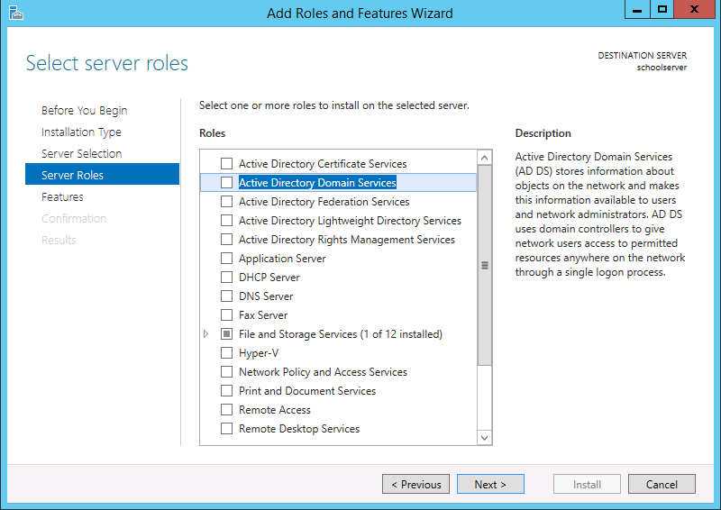
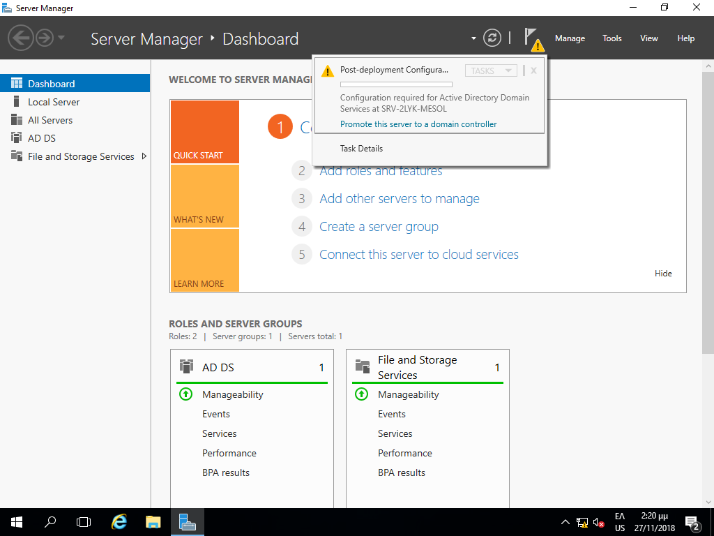

# Ρύθμιση Windows Active Directory και Domain Controller

Μετά το πέρας της εγκατάστασης των λειτουργικών συστημάτων και των βασικών
ρυθμίσεων στον εξυπηρετητή του Σ.Ε.Π.Ε.Η.Υ., είναι δυνατή η δημιουργία του
τομέα (**domain**) με την ενεργοποίηση του ρόλου [Domain Controller](https://docs.microsoft.com/en-us/openspecs/windows_protocols/ms-authsod/c4012a57-16a9-42eb-8f64-aa9e04698dca) (DC)
στον εξυπηρετητή και η ένταξη όλων των υπολογιστών σε αυτό. Ο DC αναλαμβάνει να
εξυπηρετεί όλες τις αιτήσεις για αυθεντικοποίηση εντός του domain. Πιο
αναλυτικά ο DC είναι υπεύθυνος για να επιτρέψει την πρόσβαση σε όλες τους
πόρους του domain, αυθεντικοποιεί και πιστοποιεί τους χρήστες, αποθηκεύει τα
στοιχεία των λογαριασμών των χρηστών και επιβάλει πολιτικές ασφαλείας.

!!! tip "Πληροφορία"
    Για περισσότερες πληροφορίες σχετικά με το Active Directory κοιτάξτε στο [Αρχιτεκτονική](../architecture.md) και στους [Οδηγούς](../guides.md).

## Προετοιμασία της Εγκατάστασης

!!! warning "Προσοχή"
    Πριν την αναβάθμιση ενός Windows Server σε Domain Controller θα πρέπει για
    τον ίδιο τον εξυπηρετητή να οριστεί στις παραμέτρους του TCP/IP να
    χρησιμοποιεί ως DNS server τον εαυτό του (την IP address 10.x.y.10 που
    ορίσαμε [σε προηγούμενο βήμα](../server-installation/index.md#server-ip-dns-settings)) αφαιρώντας τους DNS Servers του Π.Σ.Δ. Ο λόγος
    είναι ότι η εγκατάσταση του Domain Controller ρόλου προχωρά στην
    εγκατάσταση του DNS Server ρόλου στον εξυπηρετητή για το Domain που θα
    δημιουργηθεί.
    
    Προκειμένου ο εξυπηρετητής να μπορεί να απαντά και σε ερωτήματα DNS εκτός του Domain του οι DNS Servers του Π.Σ.Δ. [θα οριστούν ως forwarders της υπηρεσίας DNS του DC](#dns-setup).

!!! powershell "PowerShell: Αλλαγή DNS ρυθμίσεων εξυπηρετητή"
    ```shell
    $interface=Get-NetIPInterface -AddressFamily IPv4 -InterfaceAlias "Ethernet*"
        
    Set-DNSClientServerAddress -InterfaceIndex $interface.ifIndex -ServerAddresses 10.50.40.10
    ```
    Αντικαταστήστε όπου 10.50.40.10 την IP διεύθυνση του εξυπηρετητή σας.

## Εγκατάσταση Domain

### Εκκίνηση Εγκατάστασης

Στο Windows Server η διαδικασία εγκατάστασης ενός domain controller μπορεί
να γίνει μέσω γραφικού περιβάλλοντος με χρήση του εργαλείου ```Server Manager``` ακολουθώντας τα παρακάτω βήματα:

[](01-install-adds-add-features.png)

[](02-install-adds-role.png)

- Επιλέξτε το σύνδεσμο **Add roles and features** από την διεπαφή που προσφέρει το εργαλείο ```Server Manager``` με την έναρξή του.

- Στην αρχική διεπαφή **Add Roles and Features Wizard** επιλέγουμε ***Next***.

- Επιλέξτε **Select a server from the server pool** και κατόπιν επιλέξτε τον εξυπηρετητή σας (πχ srv-2lyk-mesol).

- Επιλέξτε την εγκατάσταση του ρόλου των **Active Directory Domain Services**.

- Στο διάλογο για την εγκατάσταση απαιτούμενων features επιλέξτε ***Add Features***.

- Επιβεβαιώστε ότι έχει επιλεχθεί **☑ Active Directory Domain Services** και επιλέξτε ***Next***.

- Στο παράθυρο **Add Roles and Features Wizard** επιλέξτε ***Next*** ώστε να ξεκινήσει η εγκατάσταση.

!!! powershell clear "PowerShell: Εγκατάσταση του ρόλου ADDS"
    ```shell
    Install-WindowsFeature -name AD-Domain-Services -IncludeManagementTools
    ```

## Ορισμός Forest & Domain

[](03-promote-server-to-dc.png)

[](04-add-new-forest.png)

Μετά την εγκατάσταση γίνεται επανέναρξη του υπολογιστή. Παρατηρούμε ότι στο Dashboard του ```Server Manager``` έχει προστεθεί ο AD DS (Active Directory Domain Server). Επίσης εμφανίζεται προειδοποιητικό σήμα το οποίο ενημερώνει για την εγκατάσταση των features και για την δυνατότητα να κάνουμε τον server Domain Controller, επιλέγοντας **Promote this server to a domain controller**.

Στο νέο διάλογο που εμφανίζεται επιλέγουμε το **Add a new forest** και πληκτρολογούμε στο Root domain name ένα νέο ενδεικτικό όνομα. Προτείνεται η υποδομή να αναπτυχθεί "κάτω" από το **<όνομα σχολείου>.<Νομαρχιακή Ενότητα>.priv.sch.gr** (πχ 2lyk-mesol.ait.priv.sch.gr).

Το προτεινόμενο **<όνομα σχολείου>** προκύπτει από το Domain Name (DNS) του σχολείου στο Π.Σ.Δ. και στην ουσία αποτελεί το 1ο μέρος από τη διεύθυνση του ιστοτόπου της σχολικής μονάδας. Για παράδειγμα από το http://2lyk-mesol.ait.sch.gr "κρατάμε" το 2lyk-mesol.

[](05-functional-domain-level.png)

Στο διάλογο **Domain Controller Options** αφήνουμε τις προεπιλογές στα:

- Forest functional level ***Windows Server 2016***
- Domain functional level ***Windows Server 2016***
- ☑ Domain Name System (DNS) server
- ☑ Global Catalog (GC)

Επιπλέον θα πρέπει να οριστεί ο κωδικός ασφαλείας για το λογαριασμό διαχειριστή, όταν ο εξυπηρετητής λειτουργεί σε "directory services restore mode". Για λόγους ευκολίας διαχείρισης, προτείνεται να επιλέγεται ίδιος κωδικός με αυτόν που έχει οριστεί για κάποιον από τους διαχειριστές του domain.

[](06-dns-options.png)
{.clear}

Στο διάλογο **DNS Options** πατήστε ***OK*** στο μήνυμα για τη δημιουργία DNS delegation.

[](07-netbios-name.png)
{.clear}

Στο διάλογο **Additional Options** πρέπει να ορίσετε το **ΝetBIOS domain name**. Αν έχετε ακολουθήσει την προτεινόμενη διαδικασία αφήστε το προεπιλεγμένο όνομα που ταυτίζεται με το όνομα του σχολείου (πχ 2LYK-MESOL) και επιλέγετε ***Next***.

[](08-adds-paths.png)
{.clear}

Στο διάλογο **Paths** επιβεβαιώνετε τους φακέλους αποθήκευσης της βάσης
δεδομένων και των αρχείων καταγραφής του ενεργού καταλόγου (database and log
folders). Καθώς το μέγεθος του Active Directory δεν είναι αυξημένο στα σχολικά
εργαστήρια δεν κρίνεται σκόπιμη η αποθήκευση των συγκεκριμένων αρχείων σε
πιθανό δεύτερο σκληρό δίσκο για βελτιστοποίηση της απόδοσης. 

Με αυτόν τον τρόπο γίνεται πιο εύκολη και η λήψη αντιγράφων ασφαλείας για
επαναφορά του συστήματος. Επίσης, ορίζετε το μονοπάτι του διαμοιραζόμενου
φακέλου SYSVOL. Αποδεχθείτε την προεπιλεγμένη επιλογή φακέλου επιλέγοντας
***Next***.

[](09-review-options.png)

Στο διάλογο **Review Options** παρουσιάζεται μια σύνοψη των επιλογών
εγκατάσταση, ώστε εάν επιθυμείτε να προβείτε σε ενέργειες διόρθωσης. Επιλέγετε
***Next***.

[](10-prerequisites-check.png)
{.clear}

Στο διάλογο **Prerequisites Check** πραγματοποιείται ένας έλεγχος ότι
ικανοποιούνται όλες οι απαιτήσεις και εφόσον δεν διαπιστωθούν προβλήματα η
μετατροπή του εξυπηρετητή σε domain controller ξεκινάει, εφόσον επιλέξετε
***Install***. Περιμένετε την ολοκλήρωση της εγκατάστασης του Active Directory
Domain Services.

[](11-reboot.png)
{.clear}

Με την ολοκλήρωση της εγκατάστασης πραγματοποιείται αυτόματα επανεκκίνηση του συστήματος για την εφαρμογή των αλλαγών σε αυτό.

[](12-dc-installed.png)
{.clear}

Με την επανεκκίνηση του υπολογιστή:

- Συνδέεστε ως διαχειριστής (administrator) του domain πλέον με τον ίδιο κωδικό που συνδεόσασταν πριν την εγκατάσταση του Domain.

- Στην εφαρμογή ```Server Manager``` και συγκεκριμένα στα εργαλεία (**Τools**) υπάρχουν διαθέσιμες οι εφαρμογές διαχείρισης των υπηρεσιών του Active Directory Domain, DNS κτλ.

!!! tip "Πληροφορία"
    Δεν υπάρχει η έννοια του τοπικού διαχειριστή στον Domain Controller.

!!! powershell clear "PowerShell: Ρύθμιση Forest & Domain"
    ```shell
    Install-ADDSForest -DomainName 2lyk-mesol.ait.priv.sch.gr -DomainNetBIOSName 2lyk-mesol -InstallDNS
    ```

## Ρύθμιση της υπηρεσίας DNS στον εξυπηρετητή{#dns-setup}

!!! tip "Πληροφορία"
    Στον εξυπηρετητή του εργαστηρίου κατά την εγκατάσταση του Active Directory εγκαθίσταται και η υπηρεσία ονοματολογίας Domain Name System (DNS). Η υπηρεσία αυτή είναι θεμελιώδης για τη λειτουργία του ADDS και μπορεί να απαντήσει DNS ερωτήματα για την περιοχή **<όνομα σχολείου>.<νομαρχιακή ενότητα>.priv.sch.gr**, ενώ για την ομαλή επικοινωνία και με το διαδίκτυο είναι απαραίτητο να προωθεί τα DNS ερωτήματα (για τις υπόλοιπες περιοχές) τους DNS servers του Π.Σ.Δ., τους οποίους θα πρέπει να ρυθμιστεί ώστε να τους χρησιμοποιεί ως forwarders.

Η ρύθμιση της υπηρεσίας DNS πραγματοποιείται από την κονσόλα διαχείρισης της υπηρεσίας DNS, ```DNS Manager```. Η τελευταία είναι διαθέσιμη από την εφαρμογή ```Server Manager``` αφού επιλέξετε ***Tools*** και κατόπιν ***DNS*** και το ***όνομα του εξυπηρετητή*** και με δεξί click επιλέγετε ***Properties*** και κατόπιν επιλέγετε την καρτέλα ρύθμισης των ***Forwarders***. 

Σε αυτήν την καρτέλα προσθέστε τους DNS servers του Π.Σ.Δ. που λαμβάνετε μέσω DHCP από το router του Σ.Ε.Π.Ε.Η.Υ. (συνήθως 194.63.238.4, 194.63.239.164 και 194.63.237.4).

!!! warning "Προσοχή"
    **Απενεργοποιείστε** τη ρύθμιση ***☑ Use root hints if no forwarders are available***, ώστε να είστε συμβατοί με τις ρυθμίσεις του Π.Σ.Δ. που ορίζει ότι η επικοινωνία του DNS server του Σ.Ε.Π.Ε.Η.Υ. πραγματοποιείται μόνο με τους αντίστοιχους εξυπηρετητές του Π.Σ.Δ.

!!! powershell "PowerShell: Ρύθμιση υπηρεσίας DNS"
    ```shell
    Set-DnsServerForwarder -UseRootHint $false
    Add-DnsServerForwarder -IPAddress 194.63.238.4, 194.63.239.164, 194.63.237.4
    ```

## Ενεργοποίηση συγχρονισμού ώρας

!!! tip "Πληροφορία"
    Ο εξυπηρετητής είναι απαραίτητο να έχει συγχρονισμένη την ώρα του μέσω του
    [πρωτοκόλλου NTP](https://en.wikipedia.org/wiki/Network_Time_Protocol) με
    κάποιον εξυπηρετητή NTP. Για τον λόγο αυτό ενεργοποιούμε την NTP επικοινωνία του με το δρομολογητή του τοπικού δικτύου (IP διεύθυνση δρομολογητή 10.x.y.1) καθώς και με τον εξυπηρετητή NTP του Π.Σ.Δ. **ntp.sch.gr** (για τις περιπτώσεις σχολείων που δεν διαθέτουν δρομολογητές που υποστηρίζουν το πρωτόκολλο NTP).

Η ενεργοποίηση συγχρονισμού ώρας στον DC πραγματοποιείται με τα ακόλουθα τρία βήματα:

- Αρχικά παρατηρούμε τη διαφορά ώρας μεταξύ του εξυπηρετητή DC και του δρομολογητή του τοπικού δικτύου (δεδομένου ότι υποστηρίζει NTP).

    !!! powershell "PowerShell: Έλεγχος διαφοράς ώρας DC & δρομολογητή"
        ```shell
        w32tm /stripchart /computer:10.x.y.1 /samples:3
        ```
        Αντικαταστήστε το 10.x.y.1 με την IP διεύθυνση του δρομολογητή. Συνήθως υπάρχει μια διαφορά 5-100 δευτερολέπτων.

- Στη συνέχεια ορίζουμε το δρομολογητή του Σ.Ε.Π.Ε.Η.Υ. και τον ntp.sch.gr ως πηγή NTP για τον εξυπηρετητή DC.

    !!! powershell "PowerShell: Ορισμός πηγής NTP στον DC"
        ```shell
        w32tm /config /manualpeerlist:10.x.y.1,ntp.sch.gr /syncfromflags:domhier /update
        ```
        Αντικαταστήστε το 10.x.y.1 με την IP διεύθυνση του δρομολογητή.

- Επιβεβαιώστε τη σύγκλιση ώρας μεταξύ της πηγής NTP και DC.

    !!! powershell "PowerShell: Έλεγχος διαφοράς ώρας DC & δρομολογητή"
        ```shell
        w32tm /stripchart /computer:10.x.y.1 /samples:3
        ```
        Αντικαταστήστε το 10.x.y.1 με την IP διεύθυνση του δρομολογητή. Επιβεβαιώστε ότι υπάρχει ταύτιση ώρας.
