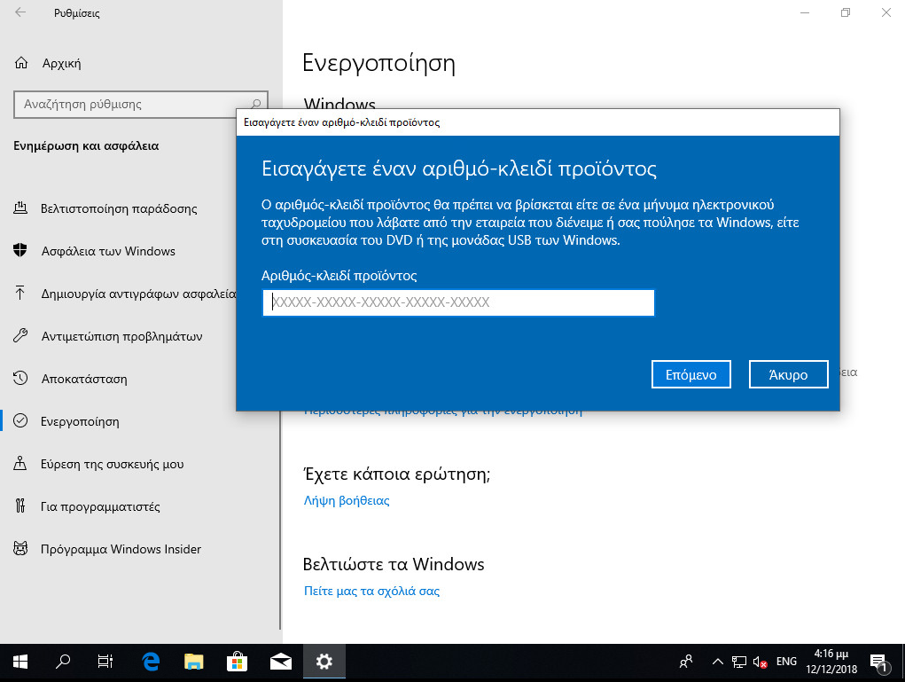

# Βασικές ρυθμίσεις σταθμού εργασίας

Για την εύρυθμη λειτουργία του σταθμού εργασίας κρίνεται απαραίτητη η πραγματοποίηση των ακόλουθων ρυθμίσεων.

## Εγκατάσταση ενημερώσεων

Απαραίτητη προϋπόθεση για την εύρυθμη λειτουργία του λειτουργικού συστήματος είναι η εγκατάσταση όλων των κρίσιμων ενημερώσεων.

[](14-windows-update.png)

Πατήστε το **`Windows key`** (ή click στο σημαιάκι των Windows) ▸ ***Ρυθμίσεις*** (το γρανάζι) ▸ ***Ενημέρωση και Ασφάλεια*** ▸ ***Έλεγχος για ενημερώσεις***.

Θα πραγματοποιηθεί σύνδεση στο Windows Update και θα "κατέβουν" και θα εγκατασταθούν οι απαραίτητες αναβαθμίσεις. Ενδέχεται να χρειαστεί και επανεκκίνηση για την ολοκλήρωση της εγκατάστασης των ενημερώσεων.

!!! powershell "PowerShell (administrator): Εγκατάσταση Ενημερώσεων"
    ```shell
     Set-ExecutionPolicy -Scope CurrentUser -ExecutionPolicy Unrestricted
     Import-Module PSWindowsUpdate -Force
     Get-Windowsupdate
     Install-WindowsUpdate -AcceptAll -AutoReboot
    ```

!!! warning "Προσοχή"
    Εάν δεν έχετε πραγματοποιήσει την εγκατάσταση από πρόσφατη έκδοση μέσων εγκατάστασης οπως αναφέρθηκε στην [παράγραφο δημιουργίας μέσων εγκατάστασης](../installation/index.md#media-creation), προτείνουμε να εγκαταστήσετε τον [Windows 11 Update Assistant](https://www.microsoft.com/el-gr/software-download/windows11), ο οποίος θα σας κάνει ενημέρωση στην πιο πρόσφατη έκδοση των Windows αποφεύγοντας τις πολύωρες αναβαθμίσεις.

## Ενεργοποίηση άδειας

[](16-registration.png)

Μετά την εγκατάσταση του λειτουργικού συστήματος είναι πιθανό να απαιτείται η ενεργοποίησή του μέσα σε κάποιο χρονικό διάστημα για να είναι δυνατή η περαιτέρω χρήση του (product activation). Η άδεια χρήσης καθορίζει αν είναι απαραίτητο κάτι τέτοιο καθώς και το διάστημα που μπορεί να χρησιμοποιηθούν τα Windows 11 χωρίς ενεργοποίηση. Η πρακτική για τους σταθμούς εργασίας των σχολικών εργαστηρίων είναι να πραγματοποιείται η διαδικασία μέσω διαδικτύου.

!!! info "Πληροφορία"
    Εάν δεν εμφανιστεί το μήνυμα ενεργοποίησης μπορείτε να "τρέξετε" το SOFTWARE LICENSING USER INTERFACE (SLUI) σε γραμμή εντολών, ανοίγοντας ένα τερματικό πατώντας **`Windows Key`** + **`R`** και πληκτρολογώντας `cmd` και δίνοντας την εντολή:
    ```shell
    slui
    ```

## Εγκατάσταση οδηγών υλικού και περιφερειακών

Τμήμα της εγκατάστασης του λειτουργικού συστήματος θεωρείται και η εγκατάσταση των οδηγών συσκευών (system drivers) της μητρικής, των καρτών επέκτασης και των περιφερειακών συσκευών.

Μπορεί να γίνει χρήση των μέσων (cd’s, δισκέτες κλπ) που παρασχέθηκαν μαζί με το υπολογιστικό σύστημα. Προτείνεται όμως να εγκαθίστανται οι τελευταίες εκδόσεις των οδηγών, που στην πλειονότητα των περιπτώσεων μπορούν να ληφθούν από το Διαδίκτυο.

Μπορείτε να κάνετε και έναν έλεγχο για τυχόν πιο ενημερωμένους οδηγούς με την ΕΛ/ΛΑΚ εφαρμογή [Snappy Driver Installer](https://sdi-tool.org/).

Σε περίπτωση που ο Η/Υ διαθέτει υλικό του κατασκευαστικού οίκου Intel, μπορείτε να ελέγξετε για ενημερώσεις των εκδόσεων των οδηγών του υλικού με την εφαρμογή [Intel Driver & Support Assistant](https://www.intel.com/content/www/us/en/support/intel-driver-support-assistant.html).

Η εγκατάσταση του εκτυπωτή, που συνήθως είναι συνδεδεμένος στο σταθμό εργασίας μπορεί να γίνει σε αυτό το σημείο σύμφωνα με τις οδηγίες του εκάστοτε μοντέλου. Για τη χρήση της υπηρεσίας εκτύπωσης από όλους τους χρήστες του εργαστηρίου ο εκτυπωτής πρέπει να διαμοιραστεί, οπότε ο σταθμός αναλαμβάνει και το ρόλο του διακομιστή εκτυπώσεων.

!!! tip "Συμβουλή"
    Προτείνεται, εφόσον υπάρχει εξυπηρετητής, [ο διαμοιρασμός εκτυπωτών να γίνεται στον εξυπηρετητή](../../server/basic-settings/index.md#printer-sharing).

## Τελικοί έλεγχοι

Χρήσιμοι είναι οι παρακάτω έλεγχοι για την εγκατάσταση των Windows:

### Ώρα και Ημερομηνία

[](19-time-settings.png)
{.clear}

Ελέγχουμε τη **σωστή ρύθμιση ώρας και ημερομηνίας**:
Πατώντας στην μπάρα εργασιών (κάτω δεξιά) στην τρέχουσα ώρα και ημερομηνια  ▸ ***Δεξί κλικ*** ▸ ***Προσαρμογή ημερομηνίας και ώρας*** ▸ ***Ζώνη ώρας*** ▸ ***(UTC+02:00 Αθήνα, Βουκουρέστι)*** επαληθεύστε ότι η ***Αυτόματη προσαρμογή θερινής ώρας*** είναι **Ενεργό** και επαληθεύστε ότι η ***Αυτόματη ρύθμιση ώρας*** είναι επίσης **Ενεργό**.

!!! powershell "PowerShell (administrator): Ρύθμιση TimeZone"
    ```shell
     Set-TimeZone -id "GTB Standard Time"
    ```

!!! info "Πληροφορία"
    - Η ώρα δεν πρέπει να διαφέρει περισσότερο από 5 λεπτά από αυτή του εξυπηρετητή, καθώς αυτό θα αποτελεί εμπόδιο στη σύνδεση στο Active Directory Domain, που παρουσιάζεται στη συνέχεια.
    - Μετά τη σύνδεση στο Active Directory Domain ο σταθμός εργασίας συγχρονίζεται μέσω [NTP πρωτοκόλλου](https://el.wikipedia.org/wiki/Network_Time_Protocol) με τον εξυπηρετητή.

### Προφίλ Δικτύου

Πατώντας στο **`Σημαιάκι των Windows`**  ▸ ***Ρυθμίσεις*** (εικονίδιο γραναζιού) ▸ ***Δίκτυο και Internet*** ▸ ***Ιδιότητες*** ▸ ***Αλλαγή ιδιοτήτων σύνδεσης*** επαληθεύστε ότι ο **Τύπος προφίλ δικτύου** είναι **Ιδιωτικό δίκτυο**.

!!! powershell "PowerShell (administrator): Αλλαγή τύπου προφίλ δικτύου σε ιδιωτικό"
    ```shell
    Get-NetConnectionProfile | Set-NetConnectionProfile -Networkcategory Private
    ```

!!! info "Πληροφορία"
    Στην ορολογία των Windows, Ιδιωτικό Προφίλ Δικτύου σημαίνει ότι πρόκειται
        για δίκτυο που εμπιστεύεστε ώστε ο σταθμός εργασίας να είναι ορατός από
        τους υπόλοιπους στο τοπικό δίκτυο για λόγους διαμοιρασμού πόρων.
