# Χειροκίνητη εγκατάσταση λειτουργικού συστήματος

## Ρύθμιση γλώσσας

[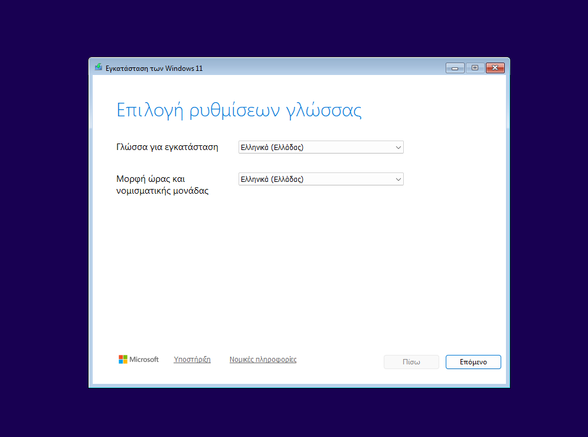](01-setup-language.png)
{.clear}

Κατά την αρχική εγκατάσταση, στο παράθυρο **Επιλογή ρυθμίσεων γλώσσας** επιλέξτε τα ακόλουθα:

- Γλώσσα προς εγκατάσταση: ***Ελληνικά (Ελλάδας)***

- Μορφή ώρας και νομισματικής μονάδας: ***Ελληνικά (Ελλάδας)***

[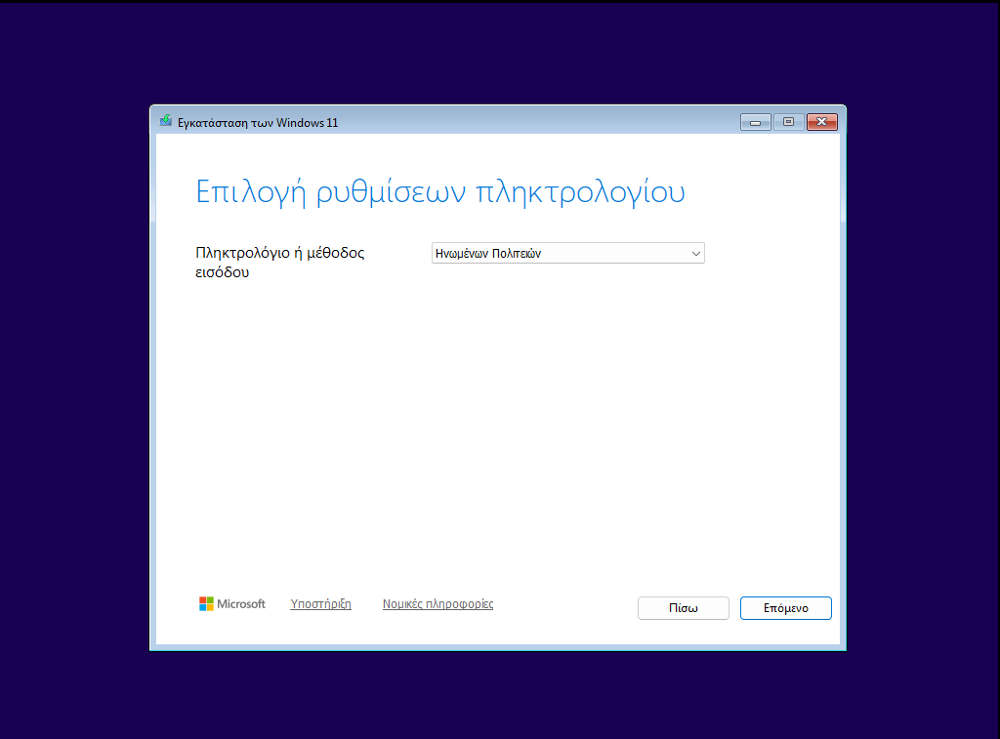](01b-setup-keyboard.png)
{.clear}

Στο παράθυρο **Επιλογή ρυθμίσεων πληκτρολογίου** επιλέξτε:

- Πληκτρολόγιο ή μέθοδος εισόδου: ***Ηνωμένων Πολιτειών***

## Εκκίνηση Εγκατάστασης

[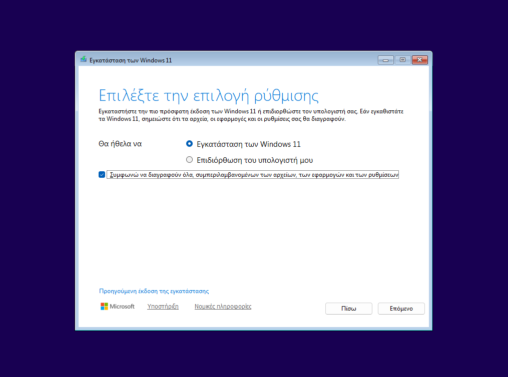](02-setup-start.png)
{.clear}

Επιλέγετε 

- ***Εγκατάσταση των Windows 11***

- ***[✔] Συμφωνώ να διαγραφούν όλα, συμπεριλαμβανομένων των αρχείων, των εφαρμογών και των ρυθμίσεων*** 

- Επιλέξτε **Επόμενο**.

[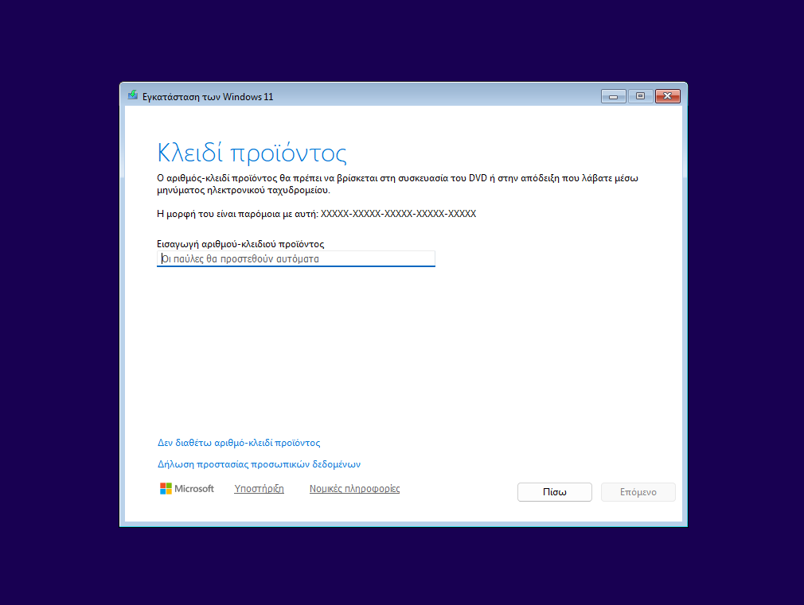](02b-setup-windows-key.png)
{.clear}

Στο παράθυρο **Κλειδί προϊόντος**:

- Εάν διαθέτετε το κλειδί των Windows πληκτρολογήστε το, 

- Αλλιώς επιλέξτε ***Δεν διαθέτω αριθμό-κλειδί προϊόντος*** 

- Στη συνέχεια επιλέξτε ***Επόμενο***

[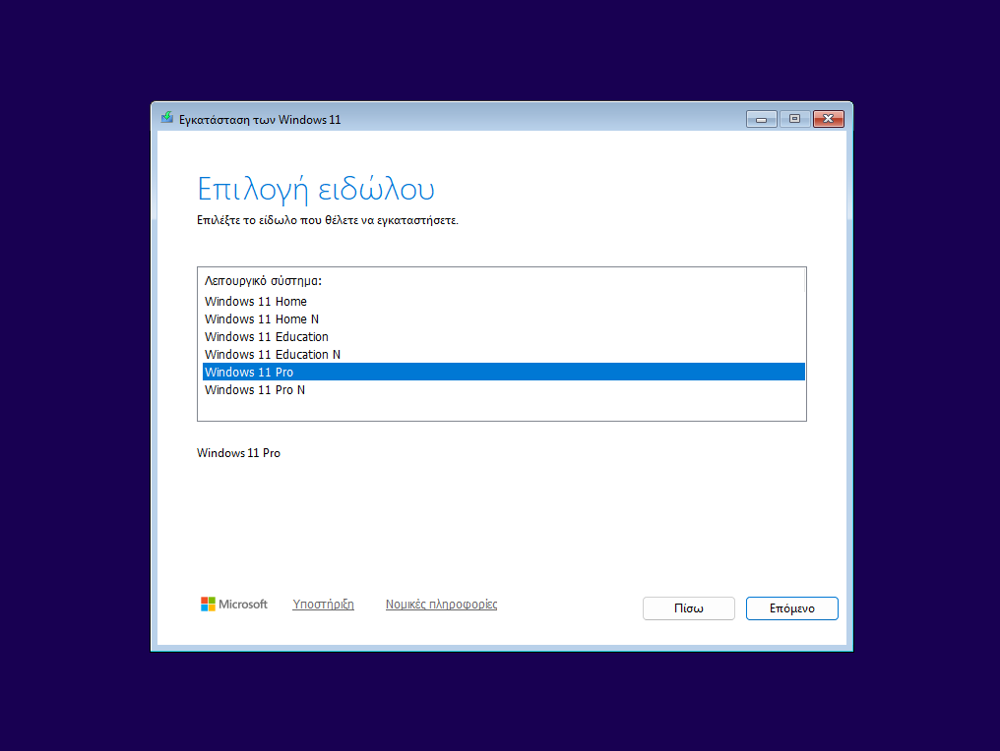](02c-setup-windows-iso.png)
{.clear}

Στο παράθυρο **Επιλογή ειδώλου** , επιλέξτε:

- ***Windows 11 Pro***

- ***Επόμενο***

[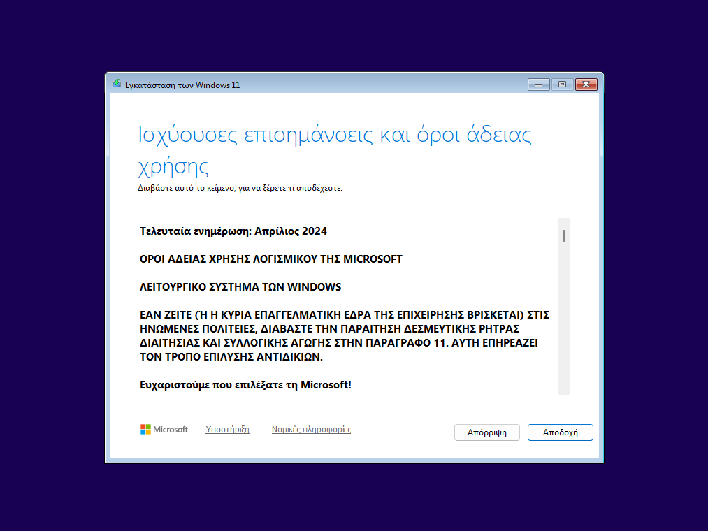](03-accept-license.png)
{.clear}

Το επόμενο βήμα για να προχωρήσει η εγκατάσταση είναι να γίνει αποδοχή των όρων της άδειας χρήσης του προϊόντος. Επιλέξτε ***Αποδοχή***

[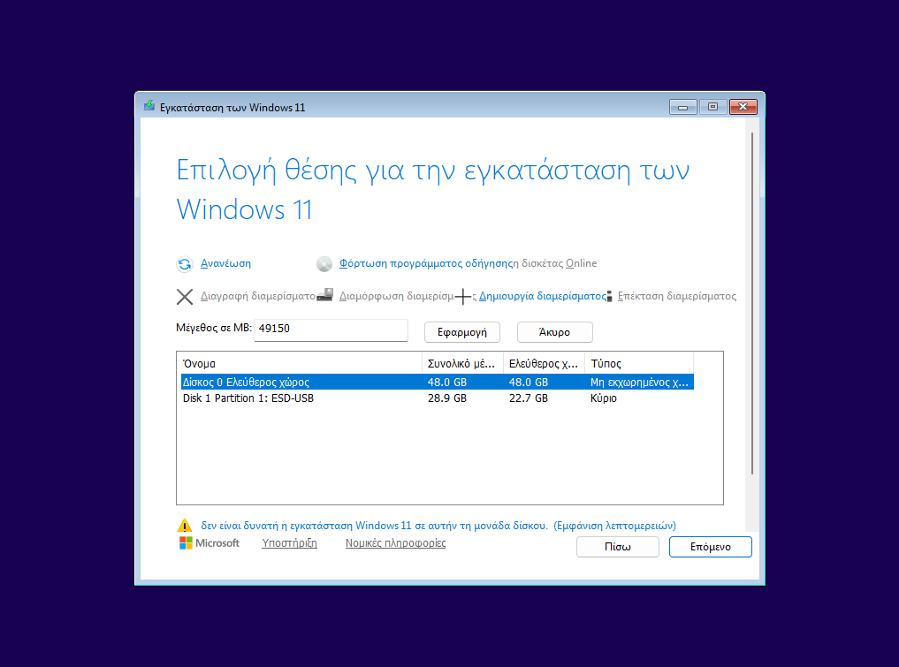](05-setup-disk.png)
{.clear}

Στην ερώτηση **Επιλογή θέσης για την εγκατάσταση των Windows 11** επιλέξτε τον σκληρό δίσκο που επιθυμείτε και κατόπιν επιλέξτε ***Δημιουργία διαμερίσματος*** και ορίστε το μέγεθος σε MB και επιλέξτε ***Εφαρμογή***.

[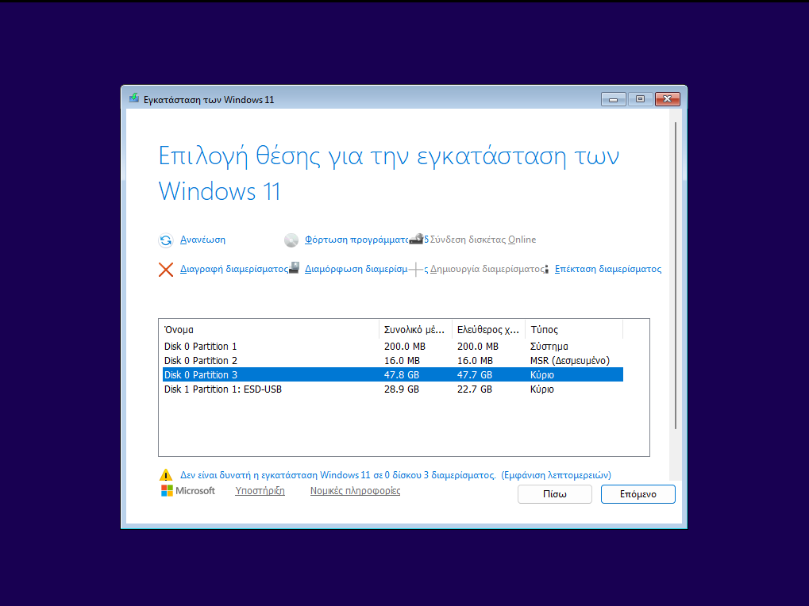](06-setup-partitions.png)
{.clear}

Αποδεχτείτε την αυτόματη δημιουργία των τριών διαμερισμάτων και επιλέξτε ***Επόμενο***.

[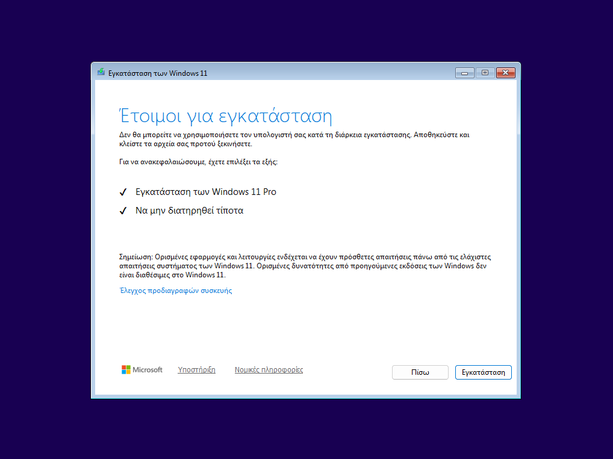](06b-setup-ready.png)
{.clear}

Στο παράθυρο **Έτοιμοι για εγκατάσταση** υπάρχει η ανακεφαλαίωση των παραπάνω επιλογών:

- Επιλέξτε ***Εγκατάσταση***.

[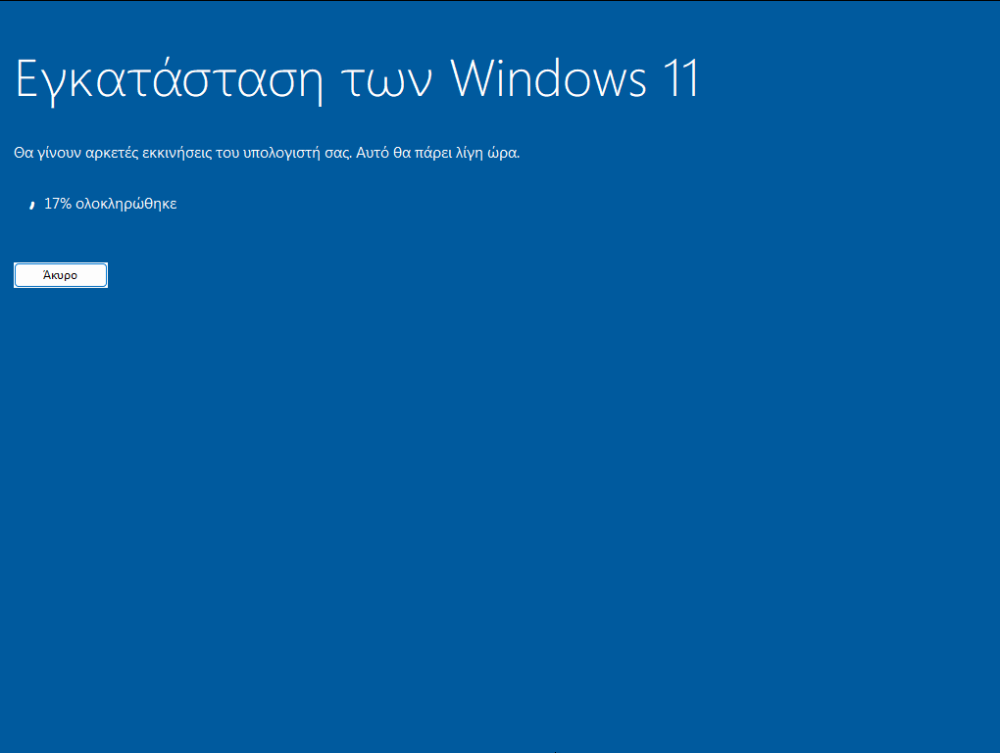](07-setup-copy-files.png)
{.clear}

Στη συνέχεια η εγκατάσταση των Windows σας ενημερώνει για τη διαδικασία αντιγραφής και εγκατάστασης των αρχείων, των δυνατοτήτων και των ενημερώσεων που η διάρκειά της (περίπου 8'-15') εξαρτάται από την ταχύτητα του συστήματός σας (μνήμη, δίσκος κτλ).

[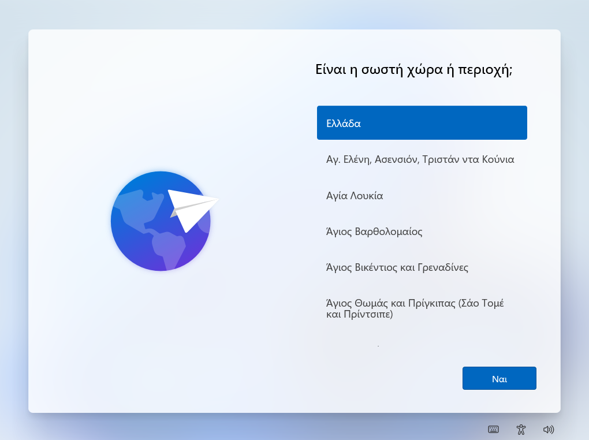](08-setup-country.png)
{.clear}

Κατόπιν της ολοκλήρωσης της αντιγραφής των αρχείων του συστήματος το σύστημα εκκινεί από την εγκατάσταση και ζητά να οριστούν οι ρυθμίσεις της εγκατάστασης. Επιβεβαιώστε επιλέγοντας ***ΝΑΙ*** ότι η περιοχή που βρίσκεστε είναι η Ελλάδα.

[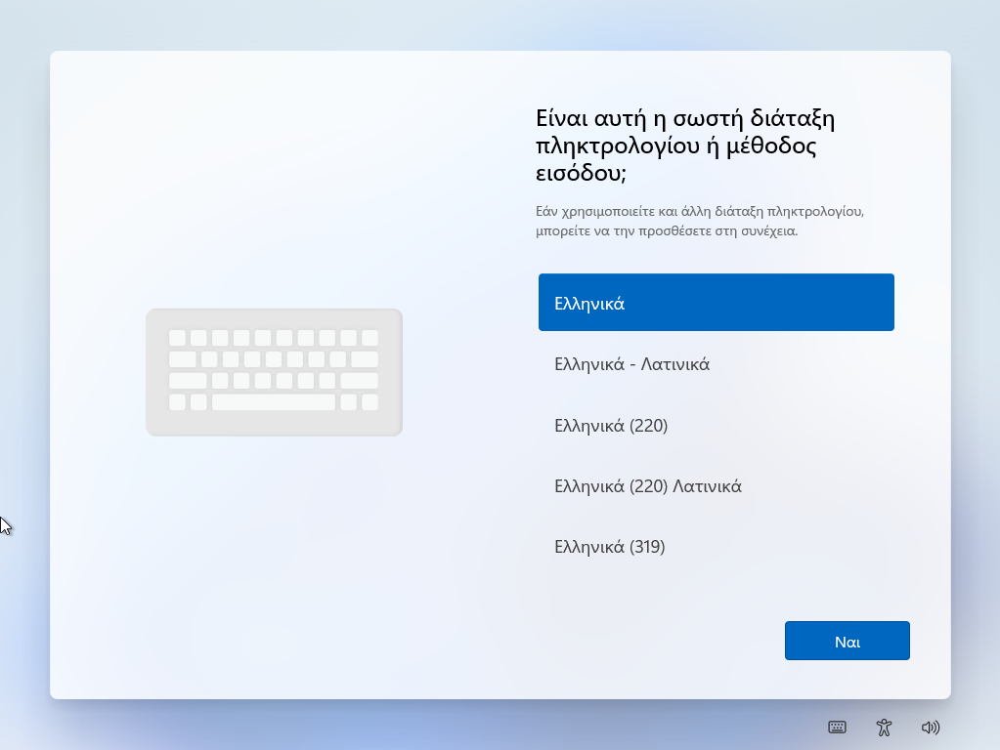](09-setup-keyboard.png)
{.clear}

Επιβεβαιώστε επιλέγοντας ***ΝΑΙ*** ότι η διάταξη του πληκτρολογίου είναι Ελληνικά.

[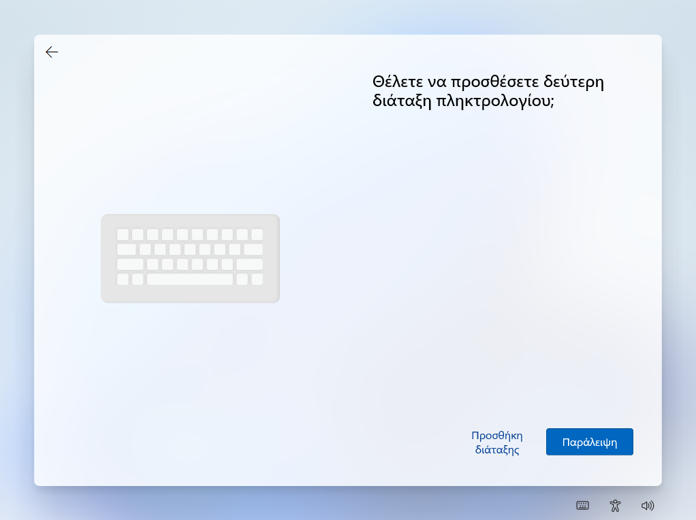](10-setup-additional-keyboard.png)
{.clear}

Επιλέξτε ***Παράλειψη*** να μην προστεθεί δεύτερη διάταξη πληκτρολογίου. Όταν ολοκληρωθεί η διαδικασία ο Η/Υ θα επανεκκινήσει για να συνεχίσει η παραμετροποίηση του συστήματος.

## Ονομασία σταθμού εργασίας

[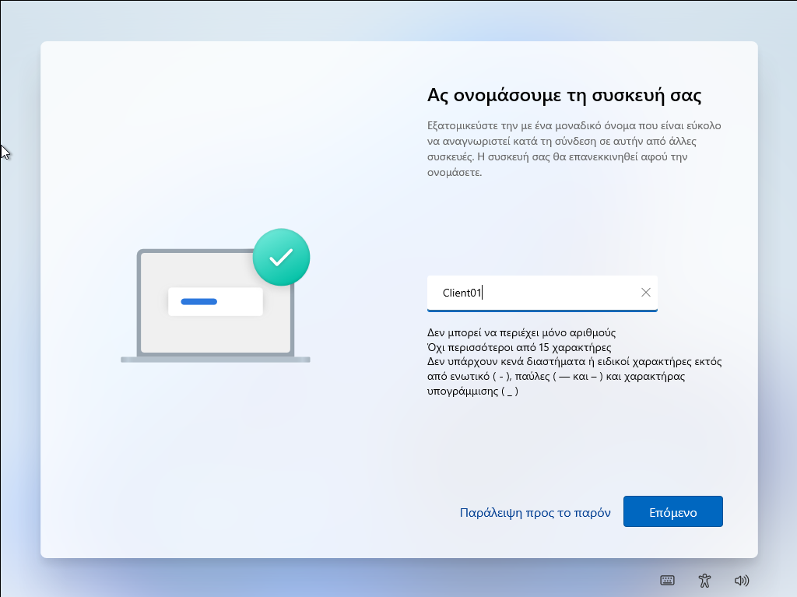](11-name-station.png)

Το επόμενο βήμα είναι να αποδοθεί όνομα στο σταθμό εργασίας. Στο Σ.Ε.Π.Ε.Η.Υ. οι σταθμοί εργασίας προτείνεται να έχουν όνομα της μορφής "ClientXY" και η αρίθμηση να ακολουθεί την τοποθέτηση των σταθμών εργασίας στο χώρο του εργαστηρίου.

Δώστε τον νέο όνομα πχ Client01, PC01 κτλ και κατόπιν επιλέξτε ***Επόμενο*** και επανεκκινήστε το σταθμό εργασίας.

!!! tip "Συμβουλή"
    Αν πατήσετε ***Παράλειψη*** μπορείτε να μετονομάσετε αργότερα το σταθμό εργασίας πατώντας το **`Windows key`** (ή click στο σημαιάκι των Windows) ▸ ***Ρυθμίσεις*** (το γρανάζι) ▸ ***Σύστημα*** ▸ ***Μετονομασία***

## Ορισμός διαχειριστή

[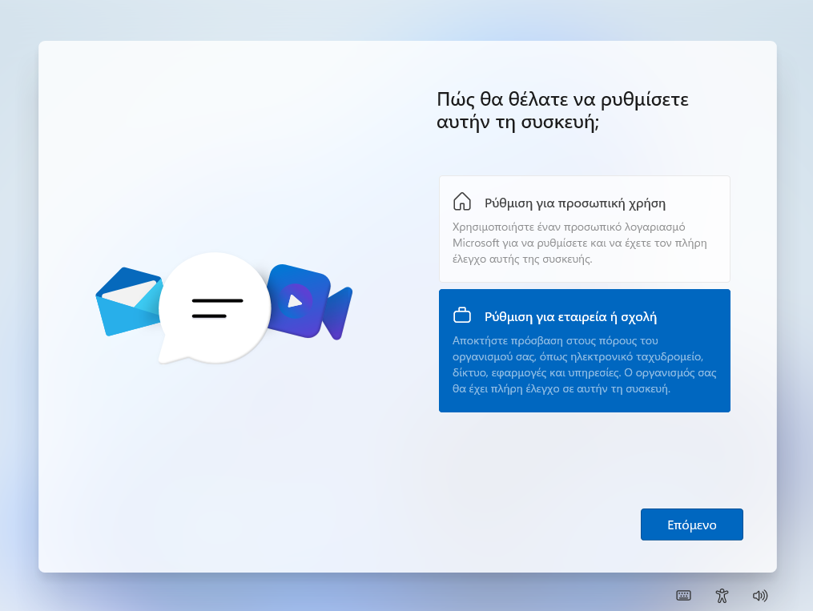](11a-setup-school.png)
{.clear}

Στην ερώτηση **Που θέλετε να ρυθμίσετε αυτήν τη συσκευή;**:

- Επιλέξτε ***Ρύθμιση για εταιρεία ή σχολή*** και ***Επόμενο***

[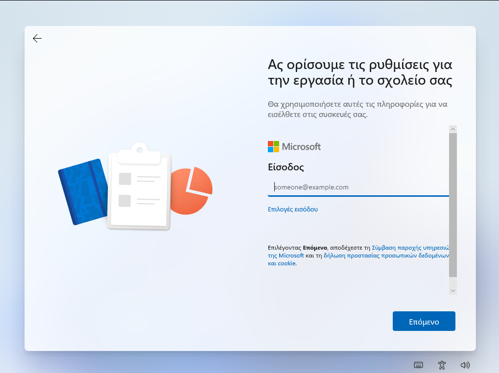](11b-setup-domain.png)

[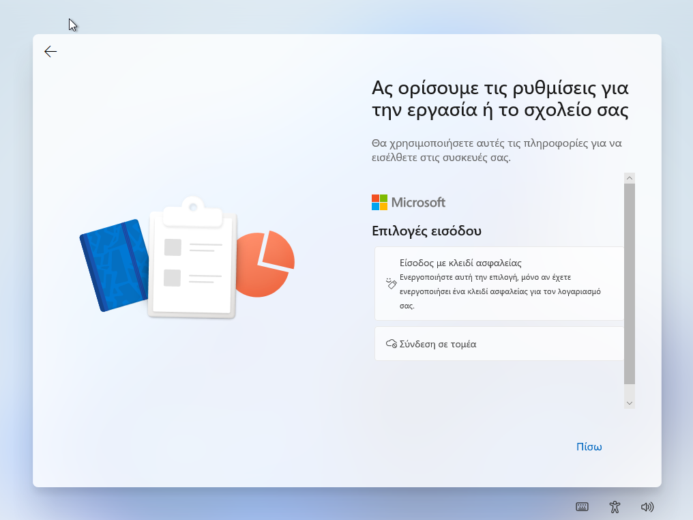](11c-setup-domain.png)
{.clear}

Στo παράθυρο **Ας ορίσουμε τις ρυθμίσεις για την εργασία ή το σχολείο σας**:

- Επιλέξτε ***Επιλογές εισόδου*** και ***Σύνδεση σε τομέα***

[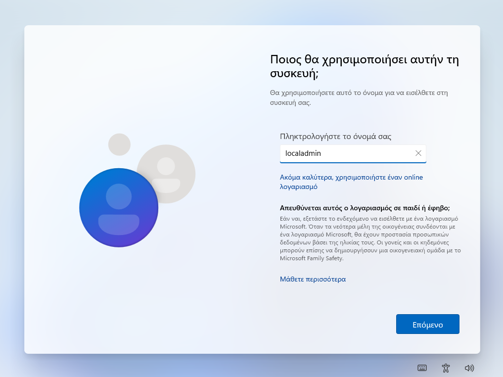](11d-setup-local-admin.png)
{.clear}

Στο παράθυρο **Ποιος θα χρησιμοποιεί αυτήν τη συσκευή**:

- Ορίστε το όνομα χρήστη **localadmin** και τον κωδικό του και απαντήστε στις 3 ερωτήσεις που θα επιλέξετε για την επαλήθευση των στοιχείων του. Καταγράψτε και αποθηκεύστε σε χαρτί τις απαντήσεις ώστε να είναι διαθέσιμες αν ποτέ τις χρειαστείτε.

!!! tip "Συμβουλή"
    Προτείνεται η χρήση κωδικού τουλάχιστον 8 χαρακτήρων, που να περιλαμβάνει πεζούς και κεφαλαίους λατινικούς χαρακτήρες, σημεία στίξης και αριθμούς (π.χ. **Changem3!**).

    **Η πρακτική χρήσης προφανούς ή κοινού κωδικού ασφαλείας πρέπει να αποφεύγεται.**

## Ρυθμίσεις Ιδιωτικότητας

Το επόμενο βήμα αφορά ρυθμίσεις ιδιωτικότητας. Προτείνουμε να επιλέξετε όσο το δυνατόν πιο αυστηρές ρυθμίσεις.

{.clear}

Στην ερώτηση **Να επιτρέπεται στη Microsoft και στις εφαρμογές να χρησιμοποιούν την τοποθεσία** επιλέξτε ***Όχι*** και κατόπιν ***Αποδοχή***.

[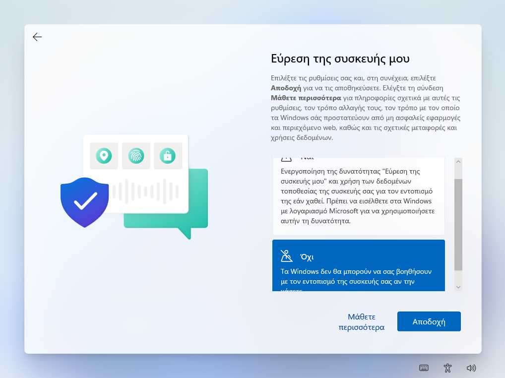](12-setup-privacy-04.png)
{.clear}

Στην ερώτηση **Εύρεση της συσκευής μου** επιλέξτε ***Όχι*** και κατόπιν ***Αποδοχή***.

[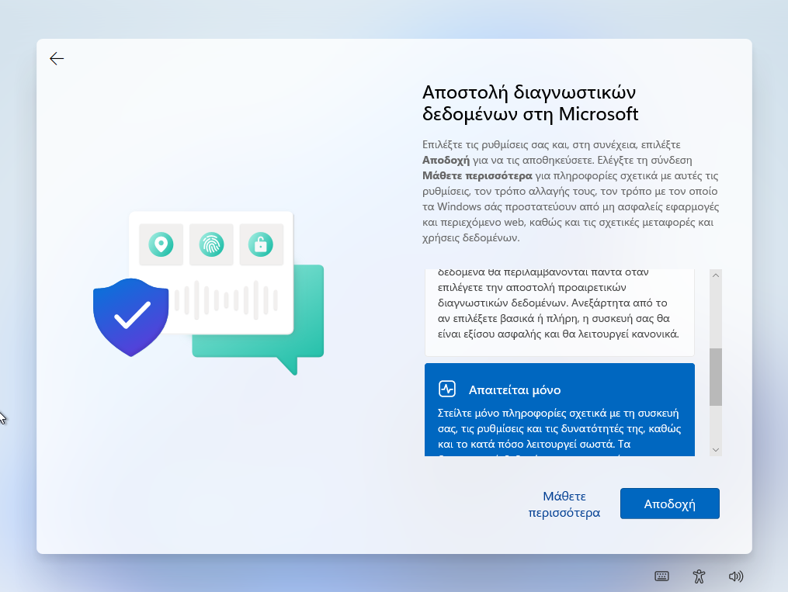](12-setup-privacy-05.png)
{.clear}

Στην ερώτηση **Αποστολή διαγνωστικών δεδομένων στη Microsoft** επιλέξτε ***Βασικό*** και κατόπιν ***Αποδοχή***.

{.clear}

Στην ερώτηση **Βελτίωση γραφής και πληκτρολόγησης** επιλέξτε ***Όχι*** και κατόπιν ***Αποδοχή***.

[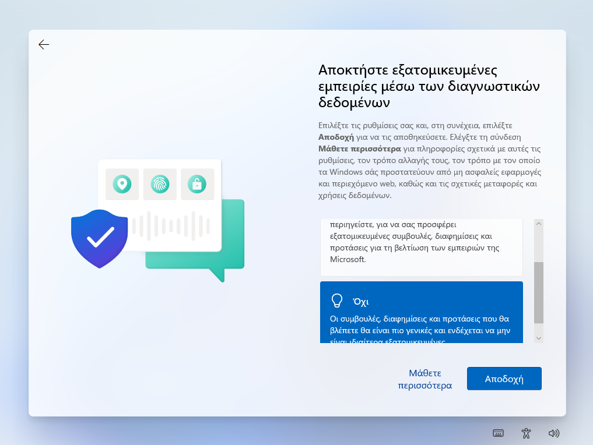](12-setup-privacy-07.png)
{.clear}

Στην ερώτηση **Αποκτήστε εξατομικευμένες εμπειρίες μέσω των διαγνωστικών δεδομένων** επιλέξτε ***Όχι*** και κατόπιν ***Αποδοχή***.

[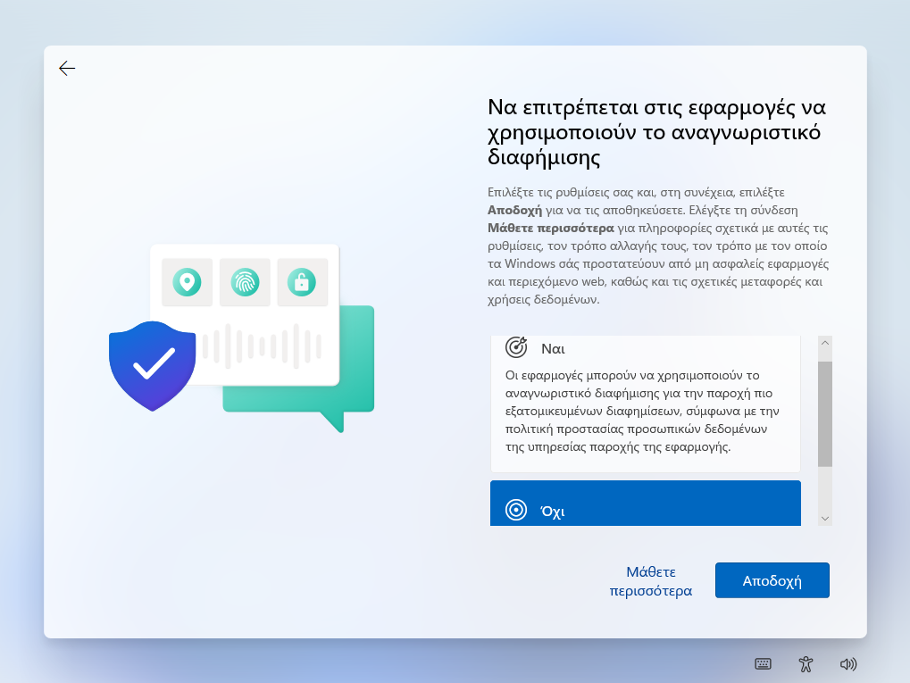](12-setup-privacy-08.png)
{.clear}

Τέλος, στην ερώτηση **Να επιτρέπεται στις εφαρμογές να χρησιμοποιούν το αναγνωριστικό διαφήμισης** επιλέξτε ***Όχι*** και κατόπιν ***Αποδοχή***.

## Ολοκλήρωση εγκατάστασης

{.clear}

H εγκατάσταση προχωρά και θα πρέπει να περιμένετε μέχρι να ολοκληρωθεί.

[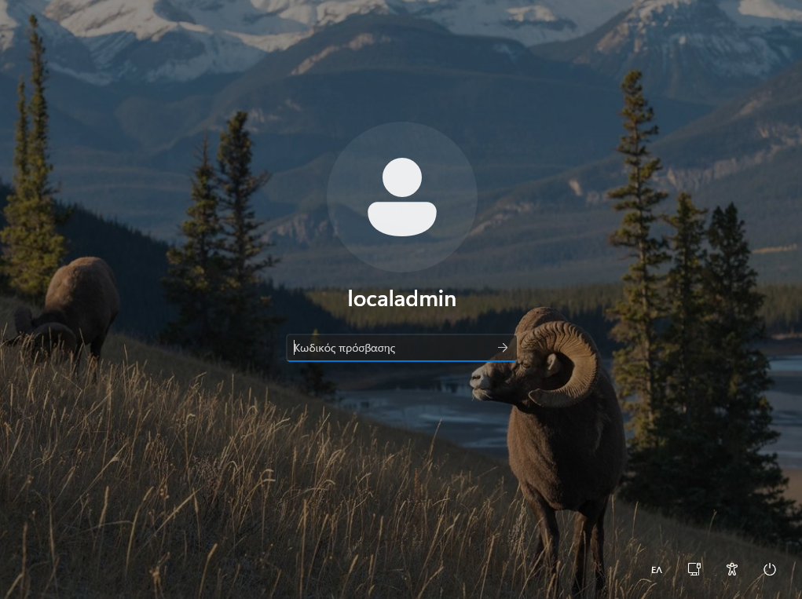](13-setup-complete.png)
{.clear}

Κατόπιν της επανεκκίνησης η εγκατάσταση έχει ολοκληρωθεί και πλέον έχετε τη δυνατότητα να συνδεθείτε με το λογαριασμό διαχειριστή που δημιουργήσατε και να προχωρήσετε με τις [Βασικές ρυθμίσεις του λειτουργικού συστήματος](../../basic-settings/index.md).
