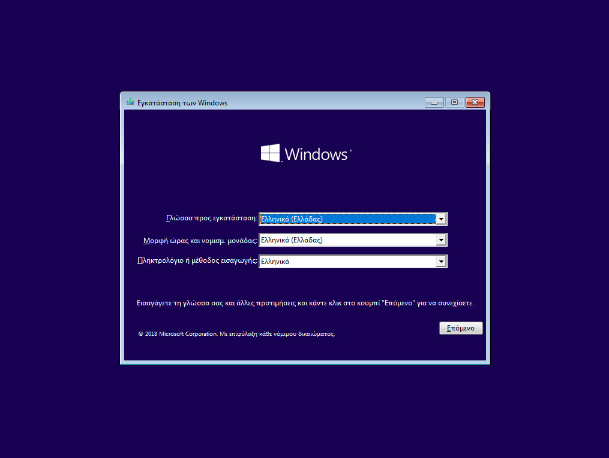
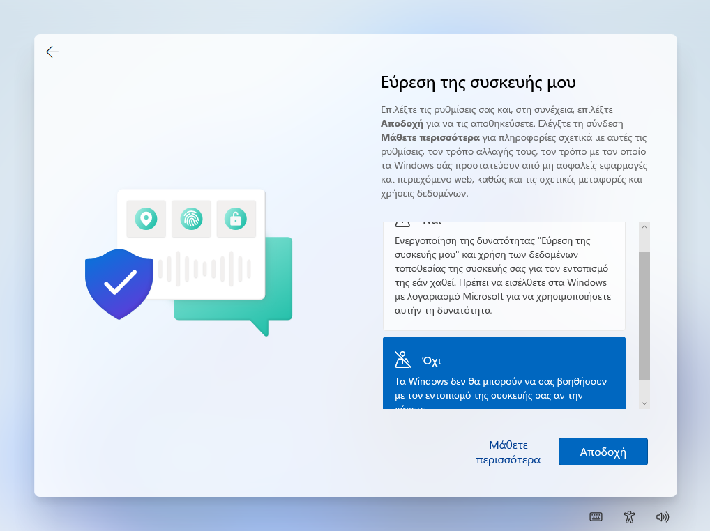

# Χειροκίνητη εγκατάσταση λειτουργικού συστήματος

## Ρύθμιση γλώσσας

Κατά την αρχική εγκατάσταση ζητείται η ρύθμιση της γλώσσας. Επιλέξτε τα ακόλουθα:

- Γλώσσα προς εγκατάσταση: ***Ελληνικά (Ελλάδας)***

- Μορφή Ώρας και Νομισματική Μονάδα: ***Ελληνικά (Ελλάδας)***

- Πληκτρολόγιο ή μέθοδος εισαγωγής: ***Ηνωμένων Πολιτειών***

## Εκκίνηση Εγκατάστασης

Επιλέγετε ***Επόμενο*** και κατόπιν ***Εγκατάσταση Τώρα***. Θα ενημερωθείτε με το μήνυμα **Εκκίνηση του προγράμματος εγκατάστασης**.

{.clear}

Το επόμενο βήμα για να προχωρήσει η εγκατάσταση είναι να γίνει αποδοχή των όρων χρήσης του προϊόντος

{.clear}

Στην ερώτηση **Ποιον τύπο εγκατάστασης θέλετε;** επιλέξτε ***Προσαρμοσμένη: Εγκατάσταση των Windows μόνο (για προχωρημένους)***.

{.clear}

Στην ερώτηση **Που θέλετε να εγκαταστήσετε τα Windows;** επιλέξτε τον σκληρό δίσκο και τη διαμέριση που επιθυμείτε και κατόπιν επιλέξτε ***Δημιουργία***.

{.clear}

Αποδεχτείτε την προτροπή να δημιουργηθούν αυτόματα τα επιπλέον διαμερίσματα για τα αρχεία του συστήματος και επιλέξτε ***Επόμενο***.

{.clear}

Στη συνέχεια η εγκατάσταση των Windows σας ενημερώνει για τη διαδικασία αντιγραφής και εγκατάστασης των αρχείων, των δυνατοτήτων και των ενημερώσεων που η διάρκειά της (περίπου 8'-15') εξαρτάται από την ταχύτητα του συστήματός σας (μνήμη, δίσκος κτλ).

{.clear}

Κατόπιν της ολοκλήρωσης της αντιγραφής των αρχείων του συστήματος το σύστημα εκκινεί από την εγκατάσταση και ζητά να οριστούν οι ρυθμίσεις της εγκατάστασης. Επιβεβαιώστε επιλέγοντας ***ΝΑΙ*** ότι η περιοχή που βρίσκεστε είναι η Ελλάδα.

{.clear}

Επιβεβαιώστε επιλέγοντας ***ΝΑΙ*** ότι η διάταξη του πληκτρολογίου είναι Ελληνικά.

{.clear}

Επιλέξτε ***Παράλειψη*** να μην προστεθεί δεύτερη διάταξη πληκτρολογίου. Όταν ολοκληρωθεί η διαδικασία ο Η/Υ θα επανεκκινήσει για να συνεχίσει η παραμετροποίηση του συστήματος.

## Ονομασία σταθμού εργασίας

Το επόμενο βήμα είναι να αποδοθεί όνομα στο σταθμό εργασίας. Στο Σ.Ε.Π.Ε.Η.Υ. οι σταθμοί εργασίας προτείνεται να έχουν όνομα της μορφής "ClientXY" και η αρίθμηση να ακολουθεί την τοποθέτηση των σταθμών εργασίας στο χώρο του εργαστηρίου.

Δώστε τον νέο όνομα πχ Client01, PC01 κτλ και κατόπιν επιλέξτε ***Επόμενο*** και επανεκκινήστε το σταθμό εργασίας.

!!! tip "Συμβουλή"
    Αν πατήσετε ***Παράλειψη*** μπορείτε να μετονομάσετε αργότερα το σταθμό εργασίας πατώντας το **`Windows key`** (ή click στο σημαιάκι των Windows) ▸ ***Ρυθμίσεις*** (το γρανάζι) ▸ ***Σύστημα*** ▸ ***Μετονομασία***

## Ορισμός διαχειριστή

{.clear}

Στην ερώτηση **Που θέλετε να κάντε τη ρύθμιση;** του λογαριασμού:

- Επιλέξτε ***Ρύθμιση για εταιρεία ή σχολή*** και ***Επόμενο***

{.clear}

Στo παράθυρο **Ας ορίσουμε τις ρυθμίσεις για την εργασία ή το σχολείο σας**

- Επιλέξτε ***Επιλογές εισόδου*** και στη συνέχεια ***Σύνδεση σε τομέα***
- Ορίστε το όνομα χρήστη **localadm** και τον κωδικό του και απαντήστε στις 3 ερωτήσεις που θα επιλέξετε για την επαλήθευση των στοιχείων του. Καταγράψτε και αποθηκεύστε σε χαρτί τις απαντήσεις ώστε να είναι διαθέσιμες αν ποτέ τις χρειαστείτε.

!!! tip "Συμβουλή"
    Προτείνεται η χρήση κωδικού τουλάχιστον 8 χαρακτήρων, που να περιλαμβάνει πεζούς και κεφαλαίους λατινικούς χαρακτήρες, σημεία στίξης και αριθμούς (π.χ. **Changem3!**).

    **Η πρακτική χρήσης προφανούς ή κοινού κωδικού ασφαλείας πρέπει να αποφεύγεται.**

## Ρυθμίσεις Ιδιωτικότητας

Το επόμενο βήμα αφορά ρυθμίσεις ιδιωτικότητας. Προτείνουμε να επιλέξετε όσο το δυνατόν πιο αυστηρές ρυθμίσεις.

{.clear}

Στην ερώτηση **Να επιτρέπεται στη Microsoft και στις εφαρμογές να χρησιμοποιούν την τοποθεσία** επιλέξτε ***Όχι*** και κατόπιν ***Αποδοχή***.

{.clear}

Στην ερώτηση **Εύρεση της συσκευής μου** επιλέξτε ***Όχι*** και κατόπιν ***Αποδοχή***.

{.clear}

Στην ερώτηση **Αποστολή διαγνωστικών δεδομένων στη Microsoft** επιλέξτε ***Βασικό*** και κατόπιν ***Αποδοχή***.

{.clear}

Στην ερώτηση **Βελτίωση γραφής και πληκτρολόγησης** επιλέξτε ***Όχι*** και κατόπιν ***Αποδοχή***.

{.clear}

Στην ερώτηση **Αποκτήστε εξατομικευμένες εμπειρίες μέσω των διαγνωστικών δεδομένων** επιλέξτε ***Όχι*** και κατόπιν ***Αποδοχή***.

{.clear}

Τέλος, στην ερώτηση **Να επιτρέπεται στις εφαρμογές να χρησιμοποιούν το αναγνωριστικό διαφήμισης** επιλέξτε ***Όχι*** και κατόπιν ***Αποδοχή***.

## Ολοκλήρωση εγκατάστασης

{.clear}

H εγκατάσταση προχωρά και θα πρέπει να περιμένετε μέχρι να ολοκληρωθεί.

{.clear}

Κατόπιν της επανεκκίνησης η εγκατάσταση έχει ολοκληρωθεί και πλέον έχετε τη δυνατότητα να συνδεθείτε με το λογαριασμό διαχειριστή που δημιουργήσατε και να προχωρήσετε με τις [Βασικές ρυθμίσεις του λειτουργικού συστήματος](../../basic-settings/index.md).
