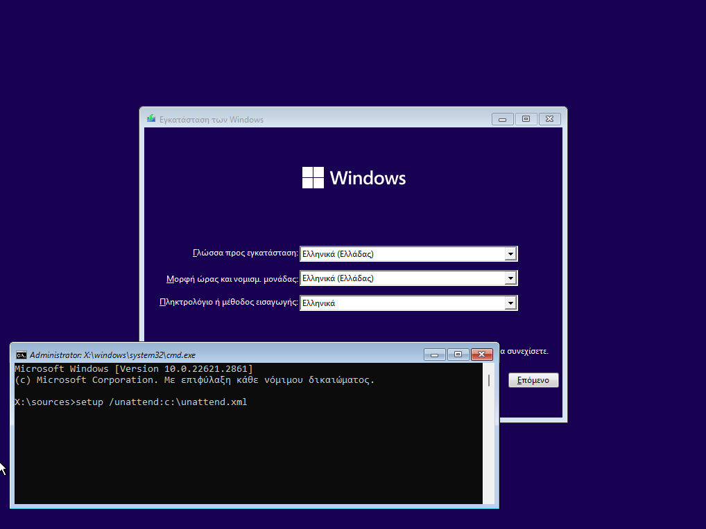

# Αυτοματοποιημένη εγκατάσταση λειτουργικού συστήματος

Για να αποφύγετε τις αρκετές ερωτήσεις κατά την εγκατάσταση του λειτουργικού συστήματος, μπορείτε να αξιοποιήσετε το αρχείο που έχει αναπτυχθεί από την Τεχνική Στήριξη που περιλαμβάνει όλες τις απαντήσεις που απαιτεί η εγκατάσταση σε μορφή xml αρχείου.

[](01-unattended-installation.png)

- Αντιγράψτε το αρχείο που είναι διαθέσιμο στη Βιβλιοθήκη του Ενημερωτικού Κόμβου σε ένα USB stick.
- Τοποθετήστε το USB stick στον προς εγκατάσταση Η/Υ.
- Πατήστε τα πλήκτρα **`Shift`** και **`F10`** στην 1η οθόνη της εγκατάστασης που ρωτά για την γλώσσα εγκατάστασης.
- Θα ανοίξει ένα παράθυρο εντολών (command) όπου θα δώσετε την εντολή:

    ```shell
        setup /unattend:c:\unattend.xml
    ```

    !!! info "Πληροφορία"
        Στην παραπάνω εντολή C: είναι το γράμμα που αντιστοιχεί στο USB Stick.

- Στην ερώτηση **Επιλέξτε το λειτουργικό σύστημα που θα εγκαταστήσετε** επιλέξτε ***Windows 11 Pro*** και κατόπιν ***Επόμενο***.
- Στην ερώτηση **Που θέλετε να εγκαταστήσετε τα Windows;** επιλέξτε τον σκληρό δίσκο και τη διαμέριση που επιθυμείτε και κατόπιν επιλέξτε ***Δημιουργία***, ***Εφαρμογή*** και ***Επόμενο***.

!!! Tip "Συμβουλή"
    Οι δύο ερωτήσεις μπορούν επίσης να απαντηθούν στο αρχείο xml, αλλά έτσι ο εκτελών την εγκατάσταση δεν θα γνωρίζει ποιο λειτουργικό σύστημα εγκαθιστά και σε ποια διαμέριση, κάτι που ίσως δημιουργήσει προβλήματα αν κάποιες διαμερίσεις πρέπει να διατηρηθούν.

- Η εγκατάσταση θα ολοκληρωθεί κανονικά και θα σας ζητηθεί να ορίσετε τον κωδικό του διαχειριστή (localadmin) πριν συνδεθείτε.

Κατόπιν μπορείτε να συνεχίσετε με το βήμα των [Βασικών ρυθμίσεων του λειτουργικού συστημάτος](../../basic-settings/index.md).