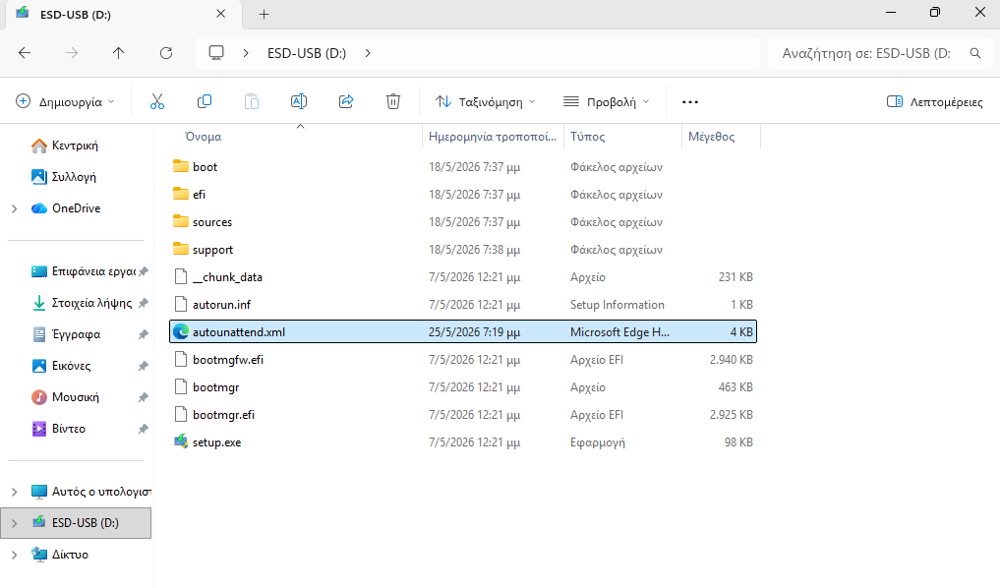

# Αυτοματοποιημένη εγκατάσταση λειτουργικού συστήματος

Για να αποφύγετε τις αρκετές ερωτήσεις κατά την εγκατάσταση του λειτουργικού συστήματος, αλλά και για να έχετε ενιαίες ρυθμίσεις στις εγκαταστάσεις μπορείτε να αξιοποιήσετε το αρχείο που έχει αναπτυχθεί από την Τεχνική Στήριξη που περιλαμβάνει όλες τις απαντήσεις που απαιτεί η εγκατάσταση σε μορφή xml αρχείου.

!!! info "Πληροφορία"
    Από την έκδοση 24H2 και μετά η Microsoft έχει σιωπηρά καταργήσει την υποστήριξη unattend.xml αρχείων και υποστηρίζει μόνο autounattend.xml αρχεία. Η διαφορά είναι ότι το autounattend.xml αναγνωρίζεται αυτόματα από το Windows Setup κατά την εκκίνηση από το μέσο εγκατάστασης (USB/DVD), ενώ το unattend.xml απαιτεί ρητή αναφορά μέσω της παραμέτρου /unattend. Στην περίπτωση του autounattend.xml, **συστήνεται** αφού ο χρήστης [κατεβάσει το .iso από τη Microsoft, να δημιουργήσει ένα **USB εγκατάστασης**](../index.md/#media-creation) και να προσθέσει το autounattend.xml, καθώς η ενσωμάτωση αρχείου autounattend.xml σε .iso απαιτεί ανακατασκευή (rebuild) του iso, κάτι που αποτελεί πιο σύνθετη διαδικασία.

- Κατεβάστε, αποσυμπιέστε και αντιγράψτε το [αρχείο xml αυτοματοποιημένης εγκατάστασης](https://ts.sch.gr/docs/odigies-egkatastasis-diaxirisis/archeio-automatopoiemenes-enkatastases-windows-11-autounattendxml/) στο usb stick που έχετε δημιουργήσει με την εγκατάσταση των windows 11, στον ριζικό (root) φάκελο.

- Τοποθετήστε το USB stick στον προς εγκατάσταση Η/Υ.
- Πραγματοποιήστε εκκίνηση του Η/Υ από το USB stick

- Στην ερώτηση **Επιλέξτε το λειτουργικό σύστημα που θα εγκαταστήσετε** επιλέξτε ***Windows 11 Pro*** και κατόπιν ***Επόμενο***.
- Στην ερώτηση **Που θέλετε να εγκαταστήσετε τα Windows;** επιλέξτε τον σκληρό δίσκο και τη διαμέριση που επιθυμείτε και κατόπιν επιλέξτε ***Δημιουργία***, ***Εφαρμογή*** και ***Επόμενο***.

!!! Tip "Συμβουλή"
    Οι δύο ερωτήσεις μπορούν επίσης να απαντηθούν στο αρχείο xml, αλλά έτσι ο εκτελών την εγκατάσταση δεν θα γνωρίζει ποιο λειτουργικό σύστημα εγκαθιστά και σε ποια διαμέριση, κάτι που ίσως δημιουργήσει προβλήματα αν κάποιες διαμερίσεις πρέπει να διατηρηθούν.

- Η εγκατάσταση θα ολοκληρωθεί κανονικά και θα σας ζητηθεί να ορίσετε τον κωδικό του διαχειριστή (localadmin) πριν συνδεθείτε.

Κατόπιν μπορείτε να συνεχίσετε με το βήμα των [Βασικών ρυθμίσεων του λειτουργικού συστημάτος](../../basic-settings/index.md).