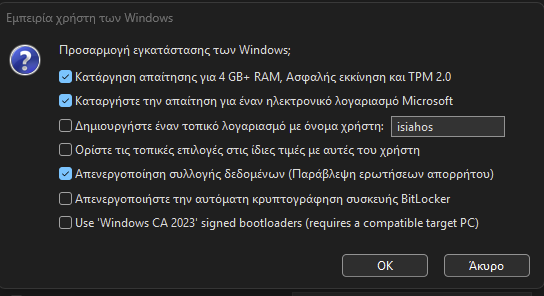

# Εγκατάσταση Windows 11 με αξιοποίηση του εργαλείου Rufus

Το εργαλείο Rufus είναι μία ΕΛ/ΛΑΚ εφαρμογή διαθέσιμη στη σελίδα https://rufus.ie/en/ και επιτρέπει την παράκαμψη των απαιτήσεων της εγκατάστασης Windows 11 (πχ BIOS, CPU, RAM, TPM).

- Αφού κατεβάσετε την τρέχουσα έκδοση του Rufus (πχ rufus-4.11.exe) την εγκαθιστάτε σε ένα σταθμό εργασίας.
- Επιτρέψτε η εφαρμογή Rufus να ελέγχει για τυχόν αναβαθμίσεις.
- Εισάγετε ένα USB stick άδειο στο σταθμό εργασίας (εάν περιέχει δεδομένα αυτά θα σβηστούν).

{.clear}
- Επιλέξτε BIOS & MBR σχέδιο κατανομής.
- Επιλέξτε το Windows 11 ISO για την εγκατάσταση (πχ Win11_24H2_Greek_x64.iso).
- Επιλέξτε ***Εκκίνηση***.
- Επιλέξτε ποιες ρυθμίσεις θέλετε να καταργήσετε από την εγκατάσταση.

{.clear}
- Επιλέξτε ***ΟΚ***.
- Χρησιμοποιήστε το USB stick να κάνετε εκκίνηση του σταθμού εργασίας που θέλετε να εγκαταστήσετε Windows 11 ακολουθώντας τη διαδικασία [Χειροκίνητης Eγκατάστασης](installation/index.md) ή [Αυτοματοποιημένης Εγκατάστασης](installation/unattended/index.md).
