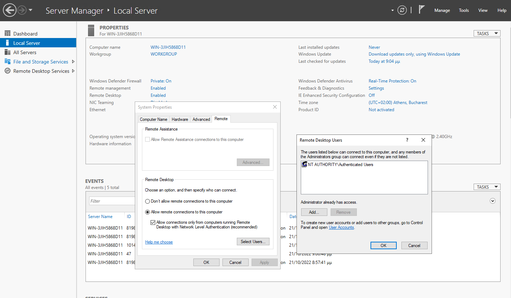

# Δημιουργία χρηστών για Remote Desktop Services

Μπορείτε να εισάγετε τους χρήστες ή τις ομάδες που επιθυμείτε να έχουν πρόσβαση στον εξυπηρετητή διαμέσου της υπηρεσίας Remote Desktop Session Host, (πχ user01, user02 κ.τ.λ.). 
Προτείνεται να εισάγετε την ομάδα **Authenticated Users** η οποία περιέχει όλους τους χρήστες του εξυπηρετητή RDSH. Οι συγκεκριμένοι χρήστες προστίθενται αυτόματα στην ομάδα **Remote Desktop Users** που έχει δικαίωμα απομακρυσμένης σύνδεσης επιφάνειας εργασίας με τον εξυπηρετητή.

[](04-rdsh-users.png)

- Από το εργαλείο `Server Manager` επιλέξτε **Local Server**
- Επιλέξτε το **Enabled** στο Remote Desktop 
- Επιλέξτε το tab **Remote**
- Επιλέξτε **Select Users**
- Επιλέξτε **Add** και γράψτε **Authenticated Users**

!!! powershell clear "PowerShell: Προσθήκη των Authenticated Users ως μέλος της ομάδας Remote Desktop Users"
    ```shell
    Add-LocalGroupMember -Group "Remote Desktop Users" -Member 'S-1-5-11'
    ```

!!! tip "Συμβουλή"
    - Με αυτόν τον τρόπο όλοι οι τοπικοί χρήστες του RDSH εξυπηρετητή γίνονται χρήστες της υπηρεσίας RDSH.
    - Τοπικοί χρήστες στον εξυπηρετητή Windows δημιουργούνται από το εργαλείο `Server Manager` επιλέγοντας Tools ▸ Computer Management ▸ Local Users and Groups ▸ Users.
    - Θυμηθείτε ότι μπορείτε να δημιουργήσετε τοπικούς χρήστες και ομάδες χρηστών ή να τις μεταφέρετε από άλλα Λ/Σ (πχ άλλα Windows ή Linux συστήματα) με την εφαρμογή [sch-scripts για Windows](../software/sch-scripts.md).
