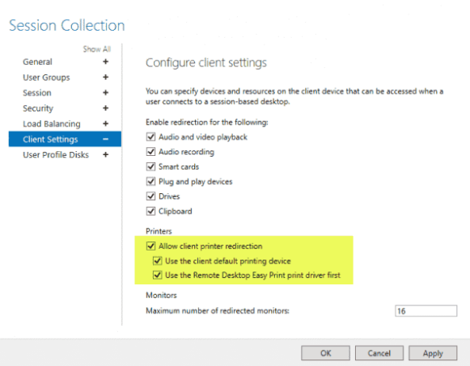

# Εγκατάσταση περιφερειακών συσκευών

## Περιφερειακές συσκευές πλην εκτυπωτών

Στο περιβάλλον του RDSH εξυπηρετητή μπορείτε στις περισσότερες περιπτώσεις να ακολουθήσετε τις οδηγίες για εγκατάσταση περιφερειακών συσκευών στον [εξυπηρετητή Microsoft Windows](../server/peripherals.md).
Εξαίρεση αποτελούν οι εκτυπωτές καθώς δεν απαιτείται να εγκατασταθούν οι οδηγοί των εκτυπωτών του κάθε σταθμού εργασίας στον εξυπηρετητή.

## Εκτυπωτές

Η εκτύπωση στο περιβάλλον του RDSH εξυπηρετητή διαφέρει από την κλασσική περίπτωση του MS-Windows περιβάλλοντος. Στο περιβάλλον του RDSH υπάρχει το RDS Easy Print μέσω του οποίο γίνεται η δρομολόγηση μίας εκτύπωσης από τον RDS Host στον εκτυπωτή που βρίσκεται συνδεμένος στον υπολογιστή πελάτη (ο οποίος συνδέθηκε στον RDS Host).

!!! warning "Προσοχή"
    Το RDS Easy Print απαιτεί [RDP πρωτόκολλο έκδοσης τουλάχιστον v6.1](./requirements.md#rdp-versions) στον υπολογιστή που συνδέεται στον RDS Host. Εάν το περιβάλλον σαν δεν ικανοποιεί αυτήν την απαίτηση θα πρέπει να υπάρχει εγκατεστημένος οδηγός του εκτυπωτή και στον RDS Host και ο οδηγός να είναι συμβατός με τα RDS (το αναφέρει ο κατασκευαστής του εκτυπωτή). Επιπλέον πρέπει να είναι εγκατεστημένο το .NET framework 3.0 SP1.

Το RDS Easy Print στην ουσία είναι ένας ενδιάμεσος (proxy) που ανακατευθύνει όλες τις εργασίες που σχετίζονται με την εκτύπωση στο περιβάλλον του χρήστη στο σταθμό εργασίας του. Αυτός είναι και ο λόγος που δεν απαιτείται η εγκατάσταση των οδηγών των εκτυπωτών του σταθμού εργασίας στον RDS Host.

Αντί να δημιουργείται λοιπόν στον εξυπηρετητή ένα UI που θα έχει τις προτιμήσεις του χρήστη για αριθμό αντιγράφων, εκτύπωση οριζόντια ή κάθετη κτλ, το RDS Easy Print μεταφέρει ("πάνω από το περιβάλλον της απομακρυσμένης σύνδεσης) τα παραπάνω στο UI του σταθμού εργασίας. Αυτό έχει σαν αποτέλεσμα ο χρήστης να έχει το δικό του περιβάλλον με τις επιλογές του.

Κατά την ανακατεύθυνση των εκτυπώσεων ο RDS Host δημιουργεί ένα αρχείο XPS και το στέλνει στον σταθμό εργασίας ο οποίος το τυπώνει στον κατάλληλο εκτυπωτή. Το φορμά XPS έχει το πλεονέκτημα να μπορεί να συμπεριλάβει και τις προτιμήσεις εκτύπωσης του χρήστη μαζί με το αρχείο.

### Ρύθμιση του Easy Print στον RDSH εξυπηρετητή

Κατά την ενεργοποίηση του RDSH ρόλου στον Windows εξυπηρετητή δημιουργείται ένας νέος εκτυπωτής με όνομα *Microsoft XPS Document Writer*. Αυτός είναι ο εκτυπωτής που χρησιμοποιεί το RDS Easy Print.

Για την ενεργοποίησή του θα πρέπει να ρυθμιστεί η αντίστοιχη πολιτική στον RDSH εξυπηρετητή.

- Πληκτρολογήστε **`Windows Key`** **+** **`R`** και κατόπιν την εντολή `gpedit.msc`.
- Πλοηγηθείτε στο μενού  ***Computer Configuration*** ▸ ***Administrative Templates*** ▸ ***Windows Components*** ▸ ***Remote Desktop Services*** ▸ ***Remote Desktop Session Host*** ▸ ***Printer Redirection***
- Ανοίξτε τη ρύθμιση **Use Remote Desktop Easy Print printer driver first** και ενεργοποιήστε την επιλέγοντας **`Enable`**.

Ρυθμίσεις για την ανακατεύθυνση των εκτυπωτών υπάρχουν και στο Remote Desktop Services Session Collection, όπου εκ προοιμίου είναι ενεργοποιημένη τόσο η ανακατεύθυνση των εκτυπωτών όσο και η χρήση του Easy Print Driver.

- Εκκινήστε την εφαρμογή `Server Manager` από το μενού **`Start`** ▸ ***Administrative Tools***.
- Επιλέξτε στο αριστερό πλαίσιο ***Remote Desktop Services*** και κατόπιν ▸ ***Session Collections***
- Στο επάνω δεξιά μενού επιλέξτε ***Tasks*** ▸ ***Edit Properties*** και επιβεβαιώστε τις ρυθμίσεις.
