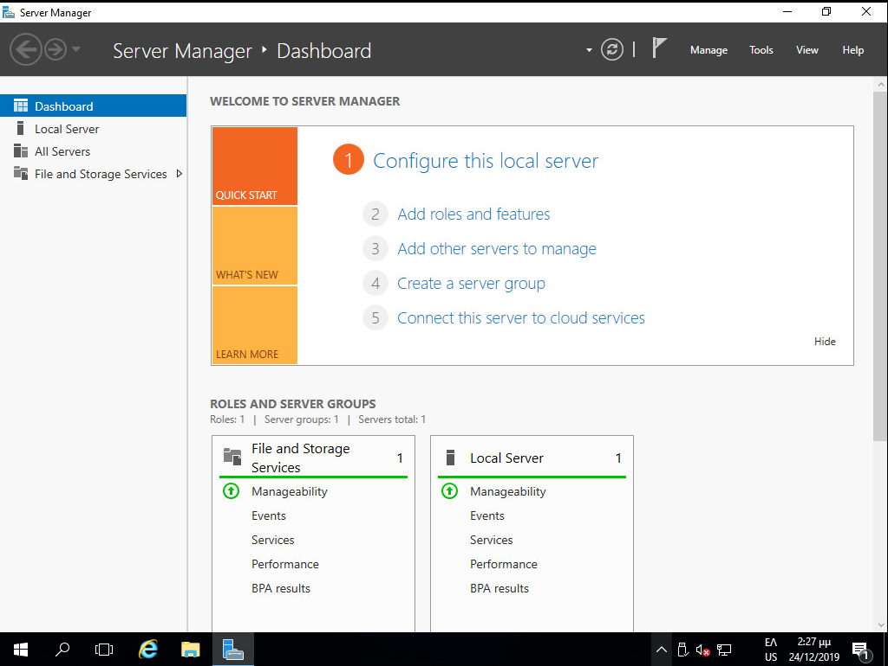
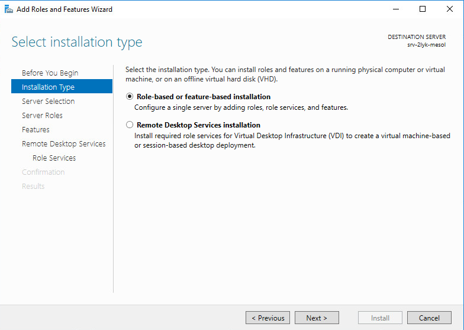
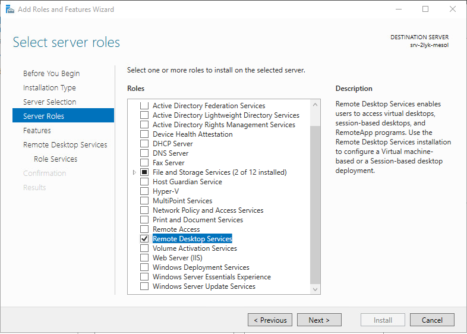
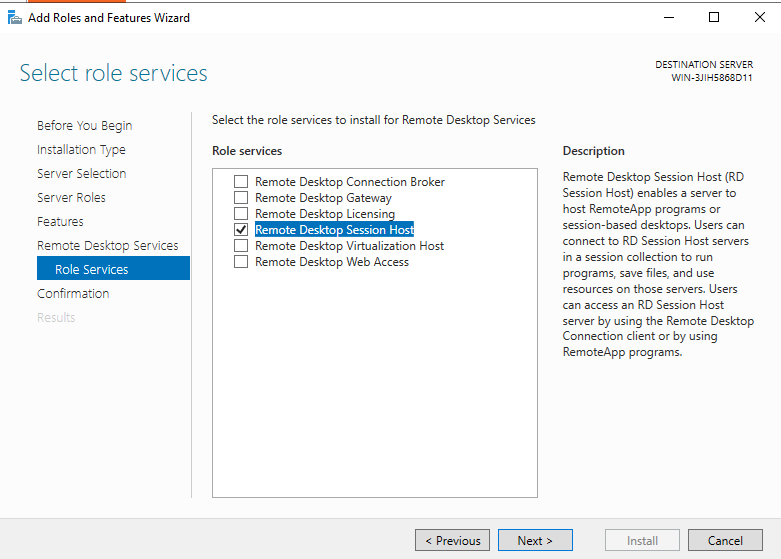

# Εγκατάσταση Windows RDSH Server

Για να ρυθμίσετε τον εξυπηρετητή σας να λειτουργεί ως Remote Desktop Session Host Server θα πρέπει να ενεργοποιήσετε το ρόλο Remote Desktop Session Host. Προαιρετικά, αν διαθέτετε άδειες RDSH CALs, ενεργοποιείτε και το ρόλο του εξυπηρετητή αδειών.

!!! info "Πληροφορία"

    - Η εγκατάσταση του RDSH ρόλου προϋποθέτει και εγκατάσταση εξυπηρετητή αδειών. Ο εξυπηρετητής αδειών δεν χρειάζεται να εγκατασταθεί / ενεργοποιηθεί εάν κάνετε δοκιμαστική χρήση του RDSH server. Σε αυτήν την περίπτωση έχετε τη δυνατότητα να αξιολογήσετε την αρχιτεκτονική δοκιμαστικά για 120 ήμερες στο οποίο διάστημα δεν απαιτείται να διαθέτετε άδειες Remote Desktop Services Client Access Licenses (RDS CALs). 
    
    - Στο διάστημα αυτό οι σταθμοί εργασίας θα μπορούν να πραγματοποιούν Remote Desktop Connection στον εξυπηρετητή χωρίς να απαιτείται εγκατάσταση επιπλέον ρόλων εξυπηρετητή αδειών. 
    
    - Μετά το πέρας των 120 ημερών οι σταθμοί εργασίας δεν θα μπορούν να πραγματοποιούν Remote Desktop Connection στον εξυπηρετητή. Για να συνεχίσετε τη χρήση της υπηρεσίας θα πρέπει να εγκαταστήσετε τις απαραίτητες άδειες ακολουθώντας τα βήματα που βρίσκονται στην ενότητα για τα Προχωρημένα Θέματα: [Εγκατάσταση αδειών Remote Desktop](../advanced.md#rds-license-setup).

!!! tip "Συμβουλή"

    Για να γνωρίζετε τις υπολειπόμενες ημέρες δοκιμαστικής χρήσης της υπηρεσίας, ανοίξτε ένα Παράθυρο PowerShell ως διαχειριστής και αντιγράψτε την εντολή:

    !!! PowerShell: Υπολειπόμενες ημέρες δοκιμαστικής χρήσης RDSH server
        ```shell
         (Invoke-WmiMethod -PATH (gwmi -namespace root\cimv2\terminalservices -class win32_terminalservicesetting).__PATH -name GetGracePeriodDays).daysleft
        ```

## Εγκατάσταση ρόλου RDSH

Στο Windows Server η διαδικασία εγκατάστασης του ρόλου RDSH μπορεί
να γίνει μέσω γραφικού περιβάλλοντος με χρήση του εργαλείου `Server Manager` ακολουθώντας τα παρακάτω βήματα:

[](00-Add-rolesAndfeatures.png)

[](01-RDS-select-role.png)

[](02-RDS-Install_Remote_Desktop_Services.png)

[](03-rds-role.png)

- Εκκινήστε την εφαρμογή `Server Manager` από το μενού **`Start`** ▸ ***Administrative Tools***
- Επιλέξτε το σύνδεσμο **Add roles and features** από την διεπαφή που προσφέρει το εργαλείο `Server Manager` με την έναρξή του.
- Στην αρχική διεπαφή **Add Roles and Features Wizard** επιλέγουμε ***Next***.
- Κατόπιν αφήνουμε επιλεγμένο το  **Role-based or feature-based installation** επιλέγουμε ***Next***.
- Αφήστε επιλεγμένο το **Select a server from the server pool** και  επιλέξτε τον εξυπηρετητή σας (πχ srv-2lyk-mesol) και κατόπιν επιλέξτε ***Next***.
- Στο παράθυρο **Select server roles** επιλέξτε την εγκατάσταση του ρόλου των **Remote Desktop Services** και και κατόπιν επιλέξτε ***Next***.
- Στο παράθυρο **Select Features** επιλέξτε ***Next***.
- Στο παράθυρο **Remote Desktop Services** επιλέξτε ***Next***.
- Στο παράθυρο **Select role services** επιλέξτε ***Remote Desktop Session Host*** και ***Add Features***.
- Στο παράθυρο **Confirm installation selections** επιλέξτε ***Install*** ώστε να ξεκινήσει η εγκατάσταση.

Εναλλακτικά, μπορείτε να εγκαταστήσετε το ρόλο του RDSH με χρήση PowerShell:

!!! powershell clear "PowerShell: Εγκατάσταση του ρόλου RDSH"
    ```shell
    Add-WindowsFeature rds-rd-server
    ```
