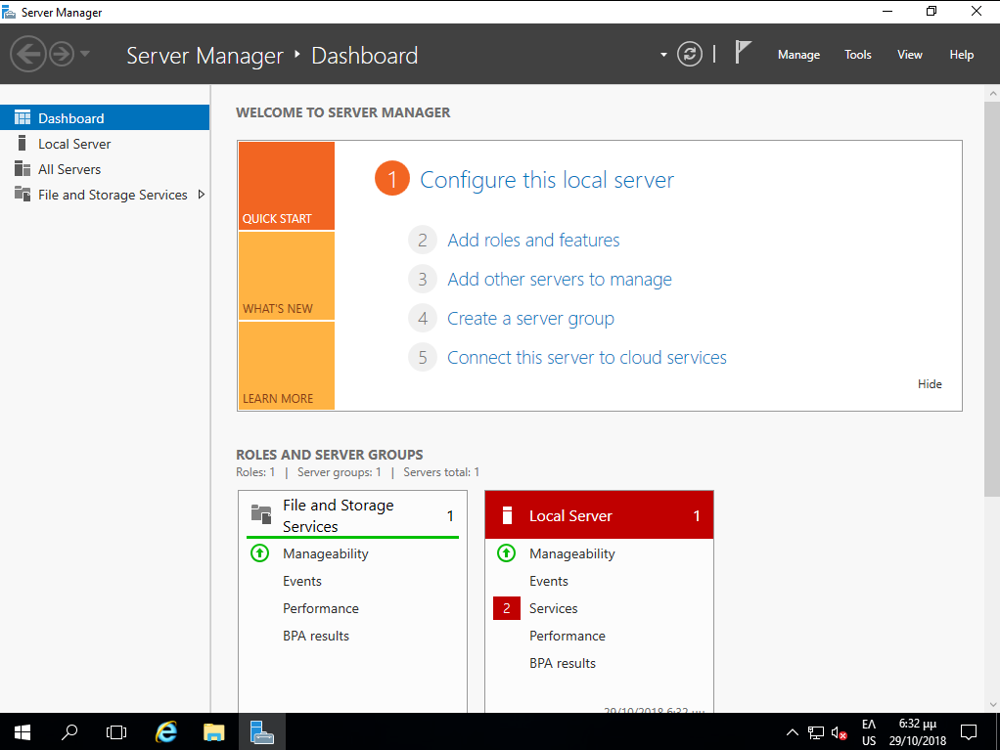
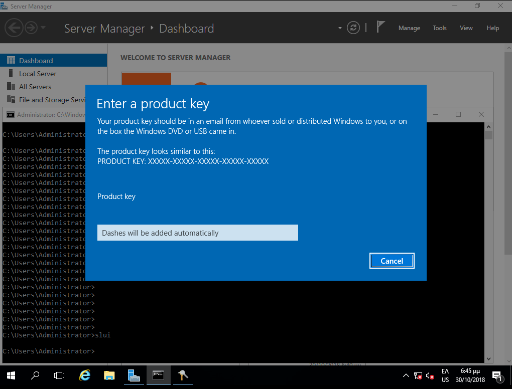
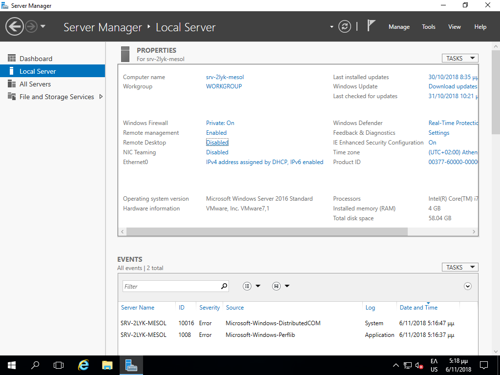
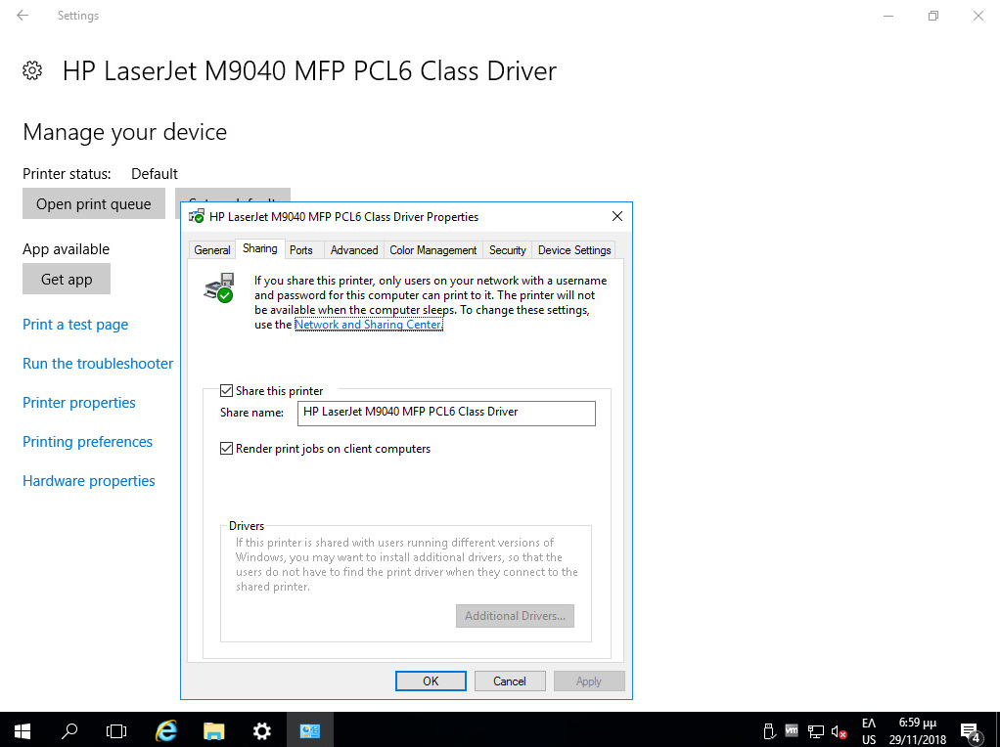
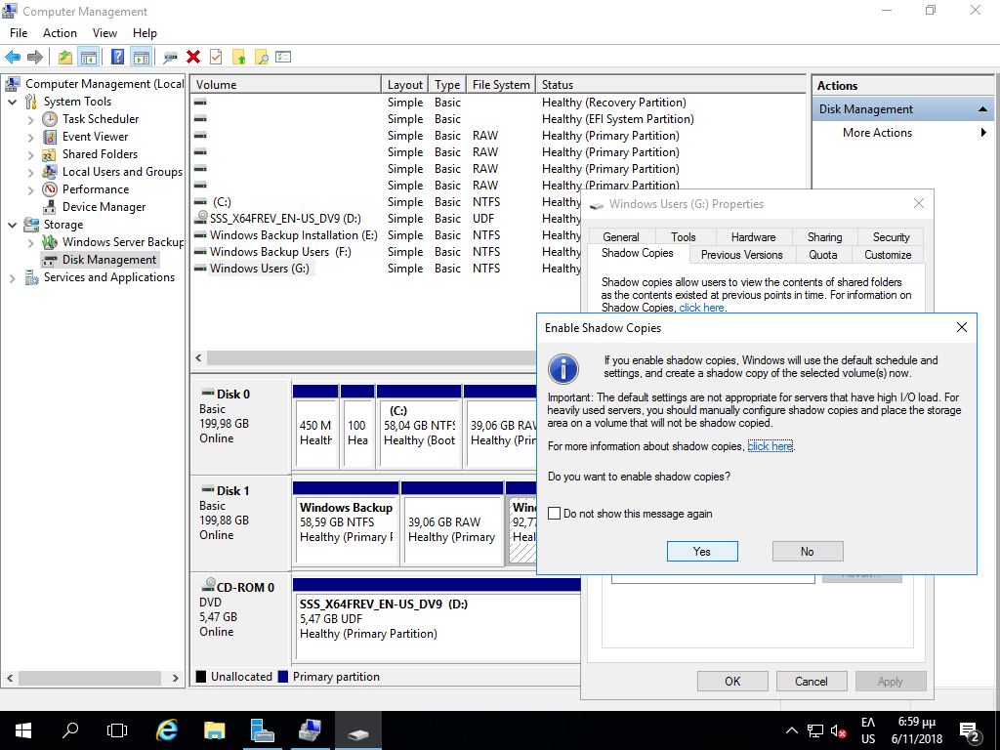
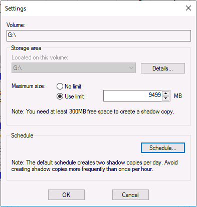

# Βασικές ρυθμίσεις εξυπηρετητή

Για την εύρυθμη λειτουργία του εξυπηρετητή του σχολικού εργαστηρίου κρίνεται απαραίτητη η πραγματοποίηση των ακόλουθων ρυθμίσεων.

## 01. Δικτυακές ρυθμίσεις

### Ορισμός του τοπικού δικτύου ως ιδιωτικού {#private-network}

[](17a-set-private-network.png)

Κατά την 1η εκκίνηση ο εξυπηρετητής συνδέεται στο τοπικό δίκτυο και αποκτά μία
  δυναμική IP μέσω πρωτοκόλλου DHCP. Στην ερώτηση του λειτουργικού συστήματος
  εάν ο συγκεκριμένος σταθμός θα είναι ορατός από τους άλλους επιλέξτε
  ***Yes***, οπότε και ορίζετε το τοπικό δίκτυο του ΣΕΠΕΗΥ ως ιδιωτικό δίκτυο.

!!! Info clear "Πληροφορία"
    Μπορείτε να διαπιστώσετε τις τρέχουσες δικτυακές ρυθμίσεις πληκτρολογώντας σε γραμμή εντολών
    ```shell
        ipconfig /all
    ```
    Τα στοιχεία αυτά θα σας φανούν χρήσιμα σε επόμενο βήμα.

### Το εργαλείο Server Manager[](17b-Server-Manager.png)

Στη συνέχεια με τη χρήση του εργαλείου `Server Manager`, το οποίο είναι ένα
  Microsoft Management Console (MMC) για τη διαχείριση του εξυπηρετητή και
  ξεκινά αυτόματα μετά το logon του διαχειριστή (administrator), ρυθμίζετε τις
  δικτυακές παραμέτρους του εξυπηρετητή.

!!! Info clear "Πληροφορία"
    Εναλλακτικά μπορείτε να "τρέξετε" το `Server Manager` με έναν από τους ακόλουθους τρόπους:
    - Το  ***Start μενού***  ▸  ***Computer*** ▸ ***δεξί-click*** ▸  ***Manage*** 
    - Το  ***Start μενού***  ▸  ***Administrative Tools***  ▸  ***Server Manager*** 
    - Πληκτρολογώντας **`Windows Key`**+**`R`** και κατόπιν **`servermanager`**

### Ορισμός δικτυακών παραμέτρων TCP/IP {#server-ip-dns-settings} [](18-tcpip-properties.png)

[](19-set-IP-DNS.png)

Οι ρυθμίσεις του δικτύου πραγματοποιούνται μέσα από το `Server Manager`
επιλέγοντας ***Local Server*** ▸ ***Ethernet0*** ▸ ***IPv4 Address assigned by
DHCP, IPv6 enabled*** και στη συνέχεια με ***δεξί κλικ*** επιλέγουμε
***Properties*** στην κάρτα δικτύου ***Ethernet0***. 

!!! tip "Συμβουλή"
    H δημιουργία του domain προτείνεται να πραγματοποιηθεί σε μεταγενέστερη φάση, όταν έχει επιβεβαιωθεί η καλή λειτουργία του υπολογιστή.

!!! info clear "Πληροφορία"
    Οι TCP/IP ρυθμίσεις μπορούν να πραγματοποιηθούν σύμφωνα με τις οδηγίες που έχουν εκδοθεί για τη διασύνδεση Σ.Ε.Π.Ε.Η.Υ. στο Π.Σ.Δ. Συνοπτικά αναφέρεται ότι σε ένα Σ.Ε.Π.Ε.Η.Υ. με ξεχωριστή (από το ADSL/VDSL
    CPE) συσκευή δρομολογητή (πχ των κατασκευαστικών οίκων Cisco, Mikrotik) που
    διαχειρίζεται το Π.Σ.Δ.:

    - Κάθε εξυπηρετητής έχει στατική IP διεύθυνση της μορφής 10.x.y.z όπου οι
    τιμές x & y εξαρτώνται από τη σχολική μονάδα και λαμβάνονται μετά από
    επικοινωνία με το helpdesk του ΠΣΔ (8011180181) και η τιμή z είναι 10 για
    τον πρώτο εξυπηρετητή της σχολικής μονάδας, 11 για τον δεύτερο εξυπηρετητή
    κοκ.
    - Οι διευθύνσεις 10.x.y.128 έως 10.x.y.254 είναι δεσμευμένες για να
    μοιράζει ο δρομολογητής διευθύνσεις μέσω DHCP και δεν πρέπει να
    χρησιμοποιούνται ως στατικές
    - Το subnet mask είναι της μορφής 255.255.255.0
    - Το default gateway έχει τιμή 10.x.y.1 όπου οι τιμές x & y παραμένουν
    ίδιες με αυτές της IP διεύθυνσης.
    - Ως DNS Server ορίζονται οι nic.sch.gr, nic.att.sch.gr, nic.thess.sch.gr,
    οι IP διευθύνσεις των οποίων (194.63.238.4, 194.63.239.164 και
    194.63.237.4) θα πρέπει να δηλωθούν στις ιδιότητες του Internet Protocol
    Version 4 (TCP/IPv4) Properties

!!! powershell "PowerShell: Δικτυακές ρυθμίσεις"
    ```shell
    $interface=Get-NetIPInterface -AddressFamily IPv4 -InterfaceAlias "Ethernet*"
        
    New-NetIPAddress -InterfaceAlias $interface.InterfaceAlias -IPAddress 10.50.40.10 -PrefixLength 24 -DefaultGateway 10.50.40.1
        
    Set-DNSClientServerAddress -InterfaceIndex $interface.ifIndex -ServerAddresses 194.63.238.4,194.63.239.164
        
    Set-NetConnectionProfile -InterfaceAlias $interface.InterfaceAlias -NetworkCategory "Private"
    ```

### Ορισμός ονόματος υπολογιστή

[](20-set-computer-name.png)

Σε ότι αφορά το όνομα του υπολογιστή (computer name) μέσα από το `Server
Manager` επιλέγοντας ***Local Server*** ▸ ***Computer Name*** ▸
***WIN-SFK.....*** και ορίζουμε Computer Description: ***School Windows
Server*** και κατόπιν πατώντας το ***Change*** ορίζουμε Computer Name:
***srv-2lyk-mesol***.

Πραγματοποιήστε τις ρυθμίσεις ονόματος και περιγραφής επιλέγοντας το πλήκτρο
OK. Ο windows server θα σας ζητήσει να πραγματοποιήσει επανεκκίνηση με τη νέα
ονοματολογία και διευθυνσιοδότηση.

!!! warning "Προσοχή"
    - Το όνομα κάθε σχολικού server είναι μοναδικό στο Π.Σ.Δ. και προκύπτει αν
    από το web site του σχολείου (π.χ. http://2lyk-mesol.ait.sch.gr) κρατήσουμε
    το αρχικό κομμάτι (π.χ. 2lyk-mesol) και προσθέσουμε **srv-** μπροστά του.
    ώστε να είναι ξεκάθαρος ο ρόλος του υπολογιστή.

    - Αν στη σχολική μονάδα συνυπάρχουν δύο διαφορετικά εργαστήρια με ανεξάρτητο domain ή εξυπηρετητής LTSP προτείνεται να δίνονται διαφορετικά ονόματα στους εξυπηρετητές με αλλαγή του προθέματος για την αποφυγή προβλημάτων (πχ. αντί του προθέματος **srv-** να δίνεται πρόθεμα **srv1-** και **srv2-** στους δύο εξυπηρετητές αντίστοιχα).

!!! powershell "PowerShell: Μετονομασία εξυπηρετητή"
    ```shell
    Rename-Computer -NewName srv-2lyk-mesol -LocalCredential administrator -Restart
    ```

## 02. Δημιουργία διαμερίσεων[](21a-users-partition.png)
[](21b-users-partition.png)
Μπορείτε να δημιουργήσετε τις προτεινόμενες διαμερίσεις όπως έχει ήδη αναφερθεί στην ενότητα εγκατάστασης του εξυπηρετητή - ρύθμισης των διαμερίσεων.

Για τη δημιουργία διαμέρισης για την αποθήκευση των αρχείων των χρηστών και των κοινόχρηστων αρχείων:
- Από το εργαλείο διαχείρισης `Server Manager` Επιλέγοντας από το μενού ***Tools***  ▸ ***Computer Management*** και κατόπιν επιλέγοντας ***Disk Management***.
- Επιλέγετε το δίσκο που θα δημιουργηθεί η διαμέριση πχ ***Disk1***
- Επιλέγετε το μη δεσμευμένο χώρο του για τη δημιουργία της διαμέρισης ***Unallocated***
- Με ***δεξί κλικ*** δημιουργείτε μία νέα διαμέριση ***New Simple Volume***
- Ορίζετε το μέγεθος της διαμέρισης σύμφωνα με τις οδηγίες στο πεδίο Simple Volume in MB πχ 95000
- Ορίζετε η διαμέριση να αντιστοιχεί με ένα drive letter πχ F
- Ορίζετε το σύστημα αρχείων να είναι τύπου ***NTFS***
- Ορίζετε το όνομα της διαμέρισης να είναι ***Users***
- Αφήνετε να πραγματοποιηθεί γρήγορη μορφοποίηση ***Perform a quick format***
- Επιλέγετε ***Next*** για την ολοκλήρωση της δημιουργίας διαμέρισης

!!! info "Πληροφορία"
    Τα παραπάνω βήματα πρέπει να επαναληφθούν για τις επιπλέον διαμερίσεις που θέλετε να δημιουργηθούν.

## 03. Ενεργοποίηση άδειας

[](22-registration.png)

Μετά την εγκατάσταση του λειτουργικού συστήματος είναι πιθανό να απαιτείται η
ενεργοποίησή του μέσα σε κάποιο χρονικό διάστημα για να είναι δυνατή η
περαιτέρω χρήση του (product activation). Η άδεια χρήσης καθορίζει αν είναι
απαραίτητο κάτι τέτοιο καθώς και το διάστημα που μπορεί να χρησιμοποιηθούν τα
Windows 2016 Server χωρίς ενεργοποίηση. Η βέλτιστη μέθοδος για τους
εξυπηρετητές των σχολικών εργαστηρίων είναι να πραγματοποιείται η διαδικασία
μέσω διαδικτύου.

!!! tip "Γραμμή εντολών: Ενεργοποίηση άδειας"
    ```shell
    slui
    ```

## 04. Εγκατάσταση ενημερώσεων
[](23-check-4-updates.png)
[](24-install-updates.png)
Απαραίτητη προϋπόθεση για την εύρυθμη λειτουργία του λειτουργικού συστήματος είναι η εγκατάσταση όλων των κρίσιμων ενημερώσεων. 

Από την εφαρμογή `Server Manager` επιλέγοντας ***Local Server*** και κατόπιν ***Download Updates only, using Windows Update*** θα πραγματοποιηθεί σύνδεση στο Windows Update και θα "κατέβουν" και θα εγκατασταθούν τα απαραίτητα updates.

Επιλέξτε ***Install now*** για την άμεση εγκατάσταση των ενημερώσεων.

!!! info clear "Πληροφορία"
    Η εκ προοιμίου συμπεριφορά των ενημερώσεων είναι να κατεβαίνουν χωρίς να
    εγκαθίστανται, το οποίο είναι μια καλή πρακτική για το Σ.Ε.Π.Ε.Η.Υ. Εάν
    επιθυμείτε να αλλάξει αυτή η πολιτική, πληκτρολογήστε σε γραμμή εντολών
    ```shell
    sconfig
    ```
    και επιλέξτε ***5.Windows Update Settings*** και κατόπιν επιλέξτε αν θα
    εγκαθίστανται αυτόματα ή μόνο θα κατεβαίνουν ή θα γίνονται όλα χειροκίνητα.

## 05. Απενεργοποίηση του Enhanced Security του Internet Explorer[](26-disable-enhanced-security.jpg)

Η βασική λειτουργικότητα του Internet Explorer έχει μειωθεί σημαντικά στις νεότερες εκδόσεις των Windows και τις περισσότερες φορές εμφανίζεται μήνυμα παρεμπόδισης περιεχομένου (content blocking) κάνοντας αδύνατη την πλοήγηση στο διαδίκτυο. Για αυτό το λόγο συνιστούμε:

- την απενεργοποίηση του Enhanced Security χαρακτηριστικού
- την ελάχιστη χρήστη του Internet Explorer, μόνο για την εγκατάσταση ενός άλλου εργαλείου πλοήγησης στο διαδίκτυο

Για την απενεργοποίηση απαιτείται το εργαλείο `Server Manager` και από το οποίο επιλέγετε ***Local Server*** και στη συνέχεια επιλέγετε ***IE Enhanced Security Configuration*** και κατόπιν ***On*** και τέλος απενεργοποιήστε ***Off***.

!!! powershell "PowerShell: Απενεργοποίηση Internet Explorer Enhanced Security"
    ```shell
    function Disable-IEESC {
    $AdminKey = "HKLM:\SOFTWARE\Microsoft\Active Setup\Installed Components\{A509B1A7-37EF-4b3f-8CFC-4F3A74704073}"
    $UserKey = "HKLM:\SOFTWARE\Microsoft\Active Setup\Installed Components\{A509B1A8-37EF-4b3f-8CFC-4F3A74704073}"
    Set-ItemProperty -Path $AdminKey -Name "IsInstalled" -Value 0
    Set-ItemProperty -Path $UserKey -Name "IsInstalled" -Value 0
    Stop-Process -Name Explorer
    Write-Host "IE Enhanced Security Configuration (ESC) has been disabled." -ForegroundColor Green
    }
    Disable-IEESC
    ```

## 06. Εγκατάσταση οδηγών υλικού και περιφερειακών

Τμήμα της εγκατάστασης του λειτουργικού συστήματος θεωρείται και η
  εγκατάσταση των οδηγών συσκευών (system drivers) της μητρικής, των καρτών
  επέκτασης και των περιφερειακών συσκευών. Μπορεί να γίνει χρήση των μέσων
  (cd’s, δισκέτες κλπ) που παρασχέθηκαν μαζί με το υπολογιστικό σύστημα.
  Προτείνεται όμως να εγκαθίστανται οι τελευταίες εκδόσεις των οδηγών, που στην
  πλειονότητα των περιπτώσεων μπορούν να ληφθούν από το Διαδίκτυο.

Μπορείτε να κάνετε και έναν έλεγχο για τυχόν πιο ενημερωμένους οδηγούς με την ΕΛ/ΛΑΚ εφαρμογή [Snappy Driver Installer](../../software/snappy-driver.md)

Σε περίπτωση που ο Η/Υ διαθέτει υλικό του κατασκευαστικού οίκου Intel,
  μπορείτε να ελέγξετε για ενημερώσεις των εκδόσεων των οδηγών του υλικού με
  την εφαρμογή [Intel Driver & Support
  Assistant](https://www.intel.com/content/www/us/en/support/intel-driver-support-assistant.html)

Η εγκατάσταση του εκτυπωτή, που συνήθως είναι συνδεδεμένος στον εξυπηρετητή,
  μπορεί να γίνει σε αυτό το σημείο σύμφωνα με τις οδηγίες του εκάστοτε
  μοντέλου. Για τη χρήση της υπηρεσίας εκτύπωσης από όλους τους χρήστες του
  εργαστηρίου ο εκτυπωτής πρέπει να διαμοιραστεί, οπότε ο εξυπηρετητής
  αναλαμβάνει και το ρόλο του διακομιστή εκτυπώσεων.

## 07. Ενεργοποίηση απομακρυσμένης πρόσβασης (Remote Desktop - για διαχειριστές)

Προκειμένου να είναι εφικτή η απομακρυσμένη διαχείριση του εξυπηρετητή (με αξιοποίηση του πρωτοκόλλου [RDP](https://en.wikipedia.org/wiki/Remote_Desktop_Protocol)) πρέπει να είναι ενεργοποιημένη η προσφερόμενη υπηρεσία των Windows:

[](01-enable-remote-desktop.png)

- Από το `Server Manager` επιλέγουμε ***Local Server*** και στη συνέχεια ***Remote Desktop: Disabled*** ώστε να την ενεργοποιήσουμε.

!!! tip "Συμβουλή"
    Εναλλακτικά με ***δεξί κλικ*** στο  ***This PC***  επιλέγουμε  ***Properties*** ▸ ***Remote Settings***

[](02-allow-fw-remote-desktop-.png)

- Στις ιδιότητες συστήματος επιλέγουμε ***Allow remote connections to this computer***.
- Επιλέγουμε ***OK*** ώστε να είναι εφικτή η απομακρυσμένη πρόσβαση στον εξυπηρετητή από όλα τα δίκτυα που είναι συνδεδεμένος ο εξυπηρετητής.
- Αφήνουμε ενεργή την επιλογή ***Allow Connections only from computers running Remote Desktop with Network Level Authentication (recommended)***

[](03-remote-desktop-users.png)

- Με αυτόν τον τρόπο ενεργοποιείται η δυνατότητα Remote Desktop στον εξυπηρετητή και επιτρέπει εξ’ ορισμού την πρόσβαση σε όσους ανήκουν στο group **Administrators** καθώς και σε όσους λογαριασμούς χρηστών ή ομάδες χρηστών προσθέσετε με το ***Add***

!!! powershell clear "PowerShell: Ενεργοποίηση Remote Desktop"
    ```shell
    Set-ItemProperty -Path 'HKLM:\System\CurrentControlSet\Control\Terminal Server' -name "fDenyTSConnections" -value 0

    Enable-NetFirewallRule -DisplayGroup "Remote Desktop"
    ```

## 08. Ενεργοποίηση υπηρεσίας διαμοιρασμού αρχείων και εκτυπωτών

### Ενεργοποίηση διαμοιρασμού αρχείων και εκτυπωτών στο τοπικό δίκτυο

[](04-Enable-File-and-Print-Sharing.png)
[](05-Enable-File-and-Print-Sharing-2.png)

Αρχικά θα πρέπει να ενεργοποιηθεί ο διαμοιρασμός αρχείων και εκτυπωτών για το τοπικό δίκτυο που έχει χαρακτηριστεί ιδιωτικό (private) [σε προηγούμενο βήμα](../installation/#private-network).

- Ανοίξτε τον Πίνακα Ελέγχου (Control Panel).
- Στην ενότητα **Network and Internet**, επιλέξτε ***View Network Status and tasks***

- Επιλέξτε ***Change Advanced sharing settings***
- Στο ιδιωτικό προφιλ, επιλέξτε **Turn on file and printer sharing**

!!! powershell clear "PowerShell: Ενεργοποίηση File and Print Sharing"
    ```shell
    Set-NetFirewallRule -DisplayGroup "File And Printer Sharing" -Enabled True -Profile Private
    ```

### Διαμοιρασμός του καταλόγου Users

[](06-share-folder-users.png)
[](07-share-folder-users-permission.png)

Όπως έχει ήδη αναφερθεί στην ενότητα εγκατάστασης του εξυπηρετητή - ρύθμισης των διαμερίσεων, υπάρχει μία διαμέριση για την αποθήκευση των αρχείων των χρηστών και των κοινόχρηστων αρχείων.

- Στη διαμέριση αυτή δημιουργήστε έναν φάκελο με όνομα **Users**.
- Διαμοιράστε το φάκελο επιλέγοντάς τον ***Users*** ▸ ***δεξί κλικ*** ▸ ***Properties*** ▸ ***Sharing*** ▸ ***Advanced Sharing*** 
- Επιλέξτε **Share this folder**
- Ως διαμοιραζόμενο όνομα (Share Name) δώστε: **Users**
- Επιλέξτε ***Permissions*** και δώστε άδειες στο Group Everyone **Full Control**
- Πατήστε το πλήκτρο ***OK*** δύο φορές για να αποδεχτείτε τις αλλαγές

!!! info clear "Πληροφορία"
    - Η τοπική ομάδα (local group) Users του εξυπηρετητή έχει δικαιώματα ανάγνωσης στον συγκεκριμένο κατάλογο.
    - Ο φάκελος Users πλέον διαμοιράζεται και είναι προσβάσιμος στο σταθμό εργασίας ή στον εξυπηρετητή πατώντας **`Ctrl`**+**`R`** και πληκτρολογώντας την εντολή **\\\srv-2lyk-mesol\users**

!!! powershell "PowerShell: Διαμοιρασμός φακέλου Users"
    ```shell
    mkdir g:\users

    New-SmbShare -Name "Users" -Path "G:\users" -FullAccess "Everyone"
    ```

### Διαμοιρασμός εκτυπωτή {#printer-sharing}

[](09-printer-sharing.png)

Κατά την εγκατάσταση του εκτυπωτή το σύστημα σας ζητά να δηλώσετε εάν θέλετε να τον διαμοιράσει. Σε περίπτωση θετικής απάντησης ο εκτυπωτής διαμοιράζεται δικτυακά. Αν έχετε επιλέξει όχι, μπορείτε επιλέγοντας  ***Windows Start*** ▸ ***Settings*** ▸ ***Devices*** ▸ ***<Όνομα Εκτυπωτή>***  να επιλέξετε τον εκτυπωτή που έχετε εγκαταστήσει (ή να προσθέσετε έναν καινούριο εκτυπωτή) και κατόπιν να επιλέξετε  ***Manage*** ▸ ***Printer Properties*** ▸ ***Καρτέλα Sharing***  να ενεργοποιήσετε το διαμοιρασμό του.

Οι χρήστες που έχουν λογαριασμό στον εξυπηρετητή αυτομάτως θα μπορούν να τυπώσουν στον διαμοιραζόμενο εκτυπωτή.

!!! info clear "Πληροφορία"
    Για εγκατάσταση εκτυπωτών δείτε στο [περιφερειακά](../peripherals/#printers)

## 09. Ενεργοποίηση υπηρεσίας shadow copies

Στις εκδόσεις των λειτουργικών συστημάτων Microsoft Windows Server από την
έκδοση 2003 και μετά ενσωματώθηκε μια πολύ χρήσιμη λειτουργικότητα με την
ονομασία **Shadow copies of shared folders**. Αυτή η δυνατότητα επιτρέπει την
αντιμετώπιση του φαινομένου της απώλειας δεδομένων σε διαμοιραζόμενους (shared)
φακέλους μετά από εσφαλμένη διαγραφή ή τροποποίηση αρχείων από τους χρήστες.
Αυτό επιτυγχάνεται με την αυτόματη δημιουργία κρυμμένων αντιγράφων (shadow
copies) των αρχείων που ανήκουν σε διαμοιραζόμενους φακέλους, ανά τακτά χρονικά
διαστήματα.

!!! tip "Συμβουλή"
    Προτείνεται η ενεργοποίηση της δυνατότητας τουλάχιστον στην κατάτμηση που
    περιέχει τα αρχεία των χρηστών, αλλά και σε οποιαδήποτε άλλη κατάτμηση
    υπάρχουν διαμοιραζόμενοι φάκελοι που χρειάζονται προστασία.

[](10-shadow-copies-via-server-manager.png)
{.clear}

Η υπηρεσία μπορεί να ρυθμιστεί από το εργαλείο διαχείρισης `Server Manager`, επιλέγοντας από το μενού ***Tools*** ▸ ***Computer Management***  και κατόπιν επιλέγοντας ***Disk Management***.  

[](11-shadow-copies-select-disk.png)  
{.clear}

Στη συνέχεια επιλέγετε τη διαμέριση που αντιστοιχεί στα αρχεία των χρηστών (στο παράδειγμα: Windows Users, δηλ. η 3η διαμέριση του 2ου δίσκου) και ***δεξί κλικ*** ▸ ***Properties***.  

[](12-shadow-copies-enable.png)
{.clear}

Επιλέγετε το tab **Shadow Copies** και κατόπιν το κουμπί ***Enable***.  

[](13-shadow-copies-schedule.png)
{.clear}

Με την επιλογή ενεργοποίησης εμφανίζεται προειδοποιητικό μήνυμα αποδοχής, το οποίο αποδέχεστε πατώντας το κουμπί ***Yes***.  

[](14-shadow-copies-settings.png)
{.clear}

Αποδεχθείτε τις προκαθορισμένες ρυθμίσεις πατώντας το ***Yes***, είτε τις αλλάζετε πατώντας το ***Settings***  

[](15-shadow-copies-size.png)
{.clear}

Σε κάθε κατάτμηση που επιλέγεται εκ προοιμίου χώρος για τη λήψη αντιγράφων ίσος με το 10% του μεγέθους της.
Στην περίπτωση που επιλέξετε να αλλάξετε τις προκαθορισμένες ρυθμίσεις, μπορείτε να ορίσετε το μέγιστο μέγεθος που θα χρησιμοποιείται για την αποθήκευση των Shadow Copies και επιπλέον πατώντας το ***Schedule*** μπορείτε να αλλάξετε το πότε θα λαμβάνονται τα αντίγραφα.  

[](16-shadow-copies-schedule.png)
{.clear}

Τροποποιείστε το υπάρχον χρονοδιάγραμμα ώστε καθημερινά να λαμβάνονται αντίγραφα στις 07:00, αν δεν υπάρχουν ιδιαιτερότητες στο ωράριο λειτουργίας του εργαστηρίου που καθιστούν αναγκαίο κάποιο διαφορετικό χειρισμό.

!!! info clear "Πληροφορία"
    Η ανάκτηση προηγούμενων εκδόσεων αρχείων από τα ληφθέντα shadow copies πραγματοποιείται:
    - Aπό την κονσόλα του εξυπηρετητή πατώντας **`Ctrl`**+**`R`** και πληκτρολογώντας την εντολή **\\\\\<server-name>\\\<driveletter>$**, όπου **\<drive-letter>** η κατάτμηση όπου βρίσκεται ο διαμοιραζόμενος φάκελος από τον οποίο θέλουμε να ανακτήσουμε αρχεία.
    - Από κάποιον σταθμό εργασίας πληκτρολογώντας **\\\\srv-2lyk-mesol**.
    - Και στις δύο περιπτώσεις πατήστε ***δεξί κλικ*** στο drive ή στο φάκελο, κατόπιν επιλέξτε το tab **Previous Versions** και τέλος το κουμπί ***Restore***.

!!! powershell "PowerShell: Ενεργοποίηση Shadow Copies στη διαμέριση των χρηστών G:"
    ```shell
    vssadmin add shadowstorage /for=G: /on=G: /maxsize=10%

    vssadmin create shadow /for=G:

    $Action=new-scheduledtaskaction -execute "c:\windows\system32\vssadmin.exe" -Argument "create shadow /for=G:"

    $Trigger=new-scheduledtasktrigger -daily -at 7:00AM

    Register-ScheduledTask -TaskName ShadowCopy -Trigger $Trigger -Action $Action -Description "ShadowCopy of Users"
    ```

## 10. Ενεργοποίηση υπηρεσίας κεντρικής εκτύπωσης - Print Server {#print-server}

Ο εξυπηρετητής του Σ.Ε.Π.Ε.Η.Υ. μπορεί να ρυθμιστεί ώστε να διαμοιράζει και να
ενεργοποιήσει αυτόματα όλους τους συνδεδεμένους σε αυτόν εκτυπωτές στους
σταθμούς εργασίας του Active Directory Domain. Το πλεονέκτημα αυτής της
ρύθμισης είναι ότι οι εκτυπωτές εμφανίζονται και στο Active Directory και οι
χρήστες μπορούν να συνδεθούν στο σωστό εκτυπωτή και επιπλέον η εγκατάσταση του
εκτυπωτή και των οδηγών του δεν απαιτεί διαχειριστικά προνόμια στους σταθμούς
εργασίας (αντιγράφονται οι οδηγοί που έχουν δηλωθεί στον Printer Server για κάθε έκδοση Windows). Πρέπει να πραγματοποιηθούν τα ακόλουθα βήματα:

- Ενεργοποίηση ρόλου Print Server
- Δημιουργία εκτυπωτών στον εξυπηρετητή.
- Ενεργοποίηση των εκτυπωτών του εξυπηρετητή στους σταθμούς εργασίας του domain με τη βοήθεια Group Policies.

### Ενεργοποίηση ρόλου Print Server

[](17-Print-and-Document-Services-role-install.png)

[](18-Print-Server-install.png)

- Από το `Server Manager` επιλέγετε ***Add roles and features*** και κατόπιν ***Role-based or feature-based installation*** και το όνομα του εξυπηρετητή και πατάτε ***Next***
- Στο παράθυρο **Add Roles and Features Wizard** επιλέγετε το ρόλο **Print and Document Services** και πατάτε το ***Add Features*** και κατόπιν το ***Next***
- Στο παράθυρο **Select Features** πατάτε ***Next***
- Στο παράθυρο **Print and Document Services** πατάτε ***Next***
- Στο παράθυρο **Role Services** επιλέγετε ***Print Server***
- Στο παράθυρο **Select Role Services** πατάτε ***Next***
- Στο παράθυρο **Confirm installation selections** πατάτε ***Install***

!!! powershell clear "PowerShell: Ενεργοποίηση ρόλου Print Server"
    ```shell
    Install-WindowsFeature Print-Services
    ```
    
!!! info "Πληροφορία"
    - Σε περίπτωση που διαθέτετε και άλλα συστήματα με Λ/Σ διαφορετικά από Windows, για να τυπώσετε θα πρέπει να έχετε ενεργό το πρωτόκολλο **SMB** (Samba Client), πχ. στο Ubuntu Linux αυτό είναι ενεργό. 
    
    - Εάν η υποστήριξη SMB δεν είναι δυνατή, τότε μπορείτε στο παράθυρο **Role Services** (κατά την ενεργοποίηση του Print Server) να προσθέσετε εκτός του ***Print Server*** και τους ρόλους ***Internet Printing*** ή/και ***LPD Service*** και να εκτυπώσετε είτε με χρήση του **IPP** πρωτοκόλλου είτε με χρήση του **LPR** πρωτοκόλλου.

### Προσθήκη εκτυπωτών στον Print Server

Από την εφαρμογή `Server Manager` και το μενού  ***Roles*** ▸ ***Print and Document Services*** ▸ ***Print Management*** ▸ ***Print Servers*** ▸ ***SERVER*** ανοίγουμε τη διαχείριση του Print Server και προσθέτουμε τους εκτυπωτές που είναι συνδεμένοι στον εξυπηρετητή. Η διαδικασία περιλαμβάνει:

[](19-Print-Server-add-printer.png)

- Προσθήκη και ρύθμιση των θυρών (**Ports**) με τις οποίες συνδέεται ο εκτυπωτής, πχ LPT1, USB κτλ αν πρόκειται για τοπικό εκτυπωτή, TCP/IP αν πρόκειται για δικτυακό εκτυπωτή.
- Προσθήκη των οδηγών (**Drivers**) του εκτυπωτή. Εκτός από x64, μπορείτε να προσθέσετε και τους x86 αν έχετε παλιές εκδόσεις Windows, με  δεξί κλικ στον επιθυμητό εκτυπωτή ▸ ***Manage Sharing*** ▸ ***Additional Drivers***
- Προσθήκη εκτυπωτή (**Printers**) και ρύθμιση των παραμέτρων του (όπως εκτύπωση σε Α4, διπλής όψης, σύνδεση με θύρα και οδηγό κτλ). Χρήσιμο είναι να επιλέξετε να εμφανίζεται ο εκτυπωτής στο Active Directory **List in Active Directory**, ώστε να μπορούν οι χρήστες να τον αναζητούν και να τον εγκαθιστούν αυτόματα.

!!! powershell "PowerShell: Διαχείριση εκτυπωτών στον Print Server"
    Υπάρχουν [οι ακόλουθες εντολές](https://docs.microsoft.com/en-us/powershell/module/printmanagement/?view=windowsserver2022-ps&viewFallbackFrom=win10-ps) για την ολοκλήρωση των παραπάνω ενεργειών με χρήση powershell.

!!! info clear "Πληροφορία"
    - Οι χρήστες μπορούν να εγκαταστήσουν τους εκτυπωτές στους σταθμούς εργασίας:
    
        - είτε από το ***Control Panel*** ▸ ***Devices and Printers*** ▸ ***Add a printer***, 
        - είτε με [UNC](https://docs.microsoft.com/en-us/openspecs/windows_protocols/ms-dtyp/62e862f4-2a51-452e-8eeb-dc4ff5ee33cc) σύνδεση στον εξυπηρετητή, πχ \\\\srv-2lyk-mesol και κατόπιν ***δεξί κλικ*** σε κάποιον από τους διαμοιραζόμενους εκτυπωτές και ***Εγκατάσταση***.

    - Η εγκατάσταση του εκτυπωτή, των οδηγών του κτλ στους σταθμούς εργασίας δεν απαιτεί διαχειριστικά προνόμια.

