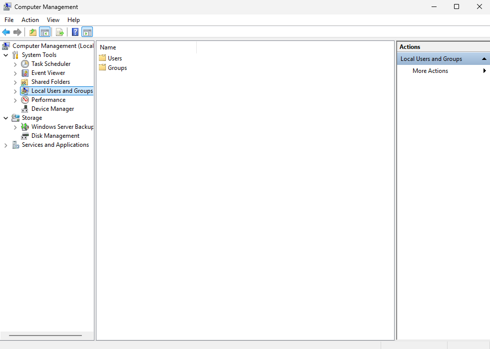

# Δημιουργία χρηστών και ομάδων χρηστών

Αν και δεν προτείνεται η δημιουργία **τοπικών χρηστών** στον εξυπηρετητή, εάν δεν υπάρχει η δυνατότητα [εγκατάστασης Domain Controller](../client-server/index.md), είναι δυνατή (η δημιουργία τοπικών χρηστών) με χρήση της εφαρμογής [`Server Manager`](./basic-settings/index.md#server-manager) επιλέγοντας ***Tools*** ▸ ***Computer Management***  ▸  ***Local Users and Groups***  ▸  ***Users***  ▸ δεξί κλικ ***New User*** στον  Windows εξυπηρετητή.

!!!tip "Συμβουλή"
    Εναλλακτικά μπορείτε να δημιουργήσετε χρήστες και ομάδες χρηστών ή να τις μεταφέρετε από άλλα Λ/Σ (πχ άλλα Windows ή Linux συστήματα) με την εφαρμογή [sch-scripts για Windows](../software/sch-scripts.md).
