# Χειροκίνητη εγκατάσταση λειτουργικού συστήματος

## Αρχική οθόνη εγκατάστασης

Αφού έχετε πραγματοποιήσει την εκκίνηση από το μέσο εγκατάστασης θα εμφανιστούν οι ακόλουθες οθόνες:

### Φόρτωση των απαραίτητων αρχείων[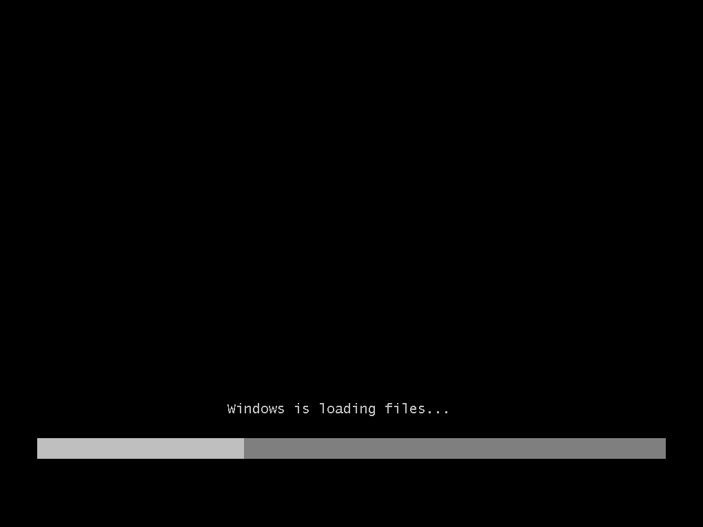](02-boot-in-progress.png)

Η διαδικασία δεν απαιτεί κάποια παρέμβαση από το χρήστη.

### Έναρξη εγκατάστασης των Windows 

Αρχικά, η διαδικασία δεν απαιτεί κάποια παρέμβαση από το χρήστη

## Αρχικές ρυθμίσεις

### Ρύθμιση γλώσσας[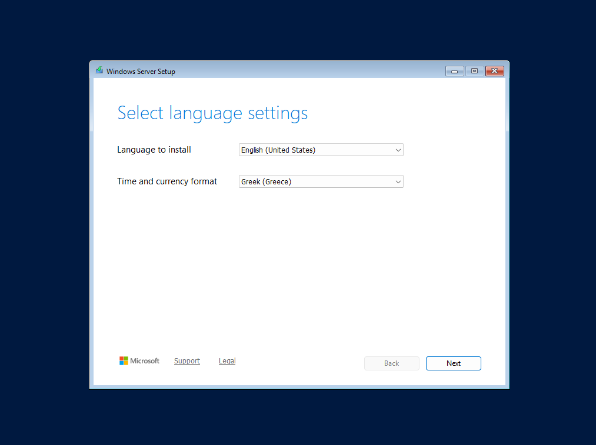](04a-language-settings.png)

Κατά την αρχική εγκατάσταση ζητείται η ρύθμιση της γλώσσας εγκατάστασης και της μορφής της ώρας και νομισματικής μονάδας (Time and currency format). Διαλέξτε ***English (United States*** και ***Greek (Greece)*** και στη συνέχεια επιλέξτε ***Next***.

### Ρύθμιση πληκτρολογίου [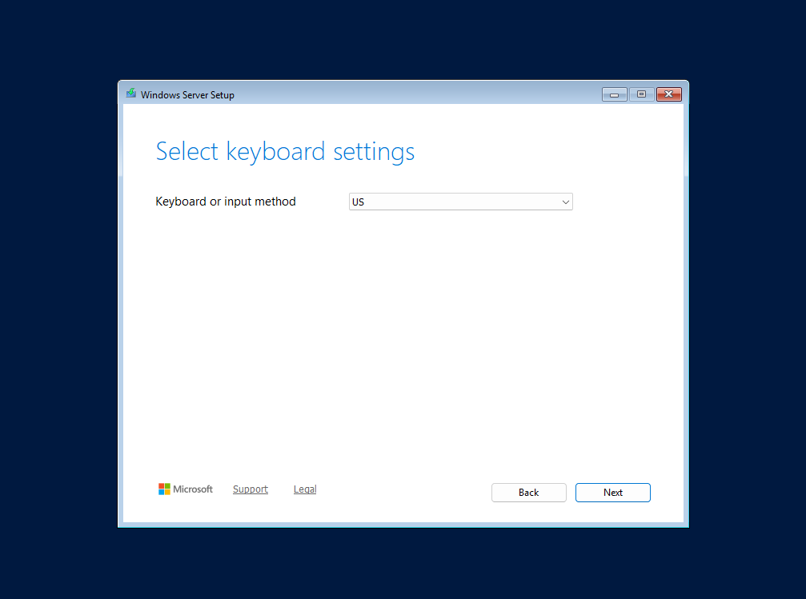](04b-keyboard-settings.png)

Κατόπιν ζητείται να επιλέξετε ρυθμίσεις πληκτρολογίου (Keyboard settings). Διαλέξτε ***US*** και στη συνέχεια επιλέξτε ***Next***.

## Ρυθμίσεις Εγκατάστασης[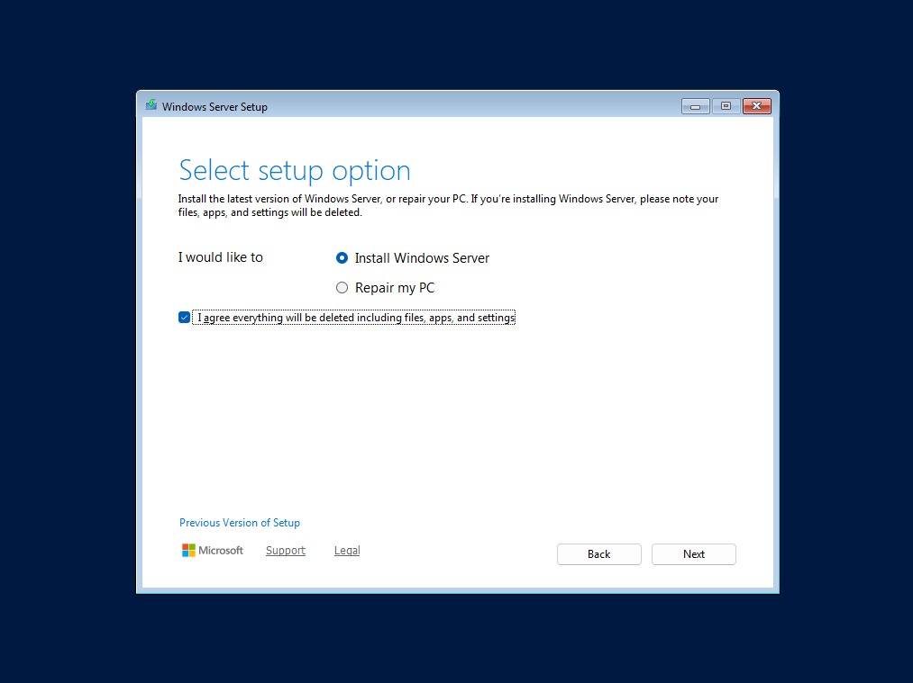](05-setup-options.png)

- Επιλέξτε ***Install Windows Server*** και

- Aποδεχθείτε η εγκατάσταση να διαγράψει τα αρχεία, τις εφαρμογές και τις ρυθμίσεις:

  ***☑ Ι agree everything will be deleted including files, apps, and settings*** 

- Επιλέξτε ***Next***.

### Επιλογή λειτουργικού συστήματος[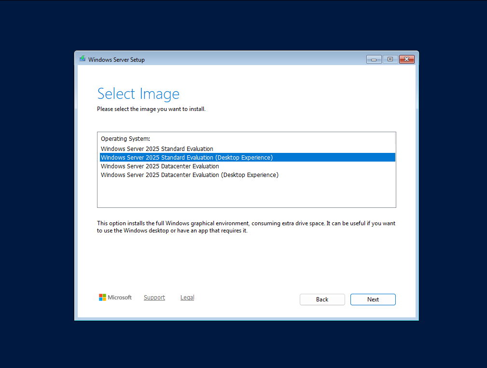](06-select-flavor.png)

- Επιλέξτε την εγκατάσταση με γραφικό περιβάλλον του ***Windows Server 2025 Standard (Desktop Experience)***.

- Επιλέξτε ***Next***.

### Αποδοχή όρων αδειοδότησης[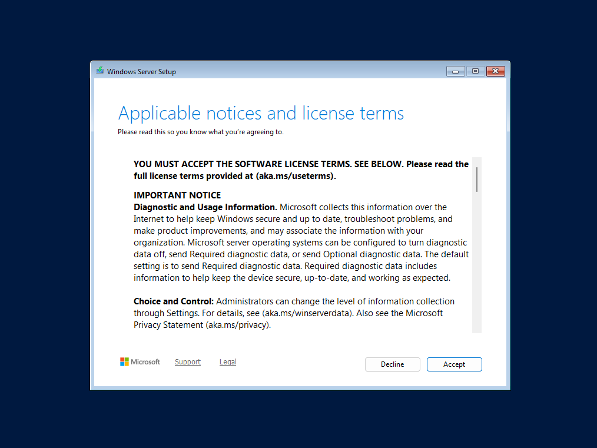](07-license.png)

- Αποδεχτείτε τους όρους αδειοδότησης επιλέγοντας ***Accept***

## Επιλογή της περιοχής εγκατάστασης του Windows Server

Επιλέξτε το δίσκο στον οποίο επιθυμείτε να πραγματοποιηθεί η εγκατάσταση.

!!! tip "Συμβουλή"
    Προτείνεται η δημιουργία 60GB διαμέρισης για το λειτουργικό σύστημα. Στο διαθέσιμο ελεύθερο χώρο μπορείτε να εγκαταστήσετε ένα 2ο λειτουργικό σύστημα ή/και το χώρο που θα αποθηκεύουν τα αρχεία τους οι χρήστες του εξυπηρετητή.

!!! warning "Προειδοποίηση"
    - Εάν επιθυμείτε να εγκαταστήσετε και 2ο λειτουργικό σύστημα πχ Linux, κάντε το μετά την εγκατάσταση του Windows Server και όχι πριν.

    - Οι "προχωρημένοι" μπορούν να εγκαταστήσουν έναν ή περισσότερους δίσκους και να έχουν στο ίδιο PC περισσότερα του ενός λειτουργικά συστήματα σε διαφορετικές διαμερίσεις. Σε αυτήν την περίπτωση ακολουθήστε την πρότασή μας για τις [διαμερίσεις](../partitioning.md).

### Εξυπηρετητής με έναν σκληρό δίσκο[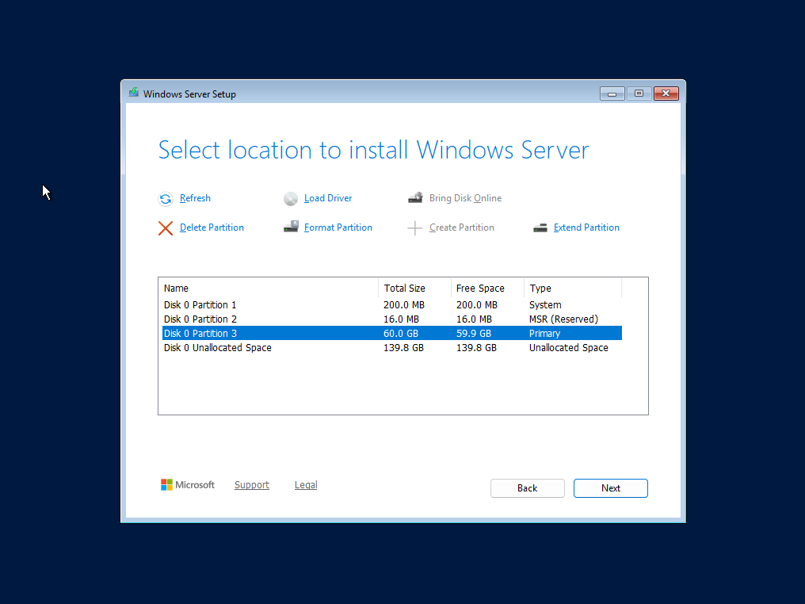](09-one-disk.png)

- Στην περίπτωση ενός σκληρού δίσκου, επιλέγουμε το δίσκο που αναφέρεται ως ***Drive 0*** στον οποίο θα γίνει η εγκατάσταση και με την επιλογή ***Create Partition*** ορίζουμε το μέγεθος της διαμέρισης (προτεινόμενο να είναι κατ' ελάχιστον 60GB ή εναλλακτικά αποδεχόμαστε το συνολικό μέγεθος του δίσκου) και επιλέγοντάς ***Apply*** δημιουργούνται αυτόματα οι απαραίτητες διαμερίσεις. Επιλέξτε ***το Disk0 Partition3*** και πατήστε ***Next***.

### Εξυπηρετητής με δύο σκληρούς δίσκους[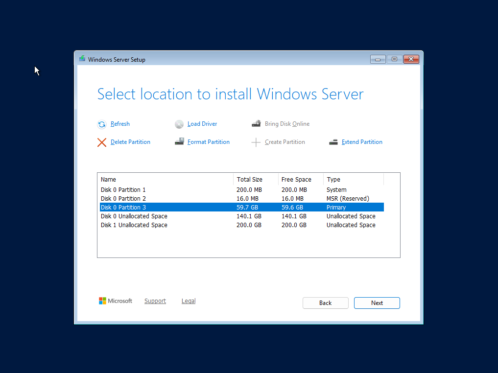](10-two-disks.png)

- Στην περίπτωση δύο σκληρών δίσκων, επιλέγουμε το δίσκο που αναφέρεται ως ***Drive 0*** στον οποίο θα γίνει η εγκατάσταση και με την επιλογή ***Create Partition*** ορίζουμε το μέγεθος της διαμέρισης (προτεινόμενο να είναι κατ' ελάχιστον 60GB ή εναλλακτικά αποδεχόμαστε το συνολικό μέγεθος του δίσκου) και επιλέγοντάς ***Apply*** δημιουργούνται αυτόματα οι απαραίτητες διαμερίσεις. Επιλέξτε ***το Disk0 Partition3*** και πατήστε ***Next***.

## Έναρξη εγκατάστασης του Λ/Σ Windows Server

[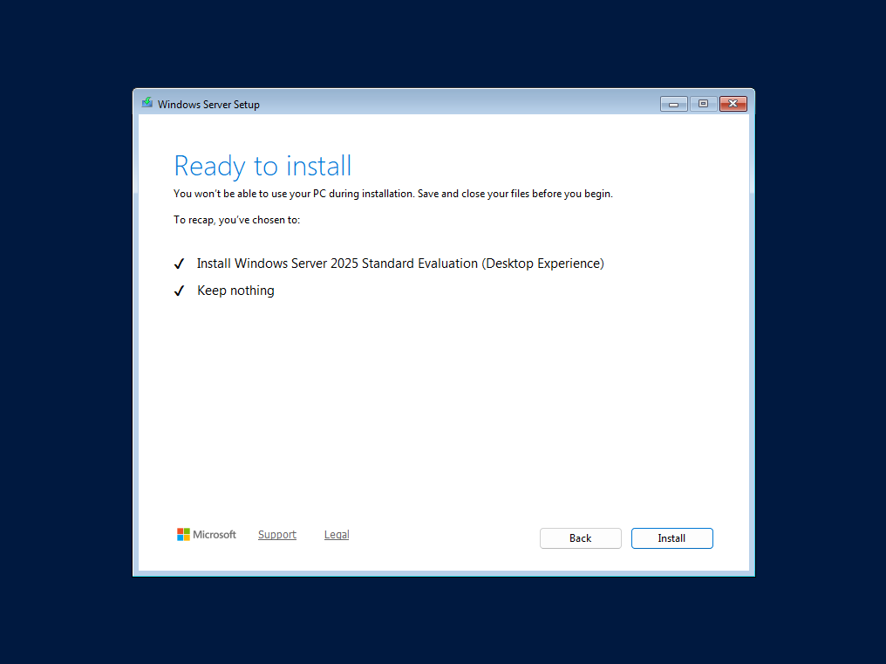](12a-ready-to-install.png)
[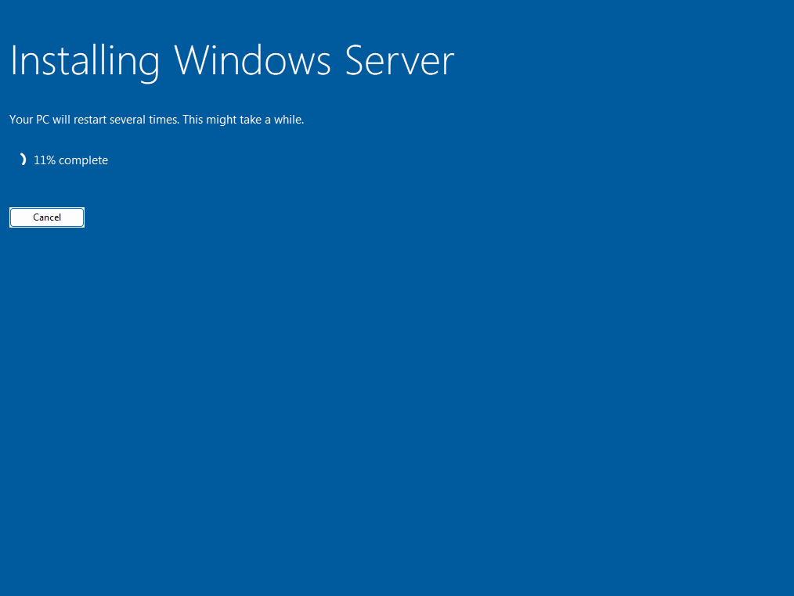](12b-copying-files.png)

Μετά τον ορισμό των διαμερίσεων ξεκινά η αντιγραφή των αρχείων των Windows
  στην κατάτμηση και ακολουθεί η εγκατάσταση χαρακτηριστικών και αναβαθμίσεων.

## Ρύθμιση κωδικού διαχειριστή[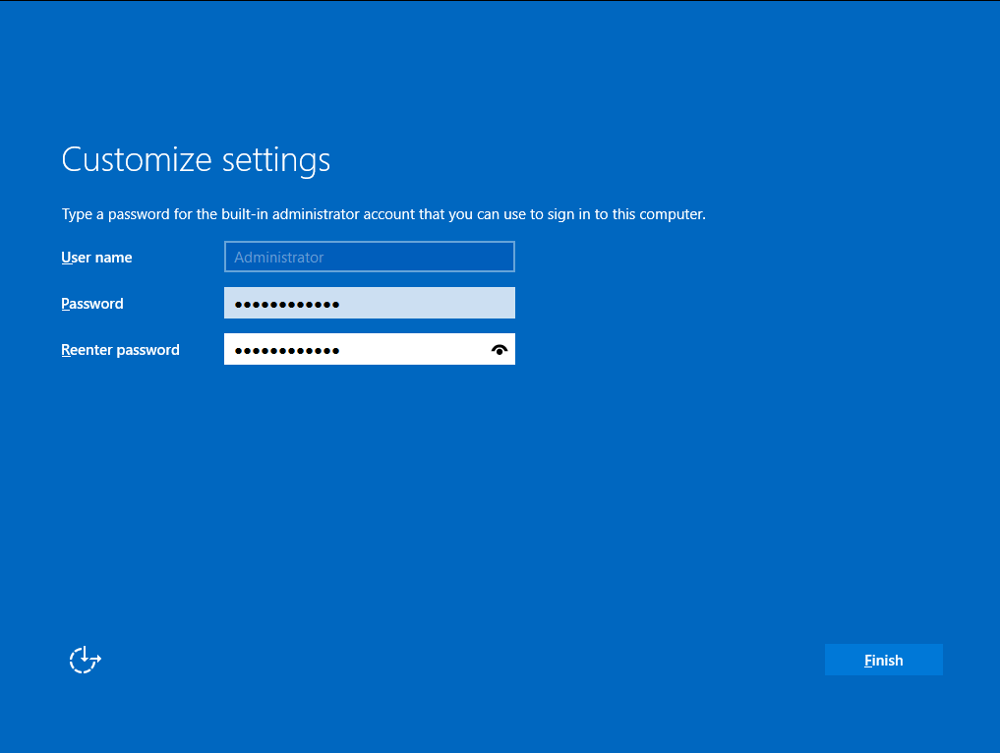](14-set-admin-password.png)
[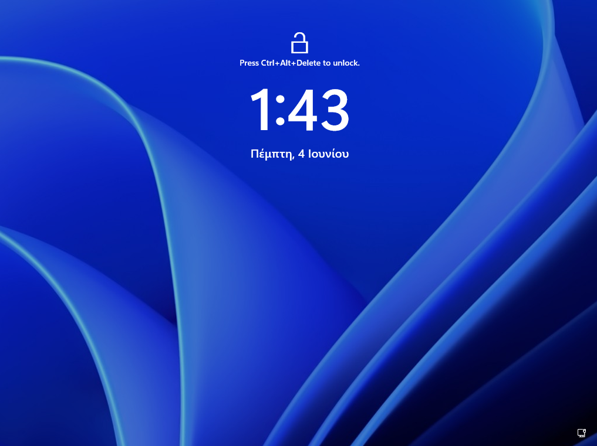](15-first-boot.png)
[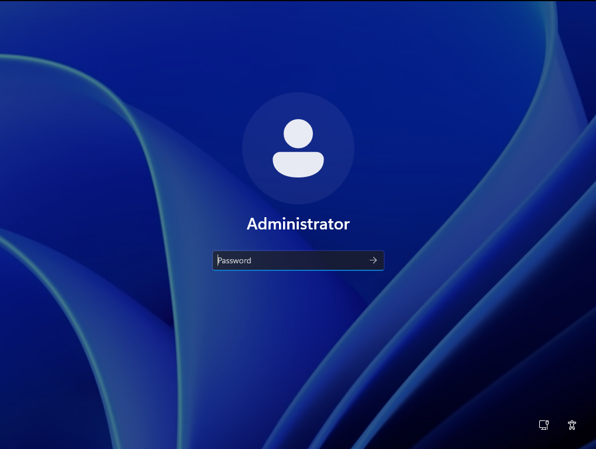](16-first-logon.png)

Στη συνέχεια ζητείται ο κωδικός ασφαλείας του διαχειριστή του συστήματος
  (administrator password). 
  
  !!! tip "Συμβουλή"
    Προτείνεται η χρήση κωδικού τουλάχιστον 8 χαρακτήρων, που να περιλαμβάνει πεζούς και κεφαλαίους λατινικούς χαρακτήρες, σημεία στίξης και αριθμούς (π.χ. **Changem3!**).

    **Η πρακτική χρήσης προφανούς ή κοινού κωδικού ασφαλείας πρέπει να αποφεύγεται.**

## Ρυθμίσεις προσωπικών δεδομένων[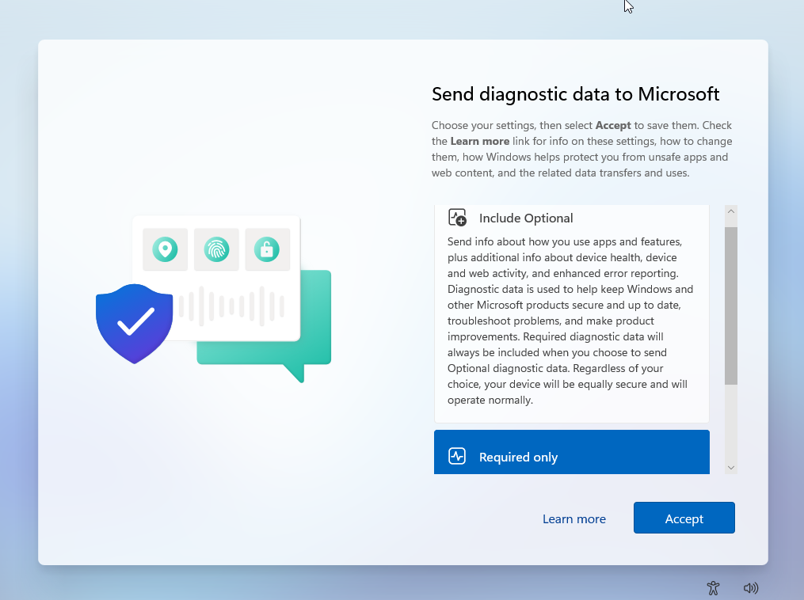](17-setup-privacy-01.png)

Τέλος ζητείται η συνέναισή σας για την αποστολή διαγνωστικών δεδομένων στη Microsoft. Επιλέξτε ***Required only*** και πατήστε ***Accept***.

Η εγκατάσταση έχει πλέον ολοκληρωθεί επιτυχώς.

Κατόπιν μπορείτε να συνεχίσετε με το βήμα των [Βασικών ρυθμίσεων του λειτουργικού συστημάτος](../../basic-settings/index.md).
