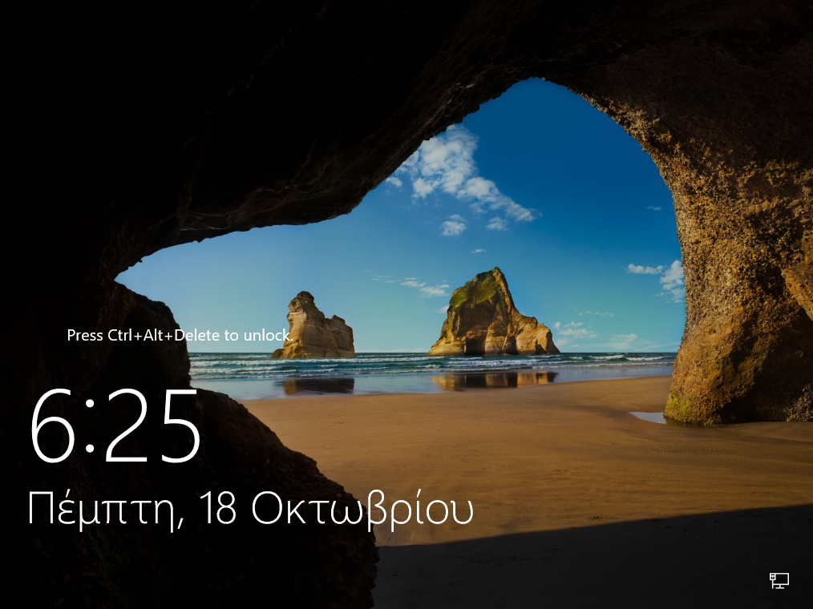

# Χειροκίνητη εγκατάσταση λειτουργικού συστήματος

## 1. Αρχική οθόνη εγκατάστασης

Αφού έχετε πραγματοποιήσει την εκκίνηση από το μέσο εγκατάστασης θα εμφανιστούν οι ακόλουθες οθόνες:

### Φόρτωση των απαραίτητων αρχείων

Η διαδικασία δεν απαιτεί κάποια παρέμβαση από το χρήστη.

### Έναρξη εγκατάστασης των Windows 

Αρχικά, η διαδικασία δεν απαιτεί κάποια παρέμβαση από το χρήστη

## 2. Ρύθμιση γλώσσας

Κατά την αρχική εγκατάσταση ζητείται η ρύθμιση των Time and currency format,
  διαλέξτε ***Greek (Greece)*** και Keyboard or input method, επιλέξτε
  ***US***.

## 3. Εκκίνηση Εγκατάστασης

Επιλέξτε ***Install Now***

## 4. Επιλογή λειτουργικού συστήματος

Επιλέξτε την εγκατάσταση του ***Windows Server 2022 Standard Desktop Experience
  (γραφικό περιβάλλον)***.

### Αποδοχή όρων αδειοδότησης

- Αποδεχτείτε τους όρους αδειοδότησης

    ☑ I accept the license terms

## 5. Ρύθμιση κατατμήσεων

- Επιλέγουμε Custom στον τύπο εγκατάστασης ***Custom: Install Windows Only
  (Advanced)***

### Εξυπηρετητής με έναν σκληρό δίσκο

- Στην περίπτωση ενός σκληρού δίσκου, επιλέγουμε το δίσκο που αναφέρεται ως
  ***Drive 0*** στον οποίο θα γίνει η εγκατάσταση και με την επιλογή ***New***
  δημιουργούμε τις απαραίτητες διαμερίσεις.

### Εξυπηρετητής με δύο σκληρούς δίσκους

- Στην περίπτωση δύο σκληρών δίσκων, επιλέγουμε το δίσκο που αναφέρεται ως
  ***Drive 0*** στον οποίο θα γίνει η εγκατάσταση και με την επιλογή ***New***
  δημιουργούμε τις απαραίτητες διαμερίσεις.

### Διαμερίσεις

- Αυτομάτως θα δημιουργηθούν στο Drive 0 από την εγκατάσταση των Windows,
  επιπλέον των διαμερίσεων που επιθυμούμε, οι τρεις (3) διαμερίσεις: Recovery,
  System και MSR (Reserved).

- Η εγκατάσταση του εξυπηρετητή προτείνεται να γίνει σε διαμερίσεις τέτοιες που
  να διευκολύνεται η μετέπειτα διαχείρισή του. Ακολουθεί ένα πρότυπο
  διαμερίσεων για συστήματα με ένα ή δύο δίσκους, λαμβάνοντας υπόψη το
  ενδεχόμενο στο ίδιο σύστημα να υπάρχει εγκατάσταση και με Linux/LTSP.

### Προτεινόμενη διαμέριση για έναν δίσκο

| Primary Partition                                 |                                                |                                              | Extended Partition                                  |                                               |                      |
| ------------------------------------------------- | ---------------------------------------------- | -------------------------------------------- | --------------------------------------------------- | --------------------------------------------- | -------------------- |
| Primary 1                                         | Primary 2                                      | Primary 3                                    | Logical 1                                           | Logical 2                                     | Logical 3            |
| 30%                                               | 15%                                            | 10%                                          | 20%                                                 | 22%                                           | 3%                   |
| 60 Gb ntfs Windows (κανονική εγκατάσταση Windows) | 30 Gb ext4 Ubuntu (κανονική εγκατάσταση Linux) | 20 Gb ext4 Ubuntu (backup εγκατάσταση Linux) | 40 Gb ntfs Windows \\Users (αρχεία χρηστών Windows) | 45 Gb ext4 Linux /home (αρχεία χρηστών Linux) | 5 Gb swap Linux swap |

 

### Προτεινόμενη διαμέριση για δύο δίσκους

| 1ος δίσκος | Primary 1                                         | Primary 2                                | Primary 3                                                   | Primary 4                                     |
| ---------- | ------------------------------------------------- | ---------------------------------------- | ----------------------------------------------------------- | --------------------------------------------- |
|            | 30%                                               | 20%                                      | 40%                                                         | 10%                                           |
|            | 60 Gb ntfs Windows (κανονική εγκατάσταση Windows) | 40 Gb ext4 Ubuntu (backup εγκατάσταση)   | 80 Gb ext4 Linux /home                                      | 20 Gb ntfs Αντίγραφο (backup) Windows \\Users |
| 2ος δίσκος | Primary 1                                         | Primary 2                                | Primary 3                                                   | Primary 4                                     |
|            | 30%                                               | 20%                                      | 47%                                                         | 3%                                            |
|            | 60 Gb ntfs Windows (backup εγκατάσταση)           | 40 Gb ext4 Ubuntu (κανονική εγκατάσταση) | 95 Gb ntfs Windows \\Users & Αντίγραφο (backup) Linux /home | 5 Gb swap Linux swap                          |

!!!tip "Συμβουλή"
    Το μέγεθος της κατάτμησης Linux swap εξαρτάται και από το μέγεθος της
    μνήμης RAM του εξυπηρετητή. Η προτεινόμενη χωρητικότητα είναι ενδεικτική
    και είναι πολύ πιθανό να διαφέρει σε κάθε ΣΕΠΕΗΥ.

## 6. Εγκατάσταση του Λ/Σ Windows Server

Μετά τον ορισμό των διαμερίσεων ξεκινά η αντιγραφή των αρχείων των Windows
  στην κατάτμηση και ακολουθεί η εγκατάσταση χαρακτηριστικών και αναβαθμίσεων.

Κατόπιν της ολοκλήρωσης των παραπάνω ενεργειών το σύστημα επανεκκινεί
  αυτόματα

## 7. Ρύθμιση κωδικού διαχειριστή

Στη συνέχεια ζητείται ο κωδικός ασφαλείας του διαχειριστή του συστήματος
  (administrator password). Η πρακτική χρήσης προφανούς ή κοινού κωδικού
  ασφαλείας δεν προτείνεται. Είναι επιθυμητό ο κωδικός να έχει τουλάχιστον 8
  χαρακτήρες και να περιλαμβάνει πεζούς και κεφαλαίους λατινικούς χαρακτήρες,
  αριθμούς και σημεία στίξης (πχ. password: **Changem3!**).

Η εγκατάσταση έχει πλέον ολοκληρωθεί επιτυχώς και μπορεί να γίνει είσοδος στο
  σύστημα πληκτρολογώντας **`Ctrl`**+**`Alt`**+**`Del`** κατόπιν επιλέγοντας
  τον χρήστη Administrator και δίνοντας τον κωδικό που δημιουργήσαμε στο
  προηγούμενο βήμα.

Κατόπιν μπορείτε να συνεχίσετε με το βήμα των [Βασικών ρυθμίσεων του λειτουργικού συστημάτος](../../basic-settings/index.md).