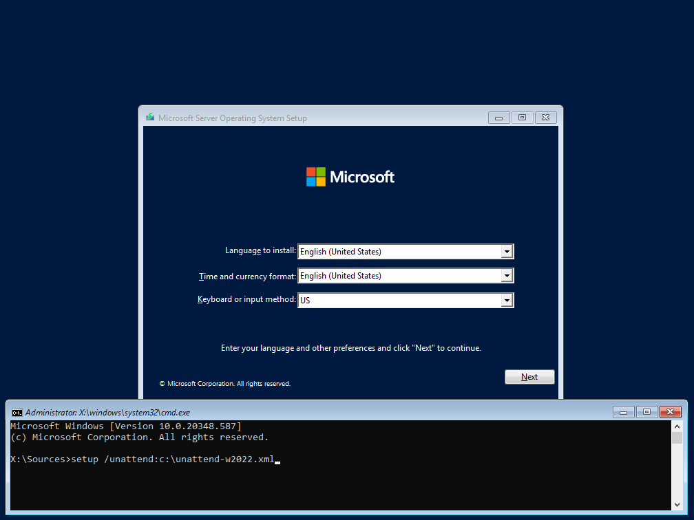
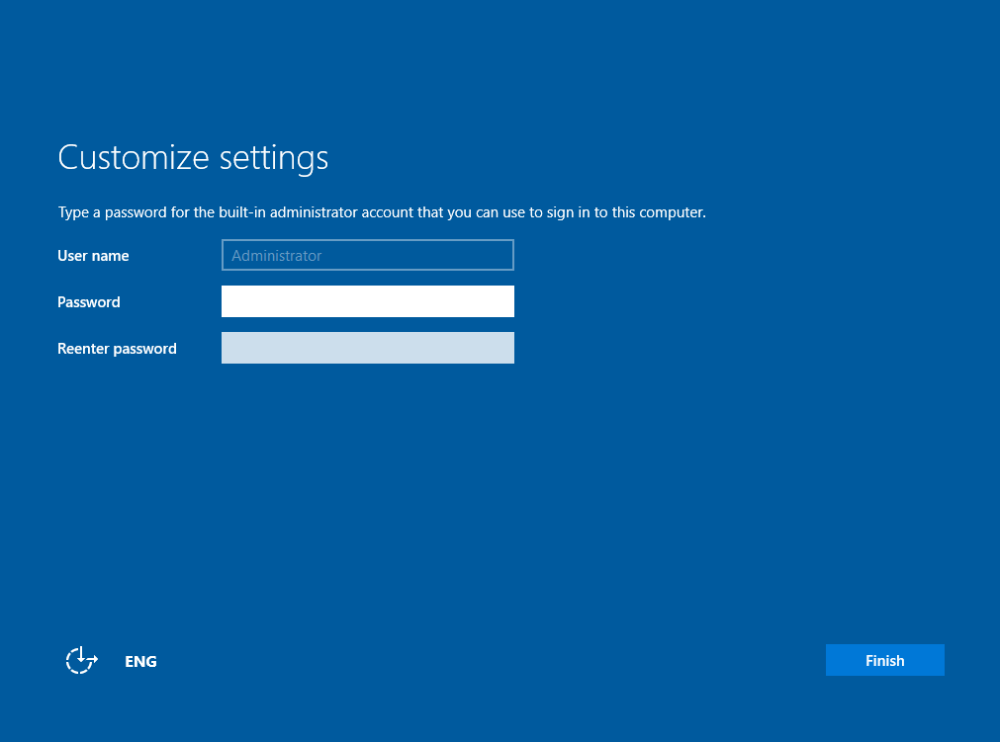

# Αυτοματοποιημένη εγκατάσταση λειτουργικού συστήματος

Για να αποφύγετε τις αρκετές ερωτήσεις κατά την εγκατάσταση του λειτουργικού συστήματος, μπορείτε να αξιοποιήσετε το αρχείο που έχει αναπτυχθεί από την Τεχνική Στήριξη που περιλαμβάνει όλες τις απαντήσεις που απαιτεί η εγκατάσταση σε μορφή xml αρχείου.

[](01-unattended-installation-w2022.png)

- Κατεβάστε, αποσυμπιέστε και αντιγράψτε το [αρχείο xml αυτοματοποιημένης εγκατάστασης](https://ts.sch.gr/docs/odigies-egkatastasis-diaxirisis/archeio-automatopoiemenes-enkatastases-windows-server-2022/) σε ένα USB stick.
- Τοποθετήστε το USB stick στον προς εγκατάσταση Η/Υ.
- Πατήστε τα πλήκτρα **`Shift`** και **`F10`** στην 1η οθόνη της εγκατάστασης που ρωτά για την γλώσσα εγκατάστασης.
- Θα ανοίξει ένα παράθυρο εντολών (command) όπου θα δώσετε την εντολή:

    ```shell
        setup /unattend:c:\unattend-w2022.xml
    ```

    !!! info "Πληροφορία"
        Στην παραπάνω εντολή C: είναι το γράμμα που αντιστοιχεί στο USB Stick.

- Στην ερώτηση **Where do you want to install the operating system?** επιλέξτε τον σκληρό δίσκο και τη διαμέριση που επιθυμείτε και κατόπιν επιλέξτε ***New***, αποδεχθείτε τα προεπιλεγμένα μεγέθη διαμερίσεων επιλόγοντας ***Apply*** και ***Next***.

!!! Tip "Συμβουλή"
    Οι ερωτήσεις μπορούν επίσης να απαντηθούν στο αρχείο xml, αλλά έτσι ο εκτελών την εγκατάσταση δεν θα γνωρίζει σε ποιο δίσκο και σε ποια διαμέριση θα πραγματοποιηθεί, κάτι που ίσως δημιουργήσει προβλήματα αν κάποιες από τις υπάρχουσες διαμερίσεις πρέπει να διατηρηθούν.

[](02-unattended-installation-w2022-admin-pass.png)

- Η εγκατάσταση θα ολοκληρωθεί κανονικά και μετά την επανεκκίνηση θα σας ζητηθεί να ορίσετε τον κωδικό του διαχειριστή (administrator) πριν συνδεθείτε.

Κατόπιν μπορείτε να συνεχίσετε με το βήμα των [Βασικών ρυθμίσεων του λειτουργικού συστημάτος](../../basic-settings/index.md).