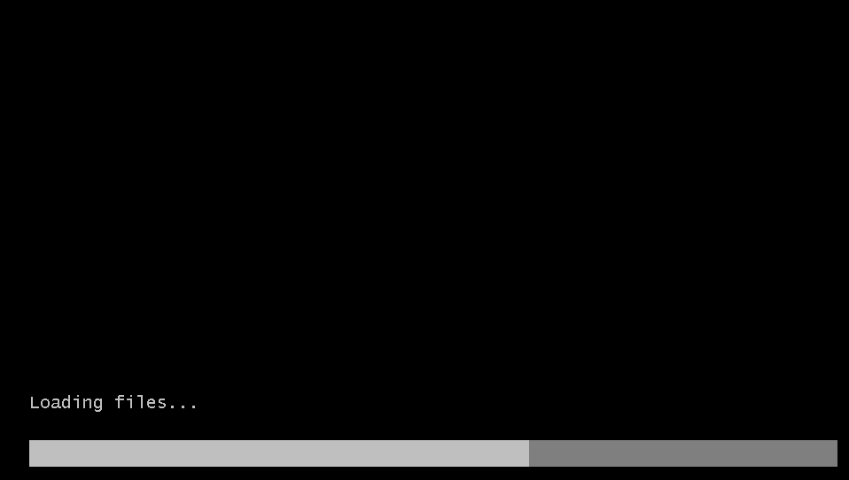
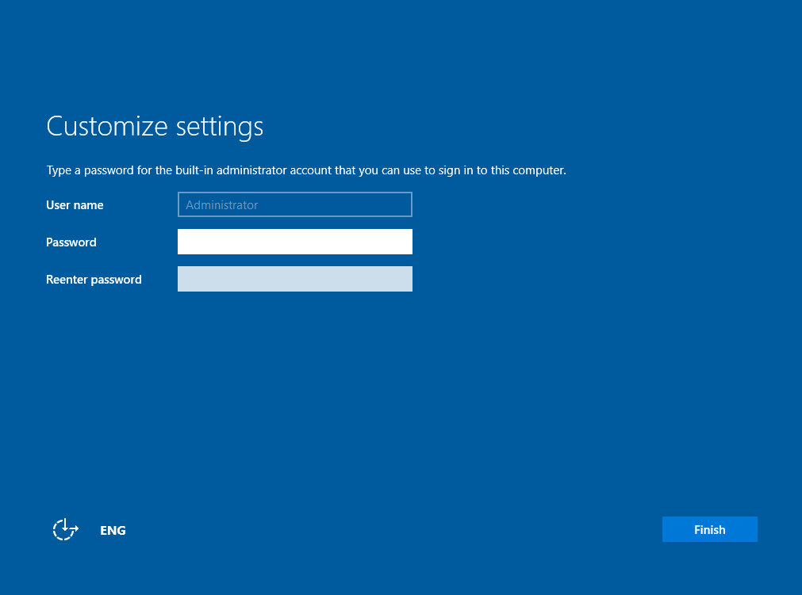

# Αυτοματοποιημένη εγκατάσταση λειτουργικού συστήματος

Για να αποφύγετε τις αρκετές ερωτήσεις κατά την εγκατάσταση του λειτουργικού συστήματος, μπορείτε να αξιοποιήσετε το αρχείο που έχει αναπτυχθεί από την Τεχνική Στήριξη που περιλαμβάνει όλες τις απαντήσεις που απαιτεί η εγκατάσταση σε μορφή xml αρχείου.

## Δημιουργία USB Stick εγκατάστασης

- Εισάγετε ένα USB Stick που είναι άδειο ή δεν σας ενδιαφέρει το περιεχόμενό του (καθώς θα μορφοποιηθεί). Τα Windows δίνουν ένα driveletter σε αυτό (έστω ότι είναι **F**)
- Κάντε mount το .iso της εγκατάστασης του Windows Server που κατεβάσατε. Τα Windows δίνουν ένα driveletter σε αυτό (έστω ότι είναι **Η**)
- Από τις οδηγίες της [επίσημης σελίδας της Microsoft](https://learn.microsoft.com/en-us/windows-server/get-started/install-windows-server?tabs=format-fat32%2Cdesktop-experience&pivots=windows-server-2025), αντιγράψτε το powershell script που σας δίνεται και εκτελέστε το από PowerShell με διαχειριστικά δικαιώματα **προσέχοντας** να δηλώσετε σωστά το driveletter του usb stick και το driveletter του Windows iso (πχ **F,H** στο παράδειγμά μας).
- Κατεβάστε, αποσυμπιέστε και αντιγράψτε το [αρχείο xml αυτοματοποιημένης εγκατάστασης](https://ts.sch.gr/docs/odigies-egkatastasis-diaxirisis/archeio-automatopoiemenes-enkatastases-windows-server-2025-autounattendxml/) στο USB stick που δημιουργήσατε (πχ **F**), στον αρχικό κατάλογο.

!!! tip "Συμβουλή"
    Σε περίπτωση που επιθυμείτε κάτι "πιο απλό" από τις PowerShell εντολές για τη δημουργία του USB Stick, μπορείτε να να κατεβάσετε την [τρέχουσα έκδοση](https://rufus.ie/en/#download) του `Rufus` και να την εγκαταστήσετε σε ένα σταθμό εργασίας.
    - Επιτρέψτε η εφαρμογή Rufus να ελέγχει για τυχόν αναβαθμίσεις.
    - Εισάγετε ένα USB stick άδειο στο σταθμό εργασίας (εάν περιέχει δεδομένα αυτά θα σβηστούν, με τη σύμφωνη γνώμη σας, κατά τη διαμόρφωσή του) και ορίστε το στην εφαρμογή `Rufus` ως **Device**.
    - Επιλέξτε το .iso της εγκατάστασης του Windows Server που κατεβάσατε στο **Boot Selection**.
    - Επιλέξτε ***Start*** για να δημιουργηθεί το USB Stick.

## Εκκίνηση του εξυπηρετητή από το USB Stick που δημουργήσατε

- Τοποθετήστε το USB stick στον προς εγκατάσταση Η/Υ και πραγματοποιήστε εκκίνηση του Η/Υ από το USB stick.
- Η εγκατάσταση ξεκινά με τη φόρτωση αρχείων από το USB εγκατάστασης
- Στην ερώτηση **Select location to install Windows Server** επιλέξτε τον σκληρό δίσκο (αν είναι Unallocated) ή και τη διαμέριση (αν έχετε ήδη μορφοποιήσει το δίσκο και έχετε δημιουργήσει διαμερίσεις, όπως αυτές που περιγράφονται στην ενότητα [διαμερίσεις](../partitioning.md)) που επιθυμείτε και κατόπιν επιλέξτε ***Create Partion***, αποδεχθείτε τα προεπιλεγμένα μεγέθη διαμερίσεων επιλέγοντας ***Apply*** και κατόπιν επιλέξτε ***Next***.

!!! Tip "Συμβουλή"
    Οι ερωτήσεις μπορούν επίσης να απαντηθούν στο αρχείο xml, αλλά έτσι ο εκτελών την εγκατάσταση δεν θα γνωρίζει σε ποιο δίσκο και σε ποια διαμέριση θα πραγματοποιηθεί, κάτι που ίσως δημιουργήσει προβλήματα αν κάποιες από τις υπάρχουσες διαμερίσεις πρέπει να διατηρηθούν.

- Η εγκατάσταση θα ολοκληρωθεί κανονικά και μετά την επανεκκίνηση θα σας ζητηθεί να ορίσετε τον κωδικό του διαχειριστή (administrator) πριν συνδεθείτε.

Κατόπιν μπορείτε να συνεχίσετε με το βήμα των [Βασικών ρυθμίσεων του λειτουργικού συστημάτος](../../basic-settings/index.md).
