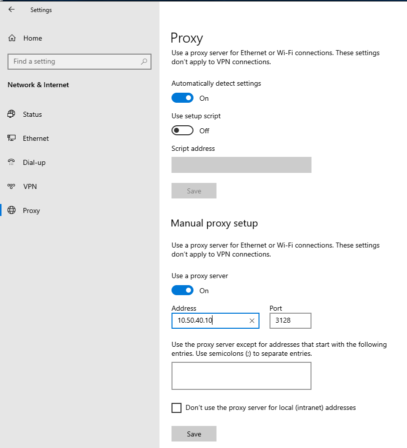

# Διακομιστής Διαμεσολάβησης

Στα σχολικά εργαστήρια προτείνεται να εγκαθίσταται διακομιστής μεσολάβησης (proxy server) για να επιτευχθεί επιτάχυνση της πρόσβασης στον παγκόσμιο ιστό, καθώς οι σελίδες αποθηκεύονται προσωρινά και είναι δυνατή η προσπέλασή τους από τους χρήστες του σχολικού εργαστηρίου, χωρίς να καταναλώνεται πολύτιμο εύρος ζώνης. Το ενσωματωμένο φράγμα ασφαλείας (firewall) δεν αξιοποιείται για την ασφάλεια του σχολικού εργαστηρίου, καθώς παρέχεται ανάλογη προστασία από το δρομολογητή της μονάδας και από το ΠΣΔ.

Ο διακομιστής μεσολάβησης μπορεί να:

* υποστηρίξει blacklist & whitelist ιστοχώρων
* περιορίσει τον αριθμό των ιστοχώρων που επισκέπτονται οι χρήστες (πχ απαγορεύοντας πρόσβαση στις σελίδες facebook*)
* υλοποιήσει caching των ενημερώσεων Windows, Linux και Antivirus (πολύ γρήγορη η αναβάθμιση σε όλους τους σταθμούς του ΣΕΠΕΗΥ)
* βοηθήσει στην καλύτερη αξιοποίηση της γραμμής του ΣΕΠΕΗΥ (λόγω του caching)
* φιλτράρει την κυκλοφορία του δικτύου, υποβοηθώντας την ασφάλεια.

Γενικά προτείνεται στα Σ.Ε.Π.Ε.Η.Υ. η χρήση του διακομιστή μεσολάβησης `Squid`, που είναι ένα λογισμικό ανοικτού κώδικα (ΕΛ/ΛΑΚ).

## Εγκατάσταση Squid

Για τη βασική εγκατάσταση πρέπει να υλοποιηθούν τα ακόλουθα βήματα:

* Πραγματοποιήστε λήψη της τελευταίας Stable έκδοσης του squid από τη διεύθυνση <https://packages.diladele.com/squid/3.5.28/squid.msi>.

!!! warning "Προσοχή"

    * Η συγκεκριμένη έκδοση διατίθεται μόνο σε x64 λειτουργικά συστήματα, επομένως δεν εγκαθίστανται σε x86 λειτουργικά συστήματα.
    * Η τελευταία έκδοση (4.14) που υπάρχει στο <https://squid.diladele.com/> έχει bugs και δεν προτείνεται για εγκατάσταση.

* Πατήστε στο ***DOWNLOAD MSI*** που αντιστοιχεί στο Squid for Windows.
* Με διπλό κλικ εκτελούμε το αρχείο **squid.msi**.
* Επιτρέψτε να τρέξει πατώντας το ***Run***.
* Στο παράθυρο του Squid Setup Wizard πατήστε ***Next***.
* Αποδεχτείτε τους όρους χρήσης επιλέγοντας ✔ ***I accept the terms in the License Aggreement*** και πατώντας ***Next***.
* Στο παράθυρο του Destination Folder ορίστε ως κατάλογο εγκατάστασης το **C:\Program Files\Squid** αφού προηγουμένως έχετε δημιουργήσει το συγκεκριμένο φάκελο.
*Πατήστε ***Install*** για να ξεκινήσει η εγκατάσταση.
* Στο παράθυρο Completed Squid Setup Wizard πατήστε ***Finish***.

!!! info "Πληροφορία"
    Θα παρατηρήσετε στο κάτω δεξί μέρος του taskbar (Tray) να υπάρχει η εφαρμογή διαχείρισης του Squid μέσω της οποίας έχετε τις ακόλουθες δυνατότητες:

    - Open Squid Configuration
    - Open Squid Folder
    - Start Squid Service
    - Stop Squid Service
    - About
    - Exit

## Αρχικές ρυθμίσεις

!!! warning "Προσοχή"
    Ορίστε τον κατάλογο **cache** στο drive που θα αποθηκεύονται και τα αρχεία των χρηστών (πχ f:) και **όχι το system drive c:** ώστε τυχόν μελλοντικά προβλήματα με τη χωρητικότητα του drive να μην επηρρεάσουν τη λειτουργία του Λ/Σ

* Από την εφαρμογή διαχείρισης του Squid στο tray επιλέξτε ***Open Squid Configuration*** ώστε να ανοίξτε για επεξεργασία το αρχείο **C:\Program Files\Squid\etc\squid.conf**.
* Αφαιρέστε το σύμβολο του σχολίου # και τροποποιήσετε τη γραμμή **#cache_dir aufs /cygdrive/d/squid/cache 3000 16 256**
σε **cache_dir aufs /cygdrive/f/squid/cache 3000 16 256** ώστε να ανταποκρίνεται στην τοποθεσία (F:) και στο μέγεθος της περιοχής cache που επιθυμείτε.
* Δημιουργήστε τον κατάλογο (στην τοποθεσία που επιλέξατε) f:\squid\cache
* Από την εφαρμογή διαχείρισης του squid στο tray σταματήστε τη λειτουργία του Squid επιλέγοντας ***Stop Squid Service***
* Στη συνέχεια κάντε double click στο εικονίδιο ***Squid Terminal*** που βρίσκεται στην επιφάνεια εργασίας πληκτρολογήστε την εντολή:

    ```shell
        squid.exe -z
    ```

* Από την εφαρμογή διαχείρισης του squid στο tray ενεργοποιήστε τη λειτουργία του Squid επιλέγοντας ***Start Squid Service***.

!!! tip "Συμβουλή"
    Η εγκατάσταση αυτόματα επιτρέπει στην εφαρμογή `squid.exe` να δέχεται συνδέσεις στη θύρα **3128** από το τοπικό δίκτυο. Επιλέξτε ***Windows Defender Firewall with Advanced Security*** και τροποποιήστε τις ρυθμίσεις του **Squid Cache Server** αν επιθυμείτε διαφορετικές ρυθμίσεις

## Χειροκίνητη ρύθμιση proxy των σταθμών εργασίας και εξυπηρετητή

[](Squid_Manual_Proxy_Setup.png)
{.clear}

Για να αξιοποιήσουν οι σταθμοί εργασίας την υπηρεσία squid, πρέπει να ρυθμίσουμε κάθε browser να χρησιμοποιεί ως proxy την IP διεύθυνση του εξυπηρετητή και την πόρτα 3128.

* Πατήστε **`Windows Key`** ▸ ***γρανάζι Ρυθμίσεις (Settings)*** ▸ ***Network and Internet*** ▸ ***Proxy***
* Ενεργοποιήστε στο **Manual Proxy Setup** την επιλογή ✔ ***Use a proxy server***
* Δηλώστε την IP του εξυπηρετητή και τη θύρα που "ακούει" στο squid (3128)
* Πατήστε το ***Save***.

!!! tip "Συμβουλή"
    Για επαλήθευση ότι πλέον αξιοποιείται το Squid, συνδεθείτε σε μία σελίδα του διαδικτύου και παρατηρήστε τη σχετική εγγραφή στο αρχείο ***C:\program files\squid\var\logs\access.log*** του Squid εξυπηρετητή, που θα αναφέρει την IP διεύθυνση του σταθμού εργασίας και τη σελίδα που διακινήθηκε μέσω του squid.
