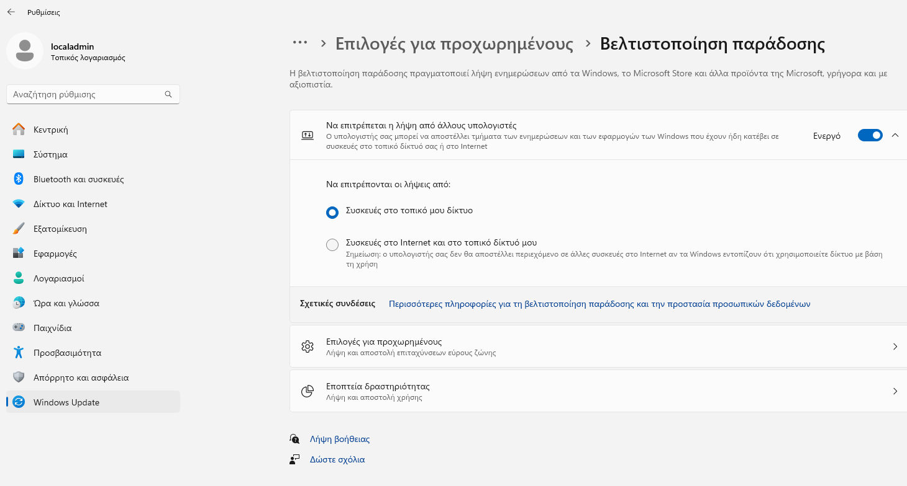

# Διαμοίραση των αναβαθμίσεων των Windows στο τοπικό δίκτυο του Σ.Ε.Π.Ε.Η.Υ.

Για τη μείωση του απαιτούμενου εύρους ζώνης για τις αναβαθμίσεις των Windows (Windows updates) υπάρχει η δυνατότητα οι αναβαθμίσεις που έχουν ήδη "κατέβει" σε έναν σταθμό εργασίας να διαμοιράζονται εντός του τοπικού δικτύου του Σ.Ε.Π.Ε.Η.Υ. Επιπλέον είναι δυνατόν οι σταθμοί εργασίας να κατεβάσουν διαφορετικά μέρη μιας αναβάθμισης και η σύνθεση αυτών των μερών να δημιουργεί το εκτελέσιμο της αναβάθμισης.

Για την ενεργοποίηση αυτού του χαρακτηριστικού:

* Κάντε δεξί κλικ στο σημαιάκι των Windows και κατόπιν επιλέξτε ***Ρυθμίσεις***
* Πατήστε στο ***Windows Update***
* Επιλέξτε ***Επιλογ΄ές για προχωρημένους***
* Επιλέξτε ***Βελτιστοποίηση παράδοσης***
* Ελέγξτε αν είναι ενεργοποιημένη η επιλογή ***Να επιτρέπεται η λήψη από άλλους υπολογιστές***
* Ελέγξτε αν είναι ενεργοποιημένη η επιλογή ***Συσκευές στο τοπικό δίκτυο***
